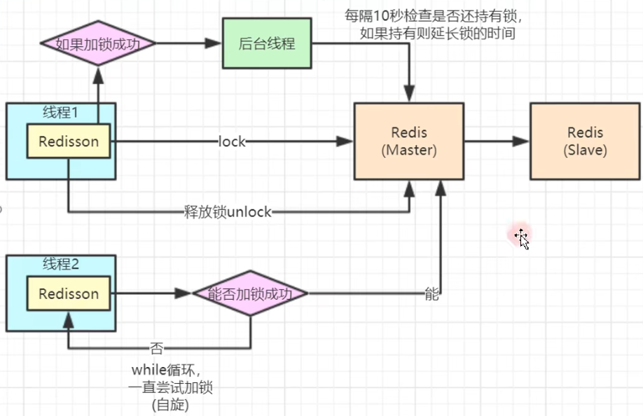

# Redis实现分布式锁
分布式应用进行逻辑处理时经常会遇到并发问题。

例子：减库存问题。

修改状态需要先读库存，在内存里修改，改完再存回去。

如果两个客户端同时读取到，客户端A改库存，客户端B改库存。
A先提交，B随后提交，就会发现用户实际的只减了一个。这不是出现并发问题了么，多卖了但记录没有。

相同操作同时进行，就会出现并发问题，因为读取和保存，这两个操作不是原子操作。

这样描述还不够精准，分两种情况

1. 如果服务端是单Tomcat，两个客户同时操作是在一个JVM中我们使用同步锁就可以解决刚说的并发问题，用一把锁加在两个操作上。
2. 如果服务器是多Tomcat，使用了Nginx尽量负载，构成了分布式系统作为服务端。我们知道synchronized锁是JVM里的一个概念，现在有多个JVM，synchronized分别在不同的JVM上。
多个客户同时操作，如果分别访问了不同的Tomcat，打到了不同的JVM上，虽然每个JVM上都有锁，但依然有可能会造成同时取到库存的情况。这时就需要用到分布式锁

> 这里Tomcat部署Java程序

要解决这个问题就要使用到分布式锁来限制程序的并发执行。Redis分布式锁的使用得非常广泛。

## 版本一
分布式锁本质上要实现的目标就是在Redis里面占一个“坑”，当别的进程也要来占坑时，发现那里已经有一根“大萝卜”，只好放弃或稍后重试。
我们知道在Redis中有一个命令是先判断是否有值，如果没有值才存入的命令`setnx`

那么我们就有如下代码
```java {9,16}
@RestController
public class RedisTestController {

    @Autowired
    RedisTemplate redisTemplate;

    @GetMapping("/de")
    public String test () {
        Boolean lock_name = redisTemplate.opsForValue().setIfAbsent("lock_name", true);
        if (lock_name) {
            try {
                int name = (int)redisTemplate.opsForValue().get("name");
                redisTemplate.opsForValue().set("name",name - 1);
            } finally {
                // 完成操作删除锁，为了防止执行业务中间有异常抛出执行不了放在finally里
                redisTemplate.delete("lock_name");
            }
            return "去库存成功！" ;

        } else {
            return "繁忙，请稍后重试！" ;
        }
    }
}
```
这个版本是最简单原理版本，还有不足。
如果在加完锁后系统宕机，那我们后续的所有请求都无法请求到这把锁。因为没有完成删除操作

## 版本二
针对上面问题，需要加一个时间的限制，目的是来防止宕机后锁无法删除问题，如下代码
```java {9,10,17}
@RestController
public class RedisTestController {

    @Autowired
    RedisTemplate redisTemplate;

    @GetMapping("/de")
    public String test () {
        // 加一个10秒钟自动删除键的设置，来防止宕机后锁无法删除问题
        Boolean lock_name = redisTemplate.opsForValue().setIfAbsent("lock_name", true,10L, TimeUnit.SECONDS);
        if (lock_name) {
            try {
                int name = (int)redisTemplate.opsForValue().get("name");
                redisTemplate.opsForValue().set("name",name - 1);
            } finally {
                // 完成操作删除锁，为了防止执行业务中间有异常抛出执行不了放在finally里
                redisTemplate.delete("lock_name");
            }
            return "去库存成功！" ;

        } else {
            return "繁忙，请稍后重试！" ;
        }
    }
}
```


## 版本三
版本二中我们已经考虑了一部分问题，还依然有不完善的点。如果服务端A执行时间超时，新进来的服务端B重新添加了`lock_name`。此时服务端A恰好执行到删除操作，把客户端B的锁给删除了，此时能进来服务端C执行加锁... 这样依然可能会导致并发问题。
怎么破？

我们为每个锁都设置一个特定的值，我这里使用UUID，如代码
```java {9,11,19,21}
@RestController
public class RedisTestController {

    @Autowired
    RedisTemplate redisTemplate;

    @GetMapping("/de")
    public String test () {
        UUID uuid = UUID.randomUUID();
        // 加一个10秒钟自动删除键的设置，来防止宕机后锁无法删除问题
        Boolean lock_name = redisTemplate.opsForValue().setIfAbsent("lock_name", uuid,10L, TimeUnit.SECONDS);
        if (lock_name) {
            try {
                int name = (int)redisTemplate.opsForValue().get("name");
                redisTemplate.opsForValue().set("name",name - 1);
            } finally {
                // 删除之前先获取，如果uuid同，表示为同一个客户端或线程的处理。
                // 需要注意一点：比较和删除他们不是一个原子操作，这做降低一些概率。相对安全一些
                if (uuid.equals(redisTemplate.opsForValue().get("lock_name"))) {
                    // 完成操作删除锁，为了防止执行业务中间有异常抛出执行不了放在finally里
                    redisTemplate.delete("lock_name");
                }
            }
            return "去库存成功！" ;

        } else {
            return "繁忙，请稍后重试！" ;
        }
    }
}
```


## 开发版本
上面版本依然会有一些瑕疵，就是如果我们程序实际执行时间超过了我们预期设定的时间，锁自动过期，导致后续程序程序并发问题。怎么破？
可以在获取锁后，开启一个线程，动态扩充我们锁的时间。

担心自己开发不能高效的规避常见的bug。实际开发中，使用一个完善的已经开发好的包redisson。
这里已经开发的非常完善，拿过来直接使用。
### 首先导入包
```xml
<dependency>
    <groupId>org.redisson</groupId>
    <artifactId>redisson-spring-boot-starter</artifactId>
    <version>3.17.0</version>
</dependency>

```
### 配置Redisson
```java
package com.wenwen.blog.config;

import org.redisson.Redisson;
import org.redisson.config.Config;
import org.springframework.context.annotation.Bean;
import org.springframework.context.annotation.Configuration;

/**
 * @Author Wang WenLei
 * @Date 2022/5/18 15:15
 * @Version 1.0
 **/
@Configuration
public class RedissonConfig {

    @Bean
    public Redisson redisson () {
        Config config = new Config();

        //单机模式
        config.useSingleServer()
            //配置地址
            .setAddress("redis://150.158.58.15:6379")
            // 配置密码
            .setPassword("redis2716")
            // 配置数据库
            .setDatabase(0);
        return (Redisson)Redisson.create(config);
    }
}
```
### 使用
```java
    @GetMapping("/de2")
    public String test2 () {
        RLock lock_name = redisson.getLock("lock_name");
        try {
            lock_name.lock(10L,TimeUnit.SECONDS);
            int name = (int)redisTemplate.opsForValue().get("name");
            redisTemplate.opsForValue().set("name",name - 1);
        } finally {
            lock_name.unlock();
        }
        return "去库存成功！" ;
    }
```

原理图：




---

> 版本说明：
>
>Java 8
>
>SpringBoot v2.3.3.RELEASE
>
>Redis 6.2.5