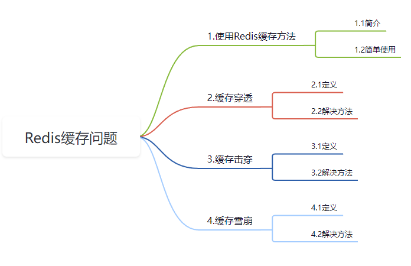
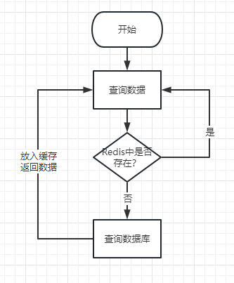

# Redis缓存问题

## 1.使用Redis缓存方法

### 1.1 简介

Redis最经常使用的方式就缓存

### 1.2 简单使用

## 2.缓存穿透

假设有一条数据，**数据库根本就不存在**，比如查询**id为-1**的数据，如果前端查询id为-1的请求发过来，Redis中没有，又会去数据库中查询，这样的话，如果有人恶意攻击(比如利用测试软件**瞬间大量的发出此种请求**)，数据库就有可能会崩掉，这就是缓存穿透。

### 解决办法

* 对参数进行校验，不合法参数直接拦截。
* 既然在数据库中查不到，对此种请求我们设置一个空对象放到Redsi中，设置一个较短的过期时间。

## 3缓存击穿

假设此时**某一个热点key即将过期**了，**在刚好过期的这个时间结点**，若有**大量的访问此热点数据的请求并发发送**过来(比如淘宝单点秒杀)，Redis中查询不到，又会一瞬间的同时访问数据库，也可能瞬间会将数据库搞崩。

### 解决办法

* 对热点key设置为永不过期(对内存不友好)。
* 加互斥锁，第一个请求到来先占用此锁，此时其他请求过来拿不到，等第一个请求从数据库查询的结果返回并且存放到Redis中，其余的请求再来访问(即会从Redis中快速拿到数据)。

## 4.缓存雪崩

假设此时正在处于淘宝秒杀的时间段，在**高并发**的情况下，如果**此时大量的缓存失效**，或者**缓存层出现故障**，所有的请求也同时访问数据库，也可能会造成数据库崩掉的状况。

### 解决办法

* 随机设置过期时间。
* 不设置过期时间。
* 若是集群部署，将热点数据分散到多台Redis服务器当中。

---

总结：穿透是redis里**不存在**这个缓存key；击穿是redis**某一个**热点 key **突然**失效，雪崩是**大面积的key缓存失效**；最终的受害者都是数据库。

完~