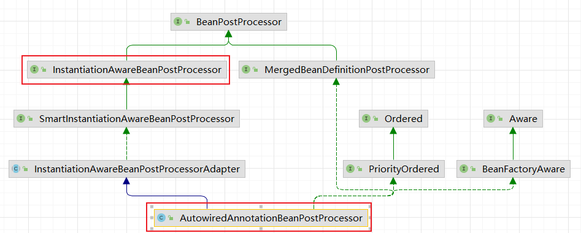

# 自动装配与条件装配
[[toc]]

> 解释摘自参考官网: Spring容器可以自动装配Beans之间的关系。可以让Spring通过检查`Application`容器自动的解析合作者（其他Beans）

基于个官网的解释，我理解@Autowired是自动装配的一种实现。而@EnableAutoConfiguration、@ComponentScan是使用者，把目标对象纳入Spring容器管理。

即：条件装配是去人对象是否纳入Spring容器管理，在@EnableAutoConfiguration范围内。

自动装配具有以下优点：
* 自动装配可以显着减少指定属性或构造函数参数的需要。
* 随着对象的发展，自动装配可以更新配置。

自动装配限制和缺点：

自动装配在项目中一致使用时效果最佳。如果一般不使用自动装配，开发人员可能会混淆使用它来只装配一个或两个 bean 定义。

* `property`和设置中的显示依赖`constructor-arg`项总是覆盖自动装配。不能自动装配简单的属性，例如：基础属性、`String`，`Classes`（和一些简单的properties数组）。此限制是设计使然
* 自动装配不如显式装配精确。尽管如前表中所述，Spring 会小心避免猜测可能会产生意想不到的结果的歧义。Spring 管理的对象之间的关系不再明确记录。
* 从 Spring 容器生成文档的工具可能无法使用接线信息。
* 容器内的多个 bean 定义可能与要自动装配的 setter 方法或构造函数参数指定的类型匹配。对于数组、集合或 `Map`实例，这不一定是问题。但是，对于期望单个值的依赖项，这种歧义不会被任意解决。如果没有唯一的 bean 定义可用，则会引发异常。

> 最后一种情况，有多种选择：
>
> * 放弃自动装配以支持显式装配。
> * `autowire-candidate`通过将其属性设置为 来避免对 bean 定义进行自动装配`false`，
> * 通过将其元素的`primary`属性设置为`true`，将单个bean定义指定为主要的候选者
> * 使用基于注解的配置实现更细粒度的控制


## 注解`@Autowired`
在Bean加载过程中，AutowiredAnnotationBeanPostProcessor对注解进行处理

`AutowiredAnnotationBeanPostProcessor`类实现了`InstantiationAwareBeanPostProcessors`接口



```java
@Override
public PropertyValues postProcessProperties(PropertyValues pvs, Object bean, String beanName) {
    // 获取注解对应的元数据
    InjectionMetadata metadata = findAutowiringMetadata(beanName, bean.getClass(), pvs);
    try {
        // 开始注入
        metadata.inject(bean, beanName, pvs);
    }
    catch (BeanCreationException ex) {
        throw ex;
    }
    catch (Throwable ex) {
        throw new BeanCreationException(beanName, "Injection of autowired dependencies failed", ex);
    }
    return pvs;
}
```
### 获取注解对应元数据
```java
private InjectionMetadata findAutowiringMetadata(String beanName, Class<?> clazz, @Nullable PropertyValues pvs) {
    // 类名作为缓存键，以便与自定义调用者向后兼容
    String cacheKey = (StringUtils.hasLength(beanName) ? beanName : clazz.getName());
    // 从缓存中获取，尽可能来减少获取数量
    InjectionMetadata metadata = this.injectionMetadataCache.get(cacheKey);
    // 有可能没有获取到，有可能已经被改变了都重新获取
    if (InjectionMetadata.needsRefresh(metadata, clazz)) {
        synchronized (this.injectionMetadataCache) {
            // 再取一次防止在取到后加上锁之前这条数据发生了改变的情况
            metadata = this.injectionMetadataCache.get(cacheKey);
            if (InjectionMetadata.needsRefresh(metadata, clazz)) {
                if (metadata != null) {
                    // 先清空
                    metadata.clear(pvs);
                }
                // 重新建立注入元数据
                metadata = buildAutowiringMetadata(clazz);
                // 重新添加缓存
                this.injectionMetadataCache.put(cacheKey, metadata);
            }
        }
    }
    return metadata;
}
```
建立注入元数据，`AutowiredAnnotationBeanPostProcessor`里的2个子类重写了inject()方法。分别负责字段的注入和方法的注入

### 字段的注入
```java
private class AutowiredFieldElement extends InjectionMetadata.InjectedElement {

    private final boolean required;

    private volatile boolean cached = false;

    @Nullable
    private volatile Object cachedFieldValue;

    public AutowiredFieldElement(Field field, boolean required) {
        super(field, null);
        this.required = required;
    }

    @Override
    protected void inject(Object bean, @Nullable String beanName, @Nullable PropertyValues pvs) throws Throwable {
        // 取到目标类
        Field field = (Field) this.member;
        Object value;
        if (this.cached) {
            value = resolvedCachedArgument(beanName, this.cachedFieldValue);
        }
        else {
            DependencyDescriptor desc = new DependencyDescriptor(field, this.required);
            desc.setContainingClass(bean.getClass());
            Set<String> autowiredBeanNames = new LinkedHashSet<>(1);
            Assert.state(beanFactory != null, "No BeanFactory available");
            TypeConverter typeConverter = beanFactory.getTypeConverter();
            try {
                // 这里使用BeanFactory的resolveDependency方法获取值
                // SpringBoot这里使用的是DefaultListableBeanFactory的实现
                // 根据descriptor的依赖类型解析出与descriptor所包装的对象匹配的候选Bean对象
                value = beanFactory.resolveDependency(desc, beanName, autowiredBeanNames, typeConverter);
            }
            catch (BeansException ex) {
                throw new UnsatisfiedDependencyException(null, beanName, new InjectionPoint(field), ex);
            }
            synchronized (this) {
                if (!this.cached) {
                    if (value != null || this.required) {
                        this.cachedFieldValue = desc;
                        registerDependentBeans(beanName, autowiredBeanNames);
                        if (autowiredBeanNames.size() == 1) {
                            String autowiredBeanName = autowiredBeanNames.iterator().next();
                            if (beanFactory.containsBean(autowiredBeanName) &&
                                    beanFactory.isTypeMatch(autowiredBeanName, field.getType())) {
                                this.cachedFieldValue = new ShortcutDependencyDescriptor(
                                        desc, autowiredBeanName, field.getType());
                            }
                        }
                    }
                    else {
                        this.cachedFieldValue = null;
                    }
                    this.cached = true;
                }
            }
        }
        if (value != null) {
            ReflectionUtils.makeAccessible(field);
            field.set(bean, value);
        }
    }
}
```

### 方法的注入
打差不差，变成循环了
```java
private class AutowiredMethodElement extends InjectionMetadata.InjectedElement {

    private final boolean required;

    private volatile boolean cached = false;

    @Nullable
    private volatile Object[] cachedMethodArguments;

    public AutowiredMethodElement(Method method, boolean required, @Nullable PropertyDescriptor pd) {
        super(method, pd);
        this.required = required;
    }

    @Override
    protected void inject(Object bean, @Nullable String beanName, @Nullable PropertyValues pvs) throws Throwable {
        if (checkPropertySkipping(pvs)) {
            return;
        }
        Method method = (Method) this.member;
        Object[] arguments;
        if (this.cached) {
            // Shortcut for avoiding synchronization...
            arguments = resolveCachedArguments(beanName);
        }
        else {
            int argumentCount = method.getParameterCount();
            arguments = new Object[argumentCount];
            DependencyDescriptor[] descriptors = new DependencyDescriptor[argumentCount];
            Set<String> autowiredBeans = new LinkedHashSet<>(argumentCount);
            Assert.state(beanFactory != null, "No BeanFactory available");
            TypeConverter typeConverter = beanFactory.getTypeConverter();
            for (int i = 0; i < arguments.length; i++) {
                MethodParameter methodParam = new MethodParameter(method, i);
                DependencyDescriptor currDesc = new DependencyDescriptor(methodParam, this.required);
                currDesc.setContainingClass(bean.getClass());
                descriptors[i] = currDesc;
                try {
                    // 获取对象
                    Object arg = beanFactory.resolveDependency(currDesc, beanName, autowiredBeans, typeConverter);
                    if (arg == null && !this.required) {
                        arguments = null;
                        break;
                    }
                    arguments[i] = arg;
                }
                catch (BeansException ex) {
                    throw new UnsatisfiedDependencyException(null, beanName, new InjectionPoint(methodParam), ex);
                }
            }
            synchronized (this) {
                if (!this.cached) {
                    if (arguments != null) {
                        DependencyDescriptor[] cachedMethodArguments = Arrays.copyOf(descriptors, arguments.length);
                        registerDependentBeans(beanName, autowiredBeans);
                        if (autowiredBeans.size() == argumentCount) {
                            Iterator<String> it = autowiredBeans.iterator();
                            Class<?>[] paramTypes = method.getParameterTypes();
                            for (int i = 0; i < paramTypes.length; i++) {
                                String autowiredBeanName = it.next();
                                if (beanFactory.containsBean(autowiredBeanName) &&
                                        beanFactory.isTypeMatch(autowiredBeanName, paramTypes[i])) {
                                    cachedMethodArguments[i] = new ShortcutDependencyDescriptor(
                                            descriptors[i], autowiredBeanName, paramTypes[i]);
                                }
                            }
                        }
                        this.cachedMethodArguments = cachedMethodArguments;
                    }
                    else {
                        this.cachedMethodArguments = null;
                    }
                    this.cached = true;
                }
            }
        }
        if (arguments != null) {
            try {
                ReflectionUtils.makeAccessible(method);
                method.invoke(bean, arguments);
            }
            catch (InvocationTargetException ex) {
                throw ex.getTargetException();
            }
        }
    }

    @Nullable
    private Object[] resolveCachedArguments(@Nullable String beanName) {
        Object[] cachedMethodArguments = this.cachedMethodArguments;
        if (cachedMethodArguments == null) {
            return null;
        }
        Object[] arguments = new Object[cachedMethodArguments.length];
        for (int i = 0; i < arguments.length; i++) {
            arguments[i] = resolvedCachedArgument(beanName, cachedMethodArguments[i]);
        }
        return arguments;
    }
}
```

### DefaultListableBeanFactory的resolveDependency()方法
> descriptor -- 描述符的意思
```java
public Object resolveDependency(DependencyDescriptor descriptor, @Nullable String requestingBeanName,
        @Nullable Set<String> autowiredBeanNames, @Nullable TypeConverter typeConverter) throws BeansException {

    // 获取工厂的参数名发现器，设置到descriptor中
    descriptor.initParameterNameDiscovery(getParameterNameDiscoverer());
    // 【当descriptor的依赖类型是Optional时】
    if (Optional.class == descriptor.getDependencyType()) {
        // 创建Optional类型的符合descriptor要求的候选Bean对象并返回 出去
        return createOptionalDependency(descriptor, requestingBeanName);
    }
    // 【当decriptord的依赖类型是ObjectFactory或者是ObjectProvider】
    else if (ObjectFactory.class == descriptor.getDependencyType() ||
            ObjectProvider.class == descriptor.getDependencyType()) {
                // 新建一个 DependencyObjectProvider的实例并返回出去
        return new DependencyObjectProvider(descriptor, requestingBeanName);
    }
    // 【当decriptord的依赖类型是javax.inject.Provider】
    else if (javaxInjectProviderClass == descriptor.getDependencyType()) {
        // 新建一个专门用于构建 javax.inject.Provider对象的工厂来构建创建Jse330Provider对象
        return new Jsr330Factory().createDependencyProvider(descriptor, requestingBeanName);
    }
    else {
        // 【当descriptor需要延迟加载时】
        Object result = getAutowireCandidateResolver().getLazyResolutionProxyIfNecessary(
                descriptor, requestingBeanName);
        if (result == null) {
            // 【当现在就需要得到候选Bean对象时】
            // 如果result为null，即表示现在需要得到候选Bean对象,解析出与descriptor所包装的对象匹配 的候选Bean对象
            result = doResolveDependency(descriptor, requestingBeanName, autowiredBeanNames, typeConverter);
        }
        return result;
    }
}

```
doResolveDependency()方法：解析出与descriptor所包装的对象匹配的候选Bean对象
```java
public Object doResolveDependency(DependencyDescriptor descriptor, @Nullable String beanName,
        @Nullable Set<String> autowiredBeanNames, @Nullable TypeConverter typeConverter) throws BeansException {
    // 设置新的当前切入点对象，得到旧的当前切入点对象
    InjectionPoint previousInjectionPoint = ConstructorResolver.setCurrentInjectionPoint(descriptor);
    try {
        // 尝试使用descriptor的快捷方法得到最佳候选Bean对象
        Object shortcut = descriptor.resolveShortcut(this);
        if (shortcut != null) {
            return shortcut;
        }

        // 获取descriptor的依赖类型
        Class<?> type = descriptor.getDependencyType();
        // 尝试使用descriptor的默认值作为最佳候选Bean对象，使用此BeanFactory的自动装配候选解析器获取descriptor的默认值
        Object value = getAutowireCandidateResolver().getSuggestedValue(descriptor);
        if (value != null) {
            // 如果value是String类型
            if (value instanceof String) {
                // 解析嵌套的值
                String strVal = resolveEmbeddedValue((String) value);
                // 获取beanName的合并后RootBeanDefinition
                BeanDefinition bd = (beanName != null && containsBean(beanName) ?
                        getMergedBeanDefinition(beanName) : null);
                value = evaluateBeanDefinitionString(strVal, bd);
            }
            TypeConverter converter = (typeConverter != null ? typeConverter : getTypeConverter());
            try {
                // 将value转换为type的实例对象并返回出去
                return converter.convertIfNecessary(value, type, descriptor.getTypeDescriptor());
            }
            catch (UnsupportedOperationException ex) {
                // 如果descriptor有包装成员属性,根据descriptor包装的成员属性来将值转换为type然后返回出去
                // 否则，根据descriptor包装的方法参数对象来将值转换为type然后返回出去
                return (descriptor.getField() != null ?
                        converter.convertIfNecessary(value, type, descriptor.getField()) :
                        converter.convertIfNecessary(value, type, descriptor.getMethodParameter()));
            }
        }

        // 尝试针对desciptor所包装的对象类型是[stream,数组,Collection类型且对象类型是接口,Map]的情况进行解析与依赖类型匹配的候选Bean对象
        Object multipleBeans = resolveMultipleBeans(descriptor, beanName, autowiredBeanNames, typeConverter);
        if (multipleBeans != null) {
            return multipleBeans;
        }

        // 尝试与type匹配的唯一候选bean对象,查找与type匹配的候选bean对象,构建成Map
        Map<String, Object> matchingBeans = findAutowireCandidates(beanName, type, descriptor);
        if (matchingBeans.isEmpty()) {
            if (isRequired(descriptor)) {
                raiseNoMatchingBeanFound(type, descriptor.getResolvableType(), descriptor);
            }
            return null;
        }
        // 定义用于存储唯一的候选Bean名变量
        String autowiredBeanName;
        // 定义用于存储唯一的候选Bean对象变量
        Object instanceCandidate;

        // 如果候选Bean对象Map不止有一个
        if (matchingBeans.size() > 1) {
            // 让autowiredBeanName引用candidates中可以自动注入的最佳候选Bean名称
            autowiredBeanName = determineAutowireCandidate(matchingBeans, descriptor);
            if (autowiredBeanName == null) {
                if (isRequired(descriptor) || !indicatesMultipleBeans(type)) {
                    return descriptor.resolveNotUnique(descriptor.getResolvableType(), matchingBeans);
                }
                else {
                    // In case of an optional Collection/Map, silently ignore a non-unique case:
                    // possibly it was meant to be an empty collection of multiple regular beans
                    // (before 4.3 in particular when we didn't even look for collection beans).
                    return null;
                }
            }
            instanceCandidate = matchingBeans.get(autowiredBeanName);
        }
        else {
            // We have exactly one match.
            Map.Entry<String, Object> entry = matchingBeans.entrySet().iterator().next();
            autowiredBeanName = entry.getKey();
            instanceCandidate = entry.getValue();
        }

        if (autowiredBeanNames != null) {
            // 如果候选bean名不为null，将autowiredBeanName添加到autowiredBeanNames中
            autowiredBeanNames.add(autowiredBeanName);
        }
        // 如果instanceCandidate是Class实例
        if (instanceCandidate instanceof Class) {
            // 让instanceCandidate引用 descriptor对autowiredBeanName解析 为该工厂的Bean实例
            // getBean()的封装，里面就是getBean()
            instanceCandidate = descriptor.resolveCandidate(autowiredBeanName, type, this);
        }
        // 定义一个result变量，用于存储最佳候选Bean对象
        Object result = instanceCandidate;
        if (result instanceof NullBean) {
            if (isRequired(descriptor)) {
                raiseNoMatchingBeanFound(type, descriptor.getResolvableType(), descriptor);
            }
            result = null;
        }
        // 如果result不是type的实例,抛出Bean不是必需类型异常
        if (!ClassUtils.isAssignableValue(type, result)) {
            throw new BeanNotOfRequiredTypeException(autowiredBeanName, type, instanceCandidate.getClass());
        }
        // 返回最佳候选Bean对象
        return result;
    }
    finally {
        ConstructorResolver.setCurrentInjectionPoint(previousInjectionPoint);
    }
}

```


## SpringBoot启动注解里`@EnableAutoConfiguration`

进入这个注解里最关键的要属@Import(AutoConfigurationImportSelector.class)，借助AutoConfigurationImportSelector，@EnableAutoConfiguration注解可以帮助SpringBoot应用将所有符合条件的@Configuration配置都加载到当前SpringBoot创建并使用的IoC容器。

借助于Spring框架原有的一个工具类：SpringFactoriesLoader的支持，@EnableAutoConfiguration可以智能的自动配置功效才得以大功告成！


AutoConfigurationImportSelector的一部分：

这里这个AutoConfigurationImportSelector实现了DeferredImportSelector，这个类继承ImportSelect

而 <span style="color:red">AutoConfigurationImportSelector重写了selectImports</span> 方法，这个方法把String[]里的内容装载进Spring容器里

```java
// spring-boot-autoconfigure:2.3.3RELEASE版本如下：
@Override
public String[] selectImports(AnnotationMetadata annotationMetadata) {
    if (!isEnabled(annotationMetadata)) {
        return NO_IMPORTS;
    }
    AutoConfigurationEntry autoConfigurationEntry = getAutoConfigurationEntry(annotationMetadata);
    return StringUtils.toStringArray(autoConfigurationEntry.getConfigurations());
}

//spring-boot-autoconfigure2.0.5RELEASE如下，跟上面版本不一样。所以这里直接进入getCandidateConfigurations这个方法
// 把getAutoConfigurationEntry方法放在了selectImports里，这么一看猜测上面的版本更新
@Override
public String[] selectImports(AnnotationMetadata annotationMetadata) {
    if (!isEnabled(annotationMetadata)) {
        return NO_IMPORTS;
    }
    AutoConfigurationMetadata autoConfigurationMetadata = AutoConfigurationMetadataLoader
        .loadMetadata(this.beanClassLoader);
    AnnotationAttributes attributes = getAttributes(annotationMetadata);
    List<String> configurations = getCandidateConfigurations(annotationMetadata,
                                                             attributes);
    configurations = removeDuplicates(configurations);
    Set<String> exclusions = getExclusions(annotationMetadata, attributes);
    checkExcludedClasses(configurations, exclusions);
    configurations.removeAll(exclusions);
    configurations = filter(configurations, autoConfigurationMetadata);
    fireAutoConfigurationImportEvents(configurations, exclusions);
    return StringUtils.toStringArray(configurations);
}
```

spring-boot-autoconfigure:2.3.3RELEASE版本再向下进到`getAutoConfigurationEntry()`

```java
protected AutoConfigurationEntry getAutoConfigurationEntry(AnnotationMetadata annotationMetadata) {
    if (!isEnabled(annotationMetadata)) {
        return EMPTY_ENTRY;
    }
    AnnotationAttributes attributes = getAttributes(annotationMetadata);
	// 这里再向下就可以看到SpringFactoriesLoader
    List<String> configurations = getCandidateConfigurations(annotationMetadata, attributes);
    configurations = removeDuplicates(configurations);
    Set<String> exclusions = getExclusions(annotationMetadata, attributes);
    checkExcludedClasses(configurations, exclusions);
    configurations.removeAll(exclusions);
    configurations = getConfigurationClassFilter().filter(configurations);
    fireAutoConfigurationImportEvents(configurations, exclusions);
    return new AutoConfigurationEntry(configurations, exclusions);
}
```

进入`getCandidateConfigurations()`

```java
/**
	 * Return the auto-configuration class names that should be considered. By default
	 * this method will load candidates using {@link SpringFactoriesLoader} with
	 * {@link #getSpringFactoriesLoaderFactoryClass()}.
	 * @param metadata the source metadata
	 * @param attributes the {@link #getAttributes(AnnotationMetadata) annotation
	 * attributes}
	 * @return a list of candidate configurations
	 */
    protected List<String> getCandidateConfigurations(AnnotationMetadata metadata, AnnotationAttributes attributes) {
        // getSpringFactoriesLoaderFactoryClass()返回的是 EnableAutoConfiguration.class
        List<String> configurations = SpringFactoriesLoader.loadFactoryNames(getSpringFactoriesLoaderFactoryClass(),
                                                                             getBeanClassLoader());
        Assert.notEmpty(configurations, "No auto configuration classes found in META-INF/spring.factories. If you "
                        + "are using a custom packaging, make sure that file is correct.");
        return configurations;
    }
```

在AutoConfigurationImportSelector类中可以看到通过 SpringFactoriesLoader.loadFactoryNames()，这一步会把所有的“ META-INF / spring.factories”都拿到放在一个map里（从代码中我们可以知道，在这个方法中会遍历整个ClassLoader中所有jar包下的spring.factories文件。也就是说我们可以在自己的jar中配置spring.factories文件，不会影响到其它地方的配置，也不会被别人的配置覆盖。）。loadFactoryNames()方法是从“ META-INF / spring.factories”形成的map里取出名称为“<span style="color:orange">org.springframework.boot.autoconfigure.EnableAutoConfiguration</span>”的列表。然后把spring-boot-autoconfigure.jar/META-INF/spring.factories中每一个xxxAutoConfiguration文件都加载到容器中。

列举其中一个例子：


<span style="color:green">META-INF/spring.factories这个文件不是只是一个文件，每个start都有一个</span>

如源码：

```java
/**
	 * Load the fully qualified class names of factory implementations of the
	 * given type from {@value #FACTORIES_RESOURCE_LOCATION}, using the given
	 * class loader.
     * 翻译：使用给定的类加载器从“ META-INF / spring.factories”加载给定类型的工厂实现的标准类名
	 * @param factoryType the interface or abstract class representing the factory
	 * @param classLoader the ClassLoader to use for loading resources; can be
	 * {@code null} to use the default
	 * @throws IllegalArgumentException if an error occurs while loading factory names
	 * @see #loadFactories
	 */
public static List<String> loadFactoryNames(Class<?> factoryType, @Nullable ClassLoader classLoader) {
    String factoryTypeName = factoryType.getName();
    // 从“ META-INF / spring.factories”形成的map里取出名称为“org.springframework.boot.autoconfigure.EnableAutoConfiguration”
    //的列表
    return loadSpringFactories(classLoader).getOrDefault(factoryTypeName, Collections.emptyList());
}
/**
*这一步会把所有的“ META-INF / spring.factories”都拿到放在一个map里
*/
private static Map<String, List<String>> loadSpringFactories(@Nullable ClassLoader classLoader) {
    MultiValueMap<String, String> result = (MultiValueMap)cache.get(classLoader);
    if (result != null) {
        return result;
    } else {
        try {
            // 获取所有spring.factories的URL
            Enumeration<URL> urls = classLoader != null ? classLoader.getResources("META-INF/spring.factories") : ClassLoader.getSystemResources("META-INF/spring.factories");
            LinkedMultiValueMap result = new LinkedMultiValueMap();

            while(urls.hasMoreElements()) {
                URL url = (URL)urls.nextElement();
                UrlResource resource = new UrlResource(url);
                Properties properties = PropertiesLoaderUtils.loadProperties(resource);
                Iterator var6 = properties.entrySet().iterator();

                while(var6.hasNext()) {
                    Entry<?, ?> entry = (Entry)var6.next();
                    String factoryTypeName = ((String)entry.getKey()).trim();
                    String[] var9 = StringUtils.commaDelimitedListToStringArray((String)entry.getValue());
                    int var10 = var9.length;

                    for(int var11 = 0; var11 < var10; ++var11) {
                        String factoryImplementationName = var9[var11];
                        result.add(factoryTypeName, factoryImplementationName.trim());
                    }
                }
            }

            cache.put(classLoader, result);
            return result;
        } catch (IOException var13) {
            throw new IllegalArgumentException("Unable to load factories from location [META-INF/spring.factories]", var13);
        }
    }
}
```


## 注解`@CompanentScan`

会自动扫描包路径下面的所有@Controller、@Service、@Repository、@Component 的类

 

它里面的属性： value指定扫描的包，includeFilters包含那些过滤，excludeFilters不包含那些过滤，useDefaultFilters默认的过滤规则是开启的，如果我们要自定义的话是要关闭的。其中@Filters是一个过滤器的接口。

@Filters 指过滤规则，FilterType指定过滤的规则（

​      FilterType.ANNOTATION：按照注解

​      FilterType.ASSIGNABLE_TYPE：按照给定的类型；

​      FilterType.ASPECTJ：使用ASPECTJ表达式

​      FilterType.REGEX：使用正则指定

​      FilterType.CUSTOM：使用自定义规则）

classes指定过滤的类
