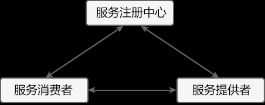

# Spring Cloud Eureke
[[toc]]
Eureka 一词来源于古希腊词汇，是“发现了”的意思。在软件领域，Eureka 是 Netflix 公司开发的一款开源的服务注册与发现组件。

Spring Cloud 将 Eureka 与 Netflix 中的其他开源服务组件（例如 Ribbon、Feign 以及 Hystrix 等）一起整合进 Spring Cloud Netflix 模块中，
整合后的组件全称为 Spring Cloud Netflix Eureka。

Eureka 是 Spring Cloud Netflix 模块的子模块，它是 Spring Cloud 对 Netflix Eureka 的二次封装，主要负责 Spring Cloud 的服务注册与发现功能。

Spring Cloud 使用 Spring Boot 思想为 Eureka 增加了自动化配置，开发人员只需要引入相关依赖和注解，就能将 Spring Boot 构建的微服务轻松地与 Eureka 进行整合。

## Eureka 两大组件
Eureka Server：Eureka服务注册中心，主要用于提供服务注册功能。当为服务启动时，会将自己的服务注册到Eureka Server。Eureka Server维护一个可用服务列表，存储了所有注册到Eureka Server的可用服务的信息，这些可用服务可以在Eureka Server的管理界面直观的看到。
Eureka Client：Eureka客户端，通常指的是微服务系统中各个微服务，主要用于和Eureka Server进行交互。在微服务应用启动后，Eureka Client会向Eureka Server发动心跳（默认周期为30s）。若Eureka Server在多个心跳周期内没有接收到某个Eureka Client心跳，Eureka Server将它从可用服务列表中移除（默认90s）。

> 注：“心跳”指的是一段定时发送的自定义信息，让对方知道自己“存活”，以确保连接的有效性。大部分 CS 架构的应用程序都采用了心跳机制，服务端和客户端都可以发心跳。
> 通常情况下是客户端向服务器端发送心跳包，服务端用于判断客户端是否在线。

## Eureka 服务注册与发现

上图中共涉及到以下 3 个角色：
* 服务注册中心（Register Service）：它是一个 Eureka Server，用于提供服务注册和发现功能。
* 服务提供者（Provider Service）：它是一个 Eureka Client，用于提供服务。它将自己提供的服务注册到服务注册中心，以供服务消费者发现。
* 服务消费者（Consumer Service）：它是一个 Eureka Client，用于消费服务。它可以从服务注册中心获取服务列表，调用所需的服务。

Eureka 实现服务注册与发现的流程如下
1. 搭建一个 Eureka Server 作为服务注册中心；
2. 服务提供者 Eureka Client 启动时，会把当前服务器的信息以服务名（spring.application.name）的方式注册到服务注册中心；
3. 服务消费者 Eureka Client 启动时，也会向服务注册中心注册；
4. 服务消费者还会获取一份可用服务列表，该列表中包含了所有注册到服务注册中心的服务信息（包括服务提供者和自身的信息）；
5. 在获得了可用服务列表后，服务消费者通过 HTTP 或消息中间件远程调用服务提供者提供的服务。

服务注册中心（Eureka Server）所扮演的角色十分重要，它是服务提供者和服务消费者之间的桥梁。服务提供者只有将自己的服务注册到服务注册中心才可能被服务消费者调用，而服务消费者也只有通过服务注册中心获取可用服务列表后，才能调用所需的服务。

## 单机使用
### 1.创建主工程
