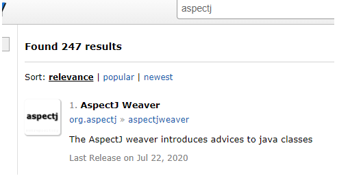
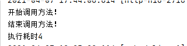

# spring AOP
[[toc]]

## 一、AOP概念及使用

### 1.定义

切面（Aspect）：跨多个类的关注点的模块化。在 Spring AOP 中，方面是通过使用常规类（基于模式的方法）或使用 `@Aspect`注解注释的常规类（@AspectJ样式）来实现的。（切面是通知和切点的结合）

连接点（Join point）：表示应用执行过程中能够插入切面的一个点，这个点可以是方法的调用、异常的抛出。在 Spring AOP 中，一个连接点总是代表一个方法调用执行。

通知（Advice）：AOP 框架中的增强处理。通知描述了切面何时执行以及如何执行增强处理。

切点（Pointcut）：可以插入增强处理的连接点。

引入（Introduction）：引入允许我们向现有的类添加新的方法或者属性。

织入（Weaving）：将增强处理添加到目标对象中，并创建一个被增强的对象，这个过程就是织入。

目标对象（Target object）：一个或多个方面通知的对象。也称“advised object”。由于 Spring AOP 是使用运行时代理实现的，因此该对象始终是代理对象。

AOP代理（AOP proxy）：由 AOP 框架创建的对象，用于实现方面协定（建议方法执行等）。在 Spring Framework 中，AOP 代理是 JDK 动态代理或 CGLIB 代理。

### 2.Spring AOP包含以下类型的advice

* 之前通知（Before advice）：advice在连接点之前运行但不能阻止执行流继续到连接点的通知（除非它抛出异常）。
* 返回后通知（After returning advice）：在连接点正常完成后运行的advice（例如，如果方法返回而没有引发异常）。
* 抛出后通知（After throwing advice）：如果方法因抛出异常而退出，则运行advice。
* 之后（最终）通知（After (finally) advice）：无论连接点以何种方式退出（正常或异常返回），都将运行advice。
* 环绕通知（Around advice）：围绕连接点的advice，例如方法调用。这是最有力的advice。环绕通知可以在方法调用之前和之后执行自定义行为。它还负责选择是继续到连接点还是通过返回自己的返回值或抛出异常来缩短advice的方法执行。

形象的表述：

```java
try{
    try{
        //@Before
        method.invoke(..);
    }finally{
        //@After 不论是否异常都会执行
    }
    //@AfterReturning
}catch(){
    //@AfterThrowing
}
```


环绕通知是最一般的建议。由于 Spring AOP 与 AspectJ 一样，提供了全方位的通知类型，因此我们建议您使用可以实现所需行为的最不强大的通知类型。

所有建议参数都是静态类型的，因此您可以使用适当类型的建议参数（例如，方法执行的返回值的类型）而不是`Object`数组。

切入点匹配的连接点的概念是 AOP 的关键，这将它与仅提供拦截的旧技术区分开来。切入点使建议的目标独立于面向对象的层次结构。例如，您可以将提供声明性事务管理的环绕建议应用到一组跨越多个对象（例如服务层中的所有业务操作）的方法。

### 3.AOP代理使用注解实现

Spring AOP代理使用标准的JDK动态代理。这使得任何接口（或一组接口）都可以被代理。

Spring AOP也可以使用CGLIB代理。这是代理类而不是接口所必需的。默认情况下，如果业务对象未实现接口，则使用 CGLIB。由于对接口而不是类进行编程是一种很好的做法，因此业务类通常实现一个或多个业务接口。在那些（希望很少见）需要advice未在接口上声明的方法或需要将代理对象作为具体类型传递给方法的情况下，可以强制使用CGLIB。

[动态代理看这个篇文章了解](../java/1_base/proxy.md)

#### 3.1启用@AspectJ支持

要在Spring配置需要启用配置基于@AspectJ切面的Spring AOP和Spring支持使用@AspectJ切面。可以通过XML或Java样式配置启用@AspectJ支持。无论哪种情况，您都需要确保AspectJ的`aspectjweaver.jar`库位于应用程序的类路径（版本1.8或更高版本）上。

我是SpringBoot项目

先使用Maven添加包支持，去这个网站找：https://mvnrepository.com/



找个用的人多的

```xml
<!-- https://mvnrepository.com/artifact/org.aspectj/aspectjweaver -->
<dependency>
    <groupId>org.aspectj</groupId>
    <artifactId>aspectjweaver</artifactId>
    <version>1.9.6</version>
</dependency>
```

##### 我这里通过Java配置启用@AspectJ支持

```java
package com.wenwen.blog.config;

import org.springframework.context.annotation.Configuration;
import org.springframework.context.annotation.EnableAspectJAutoProxy;

/**
 * @author WangWenLei
 * @DATE: 2021/4/7
 **/
@Configuration
@EnableAspectJAutoProxy
public class AopConfig {
}
```

也可以通过XML配置启用@AspectJ支持，我这里不是这种方式

```xml
<aop:aspectj-autoproxy/>
```

#### 3.2声明切面

```java
/**
 * 声明一个切面：统计每个方法执行的时间
 * @author WangWenLei
 * @DATE: 2021/4/7
 **/
@Aspect
@Component
public class PerformSpendTimeAspect {
 
}
```

#### 3.3声明切点

常见的切入点：

1. 任何公共方法的执行：  `execution(public * *(..))` 
2. 名称以“set”开头的任何方法的执行： `execution(* set*(..))` 
3. `AccountService`接口定义的任何方法的执行： `execution(* com.xyz.service.AccountService.*(..))` 
4. 服务包中定义的任何方法的执行： ` execution(* com.xyz.service.*.*(..))` 
5. 服务包或子包中定义的任何方法的执行： ` execution(* com.xyz.service..*.*(..))` 
6. 服务包中的任何连接点（仅在Spring AOP中执行方法）： ` within(com.xyz.service.*) ` 
7. 服务包或子包中的任何连接点（仅在Spring AOP中执行方法）： ` within(com.xyz.service..*)` 
8. 代理实现`AccountService`接口的任何连接点（仅在Spring AOP中是方法执行） ： ` this(com.xyz.service.AccountService)` 'this'通常以绑定形式使用

```java
package com.wenwen.blog.util.aop;

import org.aspectj.lang.ProceedingJoinPoint;
import org.aspectj.lang.annotation.After;
import org.aspectj.lang.annotation.Around;
import org.aspectj.lang.annotation.Aspect;
import org.aspectj.lang.annotation.Before;
import org.springframework.stereotype.Component;

/**
 * 声明一个切面：统计每个方法执行的时间
 * @author WangWenLei
 * @DATE: 2021/4/7
 **/
@Aspect
@Component
public class PerformSpendTimeAspect {
    @Before("execution(* com.wenwen.blog.controller..*.*(..))")
    public void startMethod(){
        System.out.println("开始调用方法！");
    }
    @After("execution(* com.wenwen.blog.controller..*.*(..))")
    public void endMethod(){
        System.out.println("结束调用方法！");
    }
    /**
     * 切面表达式：
     * execution 代表所要执行的表达式主体
     * 第一处 * 代表方法返回类型 *代表所有类型
     * 第二处 包名代表aop监控的类所在的包
     * 第三处 .. 代表该包以及其子包下的所有类方法
     * 第四处 * 代表类名，*代表所有类
     * 第五处 *(..) *代表类中的方法名，(..)表示方法中的任何参数
     *
     * @param joinPoint
     */
    @Around("execution(* com.wenwen.blog.controller..*.*(..))")
    public void performMethod(ProceedingJoinPoint joinPoint) throws Throwable {
        final long start = System.currentTimeMillis();
        // 执行目标 service
        Object result = joinPoint.proceed();
        final long end = System.currentTimeMillis();
        System.out.println("执行耗时" + (end - start));
    }

}
```

*execution* *代表所要执行的表达式主体:*

- 第一处 * 代表方法返回类型 *代表所有类型
- 第二处 包名代表aop监控的类所在的包
- 第三处 .. 代表该包以及其子包下的所有类方法
- 第四处 * 代表类名，*代表所有类
- 第五处 *(..) 其中 *代表类中的方法名，(..)表示方法中的任何参数


*运行展示：*




## 二、Spring AOP实现原理

上文我们已经建立了一个切面`PerformSpendTimeAspect`

> Spring没有自己定义切面相关的注解，而是使用来自`org.aspectj`这个Jar包里面的注解。但没用aspectj的技术解析。
>
> aspectj还有很多注解，但Spring支持的是：`@Aspect、@Before、@After、@AfterReturning、@AfterThrowing、@Around` 其余的注解Spring都是不予解析（由AspectJ内部技术去解析）

### AOP的入口
AOP是由BeanPostProcessor后置处理器开始的，它是Spring IOC容器经常使用的一个特性，这个Bean后置处理器是一个监听器，可以监听容器触发的Bean生命周期事件。

向容器注册后置处理器以后，容器中管理的Bean就具备接收IoC容器回调事件的能力

BeanPostProcessor的使用非常简单，只需要提供一个BeanPostProcess接口的实现类，然后再Bean的配置文件中设置即可

#### BeanPostProcess的源码
```java
public interface BeanPostProcessor {
    // Bean初始化前提供的回调接口
    @Nullable
    default Object postProcessBeforeInitialization(Object bean, String beanName) throws BeansException {
        return bean;
    }

    // Bean初始化后提供的回调接口
    @Nullable
    default Object postProcessAfterInitialization(Object bean, String beanName) throws BeansException {
        return bean;
    }
}
```
这两个回调入口和容器管理的Bean的生命周期紧密相关，可以为用户提供在Spring IoC 容器初始化Bean过程中自定义的处理操作

#### AbstractAutowireCapableBeanFactory类的doCreateBean()方法
BeanPostProcessor后置处理器的调用发生在Spring IoC 容器完成Bean实例对象的创建和属性注入之后，在对Spring依赖注入的源码分析中知道，
当程序第一次调用getBean()方法向Spring IoC容器索取指定Bean时，触发Spring IoC容器创建爱你Bean对象实例并进行依赖注入。

真正实现创建Bean对象并进行依赖注入的方法是AbstractAutowireCapableBeanFactory类的doCreateBean()

[思路代码如下，详情请看Spring DI章节](springdi.md)

```java
protected Object doCreateBean(String beanName, RootBeanDefinition mbd, @Nullable Object[] args)
        throws BeanCreationException {
    ...

    // Initialize the bean instance.
    Object exposedObject = bean;
    try {
        // 对Bean属性进行依赖注入，这里面会调用所有InstantiationAwareBeanPostProcessor
        populateBean(beanName, mbd, instanceWrapper);
        // Bean 实例管理对象的依赖注入完成以后，开始对Bean实例对象进行初始化
        // 为Bean实例对象应用BeanPostProcessor
        exposedObject = initializeBean(beanName, exposedObject, mbd);
    }
    catch (Throwable ex) {
        if (ex instanceof BeanCreationException && beanName.equals(((BeanCreationException) ex).getBeanName())) {
            throw (BeanCreationException) ex;
        }
        else {
            throw new BeanCreationException(
                    mbd.getResourceDescription(), beanName, "Initialization of bean failed", ex);
        }
    }

    ...

    return exposedObject;
}
```
#### AbstractAutowireCapableBeanFactory类的initializeBean()方法
```java
protected Object initializeBean(String beanName, Object bean, @Nullable RootBeanDefinition mbd) {
    // 通过JDK的安全机制验证权限
    if (System.getSecurityManager() != null) {
        // 实现 PrivilegedAction 接口的匿名内部类
        AccessController.doPrivileged((PrivilegedAction<Object>) () -> {
            invokeAwareMethods(beanName, bean);
            return null;
        }, getAccessControlContext());
    }
    else {
        // 为Bean实例对象包装相关属性，如名称、类加载器、所属容器等
        invokeAwareMethods(beanName, bean);
    }

    Object wrappedBean = bean;
    if (mbd == null || !mbd.isSynthetic()) {
        // 调用 BeanPostProcessor 后置处理器的回调方法，在Bean实例初始化前做一些事情
        wrappedBean = applyBeanPostProcessorsBeforeInitialization(wrappedBean, beanName);
    }

    try {
        // 调用Bean实例化方法，这个初始化方法是在Spring Bean定义配置文件中通过init-Method属性指定的
        invokeInitMethods(beanName, wrappedBean, mbd);
    }
    catch (Throwable ex) {
        throw new BeanCreationException(
                (mbd != null ? mbd.getResourceDescription() : null),
                beanName, "Invocation of init method failed", ex);
    }
    if (mbd == null || !mbd.isSynthetic()) {
        // 调用 BeanPostProcessor 后置处理器的回调方法，在Bean实例初始化后做一些事情
        wrappedBean = applyBeanPostProcessorsAfterInitialization(wrappedBean, beanName);
    }

    return wrappedBean;
}
```
#### BeanPostProcessor后置处理器实例初始化之前后的处理方法
前
```java
@Override
public Object applyBeanPostProcessorsBeforeInitialization(Object existingBean, String beanName)
        throws BeansException {

    Object result = existingBean;
    // 遍历容器为所创建的 Bean 添加所有的 BeanPostProcessor后置处理器
    for (BeanPostProcessor processor : getBeanPostProcessors()) {
        // 调用Bean实例所有的后置处理器中初始化前的处理方法，为Bean实例对象在初始化之前做一些自定的处理
        Object current = processor.postProcessBeforeInitialization(result, beanName);
        if (current == null) {
            return result;
        }
        result = current;
    }
    return result;
}
```
后
```java
@Override
public Object applyBeanPostProcessorsAfterInitialization(Object existingBean, String beanName)
        throws BeansException {

    Object result = existingBean;
    // 遍历容器为所创建的 Bean 添加所有的 BeanPostProcessor后置处理器
    for (BeanPostProcessor processor : getBeanPostProcessors()) {
        // 调用Bean实例所有的后置处理器中初始化前的处理方法，为Bean实例对象在初始化之前做一些自定的处理
        Object current = processor.postProcessAfterInitialization(result, beanName);
        if (current == null) {
            return result;
        }
        result = current;
    }
    return result;
}
```
BeanPostProcessor初始化前的操作方法和初始化后的操作方法均委派其实现子类实现。Spring中BeanPostProcessor的实现子类非常多，分别完成不同的操作。
如AOP面向切面变成的注册通知适配器、Bean对象的数据校验、Bean继承属性，方法的合并等。

下面我们分析一个创建AOP代理对象的子类AbstractAutoProxyCreator

### 选择代理策略
创建AOP代理对象的子类AbstractAutoProxyCreator，该类重写了postProcessAfterInitialization()方法。

看下源码，它调用了一个非常核心的方法warpIfNecessary()，如下所示：
```java
@Override
public Object postProcessAfterInitialization(@Nullable Object bean, String beanName) {
    if (bean != null) {
        Object cacheKey = getCacheKey(bean.getClass(), beanName);
        if (this.earlyProxyReferences.remove(cacheKey) != bean) {
            return wrapIfNecessary(bean, beanName, cacheKey);
        }
    }
    return bean;
}

protected Object wrapIfNecessary(Object bean, String beanName, Object cacheKey) {
    if (StringUtils.hasLength(beanName) && this.targetSourcedBeans.contains(beanName)) {
        return bean;
    }
    // 判断是否应该代理这个类
    if (Boolean.FALSE.equals(this.advisedBeans.get(cacheKey))) {
        return bean;
    }
    /**
     * 判断是否是一些 InfrastructureClass 或者是否应该跳过这个Bean
     * InfrastructureClass 就是这Advice、PointCut、Advisor等接口的实现类
     * shouldSkip()方法默认返回的是false，由于是protected修饰的方法，子类可以覆盖
     */
    if (isInfrastructureClass(bean.getClass()) || shouldSkip(bean.getClass(), beanName)) {
        this.advisedBeans.put(cacheKey, Boolean.FALSE);
        return bean;
    }

    // 获取这个Bean的通知
    // Create proxy if we have advice.
    Object[] specificInterceptors = getAdvicesAndAdvisorsForBean(bean.getClass(), beanName, null);
    if (specificInterceptors != DO_NOT_PROXY) {
        this.advisedBeans.put(cacheKey, Boolean.TRUE);
        // 创建代理
        Object proxy = createProxy(
                bean.getClass(), beanName, specificInterceptors, new SingletonTargetSource(bean));
        this.proxyTypes.put(cacheKey, proxy.getClass());
        return proxy;
    }

    this.advisedBeans.put(cacheKey, Boolean.FALSE);
    return bean;
}
```

```java
protected Object createProxy(Class<?> beanClass, @Nullable String beanName,
        @Nullable Object[] specificInterceptors, TargetSource targetSource) {

    if (this.beanFactory instanceof ConfigurableListableBeanFactory) {
        AutoProxyUtils.exposeTargetClass((ConfigurableListableBeanFactory) this.beanFactory, beanName, beanClass);
    }

    // 用于编程使用的 AOP 代理工厂,提供了一种在自定义用户代码中获取和配置 AOP 代理实例的简单方法
    ProxyFactory proxyFactory = new ProxyFactory();
    // 从其他配置对象复制配置
    proxyFactory.copyFrom(this);

    // 不直接代理目标类以及任何接口，进入
    if (!proxyFactory.isProxyTargetClass()) {
        // 确定给定的 bean 是否应该使用它的目标类而不是它的接口来代理
        if (shouldProxyTargetClass(beanClass, beanName)) {
            proxyFactory.setProxyTargetClass(true);
        }
        else {
            evaluateProxyInterfaces(beanClass, proxyFactory);
        }
    }

    Advisor[] advisors = buildAdvisors(beanName, specificInterceptors);
    proxyFactory.addAdvisors(advisors);
    proxyFactory.setTargetSource(targetSource);
    customizeProxyFactory(proxyFactory);

    proxyFactory.setFrozen(this.freezeProxy);
    if (advisorsPreFiltered()) {
        proxyFactory.setPreFiltered(true);
    }
    // 从工厂中获取代理对象
    return proxyFactory.getProxy(getProxyClassLoader());
}
```
整个过程最终调用的是`proxyFactory.getProxy(getProxyClassLoader())`方法。到这里有JDK和CGLib两种。

该如何选择？这个选择使用DefaultAopProxyFactory的createAopProxy()方法：
```java
@Override
public AopProxy createAopProxy(AdvisedSupport config) throws AopConfigException {
    if (config.isOptimize() || config.isProxyTargetClass() || hasNoUserSuppliedProxyInterfaces(config)) {
        Class<?> targetClass = config.getTargetClass();
        if (targetClass == null) {
            throw new AopConfigException("TargetSource cannot determine target class: " +
                    "Either an interface or a target is required for proxy creation.");
        }
        if (targetClass.isInterface() || Proxy.isProxyClass(targetClass)) {
            return new JdkDynamicAopProxy(config);
        }
        return new ObjenesisCglibAopProxy(config);
    }
    else {
        return new JdkDynamicAopProxy(config);
    }
}

private boolean hasNoUserSuppliedProxyInterfaces(AdvisedSupport config) {
    Class<?>[] ifcs = config.getProxiedInterfaces();
    return (ifcs.length == 0 || (ifcs.length == 1 && SpringProxy.class.isAssignableFrom(ifcs[0])));
}
```
