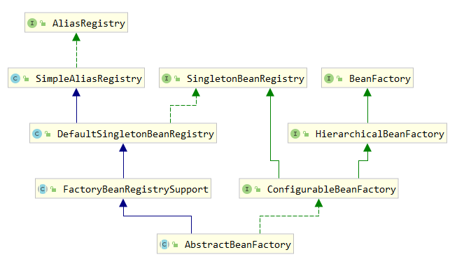

# spring DI 过程 
[[toc]]

> SpringBoot版本：spring-context-5.2.8.RELEASE.jar
> SpringBoot版本：spring-context-5.2.8.RELEASE.jar
> SpringBoot版本：spring-context-5.2.8.RELEASE.jar

## 0. 依赖注入
### 构造函数注入
```java
package x.y;

public class ThingOne {
    private String name;
    private int age;
    private BelongToFirst sex;
    public ConstructorBean1(String name, int age,BelongToFirst sex) {
        this.name = name;
        this.age = age;
        this.sex = sex;
    }
}
```
假设ThingTwo和ThingThree类不通过继承相关，则不存在潜在的歧义。因此，以下配置工作正常，您无需在 `<constructor-arg/>`元素中显式指定构造函数参数索引或类型。
```xml
<beans>
    <bean id="constructorBean1" class="learn.note.springlearn.bean.userxmlbean.ConstructorBean1">
        <constructor-arg value="wangwenlei"></constructor-arg>
        <constructor-arg value="25"></constructor-arg>
        <constructor-arg ref="belongToFirst"></constructor-arg>
    </bean>

    <bean id="belongToFirst" class="learn.note.springlearn.bean.userxmlbean.BelongToFirst">
        <property name="sex" value="男"></property>
    </bean>
</beans>
```
> 也可以使用索引或使用name：
>
> ```xml
> <beans>  
> 	<bean id="constructorBean1" class="learn.note.springlearn.bean.userxmlbean.ConstructorBean1">
>         <constructor-arg index="0" value="wangwenlei"></constructor-arg>
>         <constructor-arg name="age" value="25"></constructor-arg>
>         <constructor-arg index="2" ref="belongToFirst"></constructor-arg>
>     </bean>
>     <bean id="belongToFirst" class="learn.note.springlearn.bean.userxmlbean.BelongToFirst">
>         <property name="sex" value="男"></property>
>     </bean>
> </beans>
> ```


### setter注入
```java
public class BelongToFirst {
    private String sex;
    public void setSex(String sex) {
        this.sex = sex;
    }
}
```
xml配置
```xml
<beans>
    <bean id="belongToFirst" class="learn.note.springlearn.bean.userxmlbean.BelongToFirst">
        <property name="sex" value="男"></property>
    </bean>
</beans>
```
在命名空间上添加 `xmlns:p="http://www.springframework.org/schema/p"`
就可以使用更简洁的 XML 配置：
```xml
<beans>
    <bean id="belongToFirst" class="learn.note.springlearn.bean.userxmlbean.BelongToFirst"
        p:sex="男"
    />
</beans>
```

### 使用初体验
```java
public class Main {
    public static void main(String[] args) {
        // 你的配置文件名，放在根路径resources下
        ClassPathXmlApplicationContext context = new ClassPathXmlApplicationContext("service-learn.xml");
        // 使用getBean方法可以检索bean的实例
        final ConstructorBean1 firstXml = context.getBean("constructorBean1", ConstructorBean1.class);
        // 因为已经配置了值，取出后直接使用
        System.out.println(firstXml.getName());
        System.out.println(firstXml.getAge());
        // 试下对象里依赖另一个Bean
        System.out.println(firstXml.getSex());
    }
}
```
### 发生的时间
依赖注入有两种情况触发
1. 用户第一次调用getBean()方法时，IoC容器触发依赖注入
2. 当属性设为懒加载时，容器在解析注册Bean定义时进行预实例化

## 1. 寻找getBean()的入口
BeanFactory接口定义了SpringIoC容器的基本功能规范。BeanFactory接口中定义了几个getBean()方法，用于用户向IoC容器索取被管理的Bean的方法。
BeanFactory是接口，具体情况看他的实现AbstractBeanFactory，类图如下：



```java
@Override
public Object getBean(String name) throws BeansException {
    return doGetBean(name, null, null, false);
}

@Override
public <T> T getBean(String name, Class<T> requiredType) throws BeansException {
    return doGetBean(name, requiredType, null, false);
}

@Override
public Object getBean(String name, Object... args) throws BeansException {
    return doGetBean(name, null, args, false);
}

/**
    * Return an instance, which may be shared or independent, of the specified bean.
    * 返回指定 bean 的一个实例，该实例可以是共享的，也可以是独立的。
    * @param name the name of the bean to retrieve
    * @param requiredType the required type of the bean to retrieve
    * @param args arguments to use when creating a bean instance using explicit arguments
    * (only applied when creating a new instance as opposed to retrieving an existing one)
    * @return an instance of the bean
    * @throws BeansException if the bean could not be created
    */
public <T> T getBean(String name, @Nullable Class<T> requiredType, @Nullable Object... args)
        throws BeansException {

    return doGetBean(name, requiredType, args, false);
}
```

## 2.整体调用逻辑
干活的都do开头的，看下doGetBean
```java
/**
    * Return an instance, which may be shared or independent, of the specified bean.
    * 返回一个实例，它可以与指定的 bean 共享或独立
    * @param name  要检索的 bean 的名称
    * @param requiredType  要检索的 bean 的所需类型
    * @param args 使用显式参数创建 bean 实例时使用的参数
    * (仅在创建新实例而不是检索现有实例时应用)
    * @param typeCheckOnly 是否获取实例用于类型检查，不用于实际使用
    * @return bean 的一个实例
    * @throws BeansException 如果无法创建 bean
    */
@SuppressWarnings("unchecked")
protected <T> T doGetBean(
        String name, @Nullable Class<T> requiredType, @Nullable Object[] args, boolean typeCheckOnly)
        throws BeansException {

    // 返回 bean 名称，必要时去除工厂取消引用前缀，并将别名解析为规范名称
    String beanName = transformedBeanName(name);
    Object bean;

    // 从缓存中读取是否已经有被创建的单例模式的Bean
    Object sharedInstance = getSingleton(beanName);
    // 如果从手动注册的单例singletonObjects或earlySingletonObjects Map中找到
    if (sharedInstance != null && args == null) {
        if (logger.isTraceEnabled()) {
            // 在整个工厂内单例 bean 当前是否正在创建中 
            if (isSingletonCurrentlyInCreation(beanName)) {
                logger.trace("Returning eagerly cached instance of singleton bean '" + beanName +
                        "' that is not fully initialized yet - a consequence of a circular reference");
            }
            else {
                logger.trace("Returning cached instance of singleton bean '" + beanName + "'");
            }
        }
        // 获取 Bean 实例的对象。主要完成FactoryBean的相关处理。
        bean = getObjectForBeanInstance(sharedInstance, name, beanName, null);
    }

    else {
        // 原型 bean 当前前线程是否正在创建中（缓存中已经有原型模式的Bean)
        // 如果我们已经在创建这个 bean 实例，则失败： 我们可能在循环引用中
        if (isPrototypeCurrentlyInCreation(beanName)) {
            // 是在创建中则抛出Exception
            throw new BeanCurrentlyInCreationException(beanName);
        }

        // 检查此工厂中是否存在 bean 定义。
        BeanFactory parentBeanFactory = getParentBeanFactory();
        if (parentBeanFactory != null && !containsBeanDefinition(beanName)) {
            // Not found -> check parent.
            // 没有发现 则 检查其父
            String nameToLookup = originalBeanName(name);
            if (parentBeanFactory instanceof AbstractBeanFactory) {
                return ((AbstractBeanFactory) parentBeanFactory).doGetBean(
                        nameToLookup, requiredType, args, typeCheckOnly);
            }
            else if (args != null) {
                // Delegation to parent with explicit args.
                return (T) parentBeanFactory.getBean(nameToLookup, args);
            }
            else if (requiredType != null) {
                // No args -> delegate to standard getBean method.
                return parentBeanFactory.getBean(nameToLookup, requiredType);
            }
            else {
                return (T) parentBeanFactory.getBean(nameToLookup);
            }
        }

        if (!typeCheckOnly) {
            markBeanAsCreated(beanName);
        }

        try {
            // 根据指定Bean名称获取其父级Bean定义，主要解决Bean继承时子类和父类公共属性问题
            RootBeanDefinition mbd = getMergedLocalBeanDefinition(beanName);
            checkMergedBeanDefinition(mbd, beanName, args);

            // Guarantee initialization of beans that the current bean depends on.
            // 获取当前Bean所有依赖Bean的名称
            String[] dependsOn = mbd.getDependsOn();
            if (dependsOn != null) {
                for (String dep : dependsOn) {
                    if (isDependent(beanName, dep)) {
                        throw new BeanCreationException(mbd.getResourceDescription(), beanName,
                                "Circular depends-on relationship between '" + beanName + "' and '" + dep + "'");
                    }
                    // 把被依赖Bean注册给当前依赖的Bean
                    registerDependentBean(dep, beanName);
                    try {
                        getBean(dep);
                    }
                    catch (NoSuchBeanDefinitionException ex) {
                        throw new BeanCreationException(mbd.getResourceDescription(), beanName,
                                "'" + beanName + "' depends on missing bean '" + dep + "'", ex);
                    }
                }
            }

            // Create bean instance.
            // 创建一个单例模式的Bean的实例对象
            if (mbd.isSingleton()) {
                // 创建实例对象并注册给所依赖的对象
                sharedInstance = getSingleton(beanName, () -> {
                    try {
                        // 回调实现创建Bean实例对象
                        return createBean(beanName, mbd, args);
                    }
                    catch (BeansException ex) {
                        // Explicitly remove instance from singleton cache: It might have been put there
                        // eagerly by the creation process, to allow for circular reference resolution.
                        // Also remove any beans that received a temporary reference to the bean.
                        destroySingleton(beanName);
                        throw ex;
                    }
                });
                // 获取给定Bean的实例对象
                bean = getObjectForBeanInstance(sharedInstance, name, beanName, mbd);
            }

            else if (mbd.isPrototype()) {
                // It's a prototype -> create a new instance.
                // IoC容器创建原型模式的Bean的实例对象
                Object prototypeInstance = null;
                try {
                    beforePrototypeCreation(beanName);
                    prototypeInstance = createBean(beanName, mbd, args);
                }
                finally {
                    afterPrototypeCreation(beanName);
                }
                bean = getObjectForBeanInstance(prototypeInstance, name, beanName, mbd);
            }

            else {
                // 创建的Bean既不是单例的也不是原型模式的
                // 根据Bean定义资源中配置的方式
                String scopeName = mbd.getScope();
                if (!StringUtils.hasLength(scopeName)) {
                    throw new IllegalStateException("No scope name defined for bean ´" + beanName + "'");
                }
                Scope scope = this.scopes.get(scopeName);
                if (scope == null) {
                    throw new IllegalStateException("No Scope registered for scope name '" + scopeName + "'");
                }
                try {
                    Object scopedInstance = scope.get(beanName, () -> {
                        beforePrototypeCreation(beanName);
                        try {
                            return createBean(beanName, mbd, args);
                        }
                        finally {
                            afterPrototypeCreation(beanName);
                        }
                    });
                    bean = getObjectForBeanInstance(scopedInstance, name, beanName, mbd);
                }
                catch (IllegalStateException ex) {
                    throw new BeanCreationException(beanName,
                            "Scope '" + scopeName + "' is not active for the current thread; consider " +
                            "defining a scoped proxy for this bean if you intend to refer to it from a singleton",
                            ex);
                }
            }
        }
        catch (BeansException ex) {
            cleanupAfterBeanCreationFailure(beanName);
            throw ex;
        }
    }

    // 检查所需类型是否与实际 bean 实例的类型匹配。
    if (requiredType != null && !requiredType.isInstance(bean)) {
        try {
            T convertedBean = getTypeConverter().convertIfNecessary(bean, requiredType);
            if (convertedBean == null) {
                throw new BeanNotOfRequiredTypeException(name, requiredType, bean.getClass());
            }
            return convertedBean;
        }
        catch (TypeMismatchException ex) {
            if (logger.isTraceEnabled()) {
                logger.trace("Failed to convert bean '" + name + "' to required type '" +
                        ClassUtils.getQualifiedName(requiredType) + "'", ex);
            }
            throw new BeanNotOfRequiredTypeException(name, requiredType, bean.getClass());
        }
    }
    return (T) bean;
}

```

上面源码只定义了根据Bean定义的不同采取不同策略创建Bean实例，具体的Bean实例对象的创建过程是有实现了ObjectFactory接口的creatBean()方法完成。
具体实现类SpringBoot这里由其实现类AbstractAutowireCapableBeanFactory完成。看下源码：

```java
@Override
protected Object createBean(String beanName, RootBeanDefinition mbd, @Nullable Object[] args)
        throws BeanCreationException {

    if (logger.isTraceEnabled()) {
        logger.trace("Creating instance of bean '" + beanName + "'");
    }
    RootBeanDefinition mbdToUse = mbd;

    // Make sure bean class is actually resolved at this point, and
    // clone the bean definition in case of a dynamically resolved Class
    // which cannot be stored in the shared merged bean definition.
    // mbd是否有BeanClass 
    Class<?> resolvedClass = resolveBeanClass(mbd, beanName);
    if (resolvedClass != null && !mbd.hasBeanClass() && mbd.getBeanClassName() != null) {
        mbdToUse = new RootBeanDefinition(mbd);
        mbdToUse.setBeanClass(resolvedClass);
    }

    // 准备方法覆盖。
    try {
        mbdToUse.prepareMethodOverrides();
    }
    catch (BeanDefinitionValidationException ex) {
        throw new BeanDefinitionStoreException(mbdToUse.getResourceDescription(),
                beanName, "Validation of method overrides failed", ex);
    }

    try {
        // Give BeanPostProcessors a chance to return a proxy instead of the target bean instance.
        // 让 BeanPostProcessors 有机会返回一个代理而不是目标 bean 实例。
        // (如果Bean配置了初始化前和初始化后的处理器，则试图返回一个需要创建Bean的代理对象)
        Object bean = resolveBeforeInstantiation(beanName, mbdToUse);
        if (bean != null) {
            return bean;
        }
    }
    catch (Throwable ex) {
        throw new BeanCreationException(mbdToUse.getResourceDescription(), beanName,
                "BeanPostProcessor before instantiation of bean failed", ex);
    }

    try {
        // 创建Bean的入口
        Object beanInstance = doCreateBean(beanName, mbdToUse, args);
        if (logger.isTraceEnabled()) {
            logger.trace("Finished creating instance of bean '" + beanName + "'");
        }
        return beanInstance;
    }
    catch (BeanCreationException | ImplicitlyAppearedSingletonException ex) {
        // A previously detected exception with proper bean creation context already,
        // or illegal singleton state to be communicated up to DefaultSingletonBeanRegistry.
        throw ex;
    }
    catch (Throwable ex) {
        throw new BeanCreationException(
                mbdToUse.getResourceDescription(), beanName, "Unexpected exception during bean creation", ex);
    }
}

```

### 2.1真正创建Bean的方法
```java
// 真正创建Bean的方法
protected Object doCreateBean(String beanName, RootBeanDefinition mbd, @Nullable Object[] args)
        throws BeanCreationException {

    // 实例化Bean
    BeanWrapper instanceWrapper = null;
    if (mbd.isSingleton()) {
        // 是单例的话，从工厂 Bean 实例缓存移出这个beanName
        instanceWrapper = this.factoryBeanInstanceCache.remove(beanName);
    }
    if (instanceWrapper == null) {
        // 没得到的话，用适当的实例化策略为指定的 bean 创建一个新实例： 工厂方法、构造函数自动装配或简单实例化。
        instanceWrapper = createBeanInstance(beanName, mbd, args);
    }
    
    Object bean = instanceWrapper.getWrappedInstance();
    // 获取实例化的类型
    Class<?> beanType = instanceWrapper.getWrappedClass();
    if (beanType != NullBean.class) {
        mbd.resolvedTargetType = beanType;
    }

    // Allow post-processors to modify the merged bean definition.
    // 允许后处理器修改合并的 bean 定义。
    synchronized (mbd.postProcessingLock) {
        if (!mbd.postProcessed) {
            try {
                // 调用PostProcess后置处理器-增强器
                // 将 MergedBeanDefinitionPostProcessors 应用于指定的 bean 定义，调用它们的 postProcessMergedBeanDefinition 方法。
                applyMergedBeanDefinitionPostProcessors(mbd, beanType, beanName);
            }
            catch (Throwable ex) {
                throw new BeanCreationException(mbd.getResourceDescription(), beanName,
                        "Post-processing of merged bean definition failed", ex);
            }
            mbd.postProcessed = true;
        }
    }

    // Eagerly cache singletons to be able to resolve circular references
    // even when triggered by lifecycle interfaces like BeanFactoryAware.
    // 向容器缓存中缓存单例模式的Bean对象，以防止循环引用
    // 是单例的 是支持循环引用的 是正在初始化的 则为 true
    boolean earlySingletonExposure = (mbd.isSingleton() && this.allowCircularReferences &&
            isSingletonCurrentlyInCreation(beanName));
    if (earlySingletonExposure) {
        if (logger.isTraceEnabled()) {
            logger.trace("Eagerly caching bean '" + beanName +
                    "' to allow for resolving potential circular references");
        }
        // 这里会添加一个回调 给到 singletonFactories。尽早持有引用
        addSingletonFactory(beanName, () -> getEarlyBeanReference(beanName, mbd, bean));
    }

    // Initialize the bean instance.
    // Bean的初始化，》》》》》》》》》》》》》》》**********  依赖注入在此触发 *******《《《《《《《《《《《《《《《
    Object exposedObject = bean;
    try {
        // 将Bean实例对象封装，并且将Bean定义中的配置的属性值赋值给实例对象。
        // 这里会把所有的InstantiationAwareBeanPostProcessor都触发，肯定包括AutowiredAnnotationBeanPostProcessor啦
        populateBean(beanName, mbd, instanceWrapper);
        // 初始化Bean对象
        exposedObject = initializeBean(beanName, exposedObject, mbd);
    }
    catch (Throwable ex) {
        if (ex instanceof BeanCreationException && beanName.equals(((BeanCreationException) ex).getBeanName())) {
            throw (BeanCreationException) ex;
        }
        else {
            throw new BeanCreationException(
                    mbd.getResourceDescription(), beanName, "Initialization of bean failed", ex);
        }
    }

    if (earlySingletonExposure) {
        Object earlySingletonReference = getSingleton(beanName, false);
        if (earlySingletonReference != null) {
            if (exposedObject == bean) {
                exposedObject = earlySingletonReference;
            }
            else if (!this.allowRawInjectionDespiteWrapping && hasDependentBean(beanName)) {
                String[] dependentBeans = getDependentBeans(beanName);
                Set<String> actualDependentBeans = new LinkedHashSet<>(dependentBeans.length);
                for (String dependentBean : dependentBeans) {
                    if (!removeSingletonIfCreatedForTypeCheckOnly(dependentBean)) {
                        actualDependentBeans.add(dependentBean);
                    }
                }
                if (!actualDependentBeans.isEmpty()) {
                    throw new BeanCurrentlyInCreationException(beanName,
                            "Bean with name '" + beanName + "' has been injected into other beans [" +
                            StringUtils.collectionToCommaDelimitedString(actualDependentBeans) +
                            "] in its raw version as part of a circular reference, but has eventually been " +
                            "wrapped. This means that said other beans do not use the final version of the " +
                            "bean. This is often the result of over-eager type matching - consider using " +
                            "'getBeanNamesForType' with the 'allowEagerInit' flag turned off, for example.");
                }
            }
        }
    }

    // Register bean as disposable.
    try {
        registerDisposableBeanIfNecessary(beanName, bean, mbd);
    }
    catch (BeanDefinitionValidationException ex) {
        throw new BeanCreationException(
                mbd.getResourceDescription(), beanName, "Invalid destruction signature", ex);
    }

    return exposedObject;
}

/**
    * Create a new instance for the specified bean, using an appropriate instantiation strategy:
    * factory method, constructor autowiring, or simple instantiation.
    * @param beanName the name of the bean
    * @param mbd the bean definition for the bean
    * @param args explicit arguments to use for constructor or factory method invocation
    * @return a BeanWrapper for the new instance
    * @see #obtainFromSupplier
    * @see #instantiateUsingFactoryMethod
    * @see #autowireConstructor
    * @see #instantiateBean
    */
protected BeanWrapper createBeanInstance(String beanName, RootBeanDefinition mbd, @Nullable Object[] args) {
    // Make sure bean class is actually resolved at this point.
    // 确认Bean是可实例化的
    Class<?> beanClass = resolveBeanClass(mbd, beanName);

    if (beanClass != null && !Modifier.isPublic(beanClass.getModifiers()) && !mbd.isNonPublicAccessAllowed()) {
        throw new BeanCreationException(mbd.getResourceDescription(), beanName,
                "Bean class isn't public, and non-public access not allowed: " + beanClass.getName());
    }

    // 返回用于创建 bean 实例的回调（如果有）。
    Supplier<?> instanceSupplier = mbd.getInstanceSupplier();
    if (instanceSupplier != null) {
        // 从给定的提供者处获取一个 bean 实例
        return obtainFromSupplier(instanceSupplier, beanName);
    }

    if (mbd.getFactoryMethodName() != null) {
        return instantiateUsingFactoryMethod(beanName, mbd, args);
    }

    // Shortcut when re-creating the same bean...
    // 重新创建相同 bean 时的快捷方式
    // 是否需要解决自动装配化的变量 默认否
    boolean resolved = false;
    // 自动装配化 必要？
    boolean autowireNecessary = false;
    if (args == null) {
        synchronized (mbd.constructorArgumentLock) {
            if (mbd.resolvedConstructorOrFactoryMethod != null) {
                resolved = true;
                autowireNecessary = mbd.constructorArgumentsResolved;
            }
        }
    }
    if (resolved) {
        if (autowireNecessary) {
            // 配置了自动装配属性，使用容器的自动装配进行实例化
            // 容器的自动装配根据参数类型匹配Bean的构造方法
            return autowireConstructor(beanName, mbd, null, null);
        }
        else {
            // 使用默认的无参构造方法进行实例化
            return instantiateBean(beanName, mbd);
        }
    }

    // Candidate constructors for autowiring?
    // 使用Bean的构造方法进行实例化
    Constructor<?>[] ctors = determineConstructorsFromBeanPostProcessors(beanClass, beanName);
    if (ctors != null || mbd.getResolvedAutowireMode() == AUTOWIRE_CONSTRUCTOR ||
            mbd.hasConstructorArgumentValues() || !ObjectUtils.isEmpty(args)) {
        // 使用容器的自动装配特性，调用匹配的构造方法进行实例化
        return autowireConstructor(beanName, mbd, ctors, args);
    }

    // Preferred constructors for default construction?
    // 默认构造的首选构造函数？
    ctors = mbd.getPreferredConstructors();
    if (ctors != null) {
        return autowireConstructor(beanName, mbd, ctors, null);
    }

    // No special handling: simply use no-arg constructor.
    // 使用默认的无参构造方法进行实例化
    return instantiateBean(beanName, mbd);
}

// 默认的无参构造方法进行实例化
protected BeanWrapper instantiateBean(String beanName, RootBeanDefinition mbd) {
    try {
        Object beanInstance;
        if (System.getSecurityManager() != null) {
            beanInstance = AccessController.doPrivileged(
                    (PrivilegedAction<Object>) () -> getInstantiationStrategy().instantiate(mbd, beanName, this),
                    getAccessControlContext());
        }
        else {
            // 通过实例化策略实例化
            beanInstance = getInstantiationStrategy().instantiate(mbd, beanName, this);
        }
        // 把实例化的对象包装成 BeanWrapper 对象
        BeanWrapper bw = new BeanWrapperImpl(beanInstance);
        initBeanWrapper(bw);
        return bw;
    }
    catch (Throwable ex) {
        throw new BeanCreationException(
                mbd.getResourceDescription(), beanName, "Instantiation of bean failed", ex);
    }
}
```


### 2.2执行Bean的实例化
```java
public Object instantiate(RootBeanDefinition bd, @Nullable String beanName, BeanFactory owner) {
    // Don't override the class with CGLIB if no overrides.
    // 如果没有覆盖，请不要使用 CGLIB 覆盖该类。
    if (!bd.hasMethodOverrides()) {
        Constructor<?> constructorToUse;
        synchronized (bd.constructorArgumentLock) {
            // 获取对象的构造方法或工厂方法
            constructorToUse = (Constructor<?>) bd.resolvedConstructorOrFactoryMethod;
            // 没有构造方法或工厂方法进入判断
            if (constructorToUse == null) {
                // JDK反射机制，到要实例化的类
                final Class<?> clazz = bd.getBeanClass();
                // 判断是否是接口
                if (clazz.isInterface()) {
                    throw new BeanInstantiationException(clazz, "Specified class is an interface");
                }
                try {
                    // 安全管理器不为空
                    if (System.getSecurityManager() != null) {
                        // 回调方法，得到Bean的构造方法
                        constructorToUse = AccessController.doPrivileged(
                                (PrivilegedExceptionAction<Constructor<?>>) clazz::getDeclaredConstructor);
                    }
                    else {
                        // 直接得到Bean的构造方法
                        constructorToUse = clazz.getDeclaredConstructor();
                    }
                    // 给RootBeanDefinition 存储构造方法和工厂方法变量 赋值
                    bd.resolvedConstructorOrFactoryMethod = constructorToUse;
                }
                catch (Throwable ex) {
                    throw new BeanInstantiationException(clazz, "No default constructor found", ex);
                }
            }
        }
        return BeanUtils.instantiateClass(constructorToUse);
    }
    else {
        // Must generate CGLIB subclass.
        // 必须生成 CGLIB 子类，这里点进去直接是一个抛出异常的方法，都是他的子类可以重写此方法。下面看重写详情
        return instantiateWithMethodInjection(bd, beanName, owner);
    }
}
```


#### 2.2.1JDK 反射实例Class
```java
public static <T> T instantiateClass(Constructor<T> ctor, Object... args) throws BeanInstantiationException {
    Assert.notNull(ctor, "Constructor must not be null");
    try {
        ReflectionUtils.makeAccessible(ctor);
        // 确定是否存在 Kotlin 反射 且 是否是 Kotlin 类型
        if (KotlinDetector.isKotlinReflectPresent() && KotlinDetector.isKotlinType(ctor.getDeclaringClass())) {
            // Kotlin方式实例化
            return KotlinDelegate.instantiateClass(ctor, args);
        }
        else {
            // 获取构造方法参数类型数组
            Class<?>[] parameterTypes = ctor.getParameterTypes();
            Assert.isTrue(args.length <= parameterTypes.length, "Can't specify more arguments than constructor parameters");
            Object[] argsWithDefaultValues = new Object[args.length];
            // 处理参数
            for (int i = 0 ; i < args.length; i++) {
                // 构造函数对应位置上的参数未传入
                if (args[i] == null) {
                    Class<?> parameterType = parameterTypes[i];
                    // 根据是基本类型，初始化一个基本类型或null
                    argsWithDefaultValues[i] = (parameterType.isPrimitive() ? DEFAULT_TYPE_VALUES.get(parameterType) : null);
                }
                else {
                    // 传入的话赋值到参数数组
                    argsWithDefaultValues[i] = args[i];
                }
            }
            // 》》》》》  *** 终于真正的最终的执行实例化 *** 《《《《
            return ctor.newInstance(argsWithDefaultValues);
        }
    }
    catch (InstantiationException ex) {
        throw new BeanInstantiationException(ctor, "Is it an abstract class?", ex);
    }
    catch (IllegalAccessException ex) {
        throw new BeanInstantiationException(ctor, "Is the constructor accessible?", ex);
    }
    catch (IllegalArgumentException ex) {
        throw new BeanInstantiationException(ctor, "Illegal arguments for constructor", ex);
    }
    catch (InvocationTargetException ex) {
        throw new BeanInstantiationException(ctor, "Constructor threw exception", ex.getTargetException());
    }
}
```

#### 2.2.1 CGLib 反射实例Class
```java
@Override
protected Object instantiateWithMethodInjection(RootBeanDefinition bd, @Nullable String beanName, BeanFactory owner) {
    // 调用下面方法
    return instantiateWithMethodInjection(bd, beanName, owner, null);
}

@Override
protected Object instantiateWithMethodInjection(RootBeanDefinition bd, @Nullable String beanName, BeanFactory owner,
        @Nullable Constructor<?> ctor, Object... args) {

    // Must generate CGLIB subclass...
    // 下面看instantiate详情
    return new CglibSubclassCreator(bd, owner).instantiate(ctor, args);
}

public Object instantiate(@Nullable Constructor<?> ctor, Object... args) {
    // 使用 CGLIB 为提供的 bean 定义创建 bean 类的增强子类。
    Class<?> subclass = createEnhancedSubclass(this.beanDefinition);
    Object instance;
    if (ctor == null) {
        // 无参构造
        instance = BeanUtils.instantiateClass(subclass);
    }
    else {
        // 有参构造
        try {
            Constructor<?> enhancedSubclassConstructor = subclass.getConstructor(ctor.getParameterTypes());
            instance = enhancedSubclassConstructor.newInstance(args);
        }
        catch (Exception ex) {
            throw new BeanInstantiationException(this.beanDefinition.getBeanClass(),
                    "Failed to invoke constructor for CGLIB enhanced subclass [" + subclass.getName() + "]", ex);
        }
    }
    // SPR-10785: set callbacks directly on the instance instead of in the
    // enhanced class (via the Enhancer) in order to avoid memory leaks.
    // SPR-10785：直接在实例上设置回调，而不是在增强类（通过增强器）以避免内存泄漏。
    Factory factory = (Factory) instance;
    factory.setCallbacks(new Callback[] {NoOp.INSTANCE,
            new LookupOverrideMethodInterceptor(this.beanDefinition, this.owner),
            new ReplaceOverrideMethodInterceptor(this.beanDefinition, this.owner)});
    return instance;
}
```

### 2.3 填充属性
下面原码之前先来了解下Spring之InstantiationAwareBeanPostProcessor接口，不然看的会有点懵。

[Spring之InstantiationAwareBeanPostProcessor接口，介绍对象创建过程中用到的几个回调方法](replenish/InstantiationAwareBeanPostProcessor.md)

```java {16}
protected void populateBean(String beanName, RootBeanDefinition mbd, @Nullable BeanWrapper bw) {
    if (bw == null) {
        if (mbd.hasPropertyValues()) {
            throw new BeanCreationException(
                    mbd.getResourceDescription(), beanName, "Cannot apply property values to null instance");
        }
        else {
            // Skip property population phase for null instance.
            return;
        }
    }

    // Give any InstantiationAwareBeanPostProcessors the opportunity to modify the
    // state of the bean before properties are set. This can be used, for example,
    // to support styles of field injection.
    // 让任何 InstantiationAwareBeanPostProcessors 有机会在设置属性之前修改 bean 的状态。
    // 例如，这可以用于支持字段注入的样式。
    if (!mbd.isSynthetic() && hasInstantiationAwareBeanPostProcessors()) {
        for (BeanPostProcessor bp : getBeanPostProcessors()) {
            if (bp instanceof InstantiationAwareBeanPostProcessor) {
                InstantiationAwareBeanPostProcessor ibp = (InstantiationAwareBeanPostProcessor) bp;
                //postProcessAfterInstantiation 这个方法返回true，后面的处理器才会继续执行，但返回false，直接return了
                if (!ibp.postProcessAfterInstantiation(bw.getWrappedInstance(), beanName)) {
                    // 处理器若告知说不用继续赋值了，那就以处理器的结果为准即可
                    return;
                }
            }
        }
    }

    PropertyValues pvs = (mbd.hasPropertyValues() ? mbd.getPropertyValues() : null);

    int resolvedAutowireMode = mbd.getResolvedAutowireMode();
    if (resolvedAutowireMode == AUTOWIRE_BY_NAME || resolvedAutowireMode == AUTOWIRE_BY_TYPE) {
        MutablePropertyValues newPvs = new MutablePropertyValues(pvs);
        // Add property values based on autowire by name if applicable.
        if (resolvedAutowireMode == AUTOWIRE_BY_NAME) {
            autowireByName(beanName, mbd, bw, newPvs);
        }
        // Add property values based on autowire by type if applicable.
        if (resolvedAutowireMode == AUTOWIRE_BY_TYPE) {
            autowireByType(beanName, mbd, bw, newPvs);
        }
        pvs = newPvs;
    }

    boolean hasInstAwareBpps = hasInstantiationAwareBeanPostProcessors();
    boolean needsDepCheck = (mbd.getDependencyCheck() != AbstractBeanDefinition.DEPENDENCY_CHECK_NONE);

    PropertyDescriptor[] filteredPds = null;
    if (hasInstAwareBpps) {
        if (pvs == null) {
            pvs = mbd.getPropertyValues();
        }
        for (BeanPostProcessor bp : getBeanPostProcessors()) {
            if (bp instanceof InstantiationAwareBeanPostProcessor) {
                InstantiationAwareBeanPostProcessor ibp = (InstantiationAwareBeanPostProcessor) bp;
                // 调用 postProcessProperties方法
                PropertyValues pvsToUse = ibp.postProcessProperties(pvs, bw.getWrappedInstance(), beanName);
                // 如果返回null,调用 postProcessPropertyValues 方法。感觉这里编写目的是兼容已废弃方法
                if (pvsToUse == null) {
                    if (filteredPds == null) {
                        filteredPds = filterPropertyDescriptorsForDependencyCheck(bw, mbd.allowCaching);
                    }
                    pvsToUse = ibp.postProcessPropertyValues(pvs, filteredPds, bw.getWrappedInstance(), beanName);
                    if (pvsToUse == null) {
                        return;
                    }
                }
                pvs = pvsToUse;
            }
        }
    }
    if (needsDepCheck) {
        if (filteredPds == null) {
            filteredPds = filterPropertyDescriptorsForDependencyCheck(bw, mbd.allowCaching);
        }
        checkDependencies(beanName, mbd, filteredPds, pvs);
    }
    // 真正设置属性的方法。
    if (pvs != null) {
        applyPropertyValues(beanName, mbd, bw, pvs);
    }
}
```

### 2.4 初始化Bean对象
```java
protected Object initializeBean(String beanName, Object bean, @Nullable RootBeanDefinition mbd) {
    // 通过JDK的安全机制验证权限
    if (System.getSecurityManager() != null) {
        // 实现 PrivilegedAction 接口的匿名内部类
        AccessController.doPrivileged((PrivilegedAction<Object>) () -> {
            invokeAwareMethods(beanName, bean);
            return null;
        }, getAccessControlContext());
    }
    else {
        // 为Bean实例对象包装相关属性，如名称、类加载器、所属容器等
        invokeAwareMethods(beanName, bean);
    }

    Object wrappedBean = bean;
    if (mbd == null || !mbd.isSynthetic()) {
        // 调用 BeanPostProcessor 后置处理器的回调方法，在Bean实例初始化前做一些事情
        wrappedBean = applyBeanPostProcessorsBeforeInitialization(wrappedBean, beanName);
    }

    try {
        // 调用Bean实例化方法，这个初始化方法是在Spring Bean定义配置文件中通过init-Method属性指定的
        invokeInitMethods(beanName, wrappedBean, mbd);
    }
    catch (Throwable ex) {
        throw new BeanCreationException(
                (mbd != null ? mbd.getResourceDescription() : null),
                beanName, "Invocation of init method failed", ex);
    }
    if (mbd == null || !mbd.isSynthetic()) {
        // 调用 BeanPostProcessor 后置处理器的回调方法，在Bean实例初始化后做一些事情
        wrappedBean = applyBeanPostProcessorsAfterInitialization(wrappedBean, beanName);
    }

    return wrappedBean;
}
```

## 3.寻找使用getBean()的入口
### 3.1 SpringBoot启动时触发加载Bean
[refresh()方法中`registerBeanPostProcessors(beanFactory);`](./springboot_refreshContext.html#第11步-finishbeanfactoryinitialization-beanfactory)

### 3.2 @Autowire注解
[上面2.3填充属性小节中有一步扩展](#_2-3-填充属性)
1. 任何 InstantiationAwareBeanPostProcessors 有机会在设置属性之前修改 bean 的状态
2. 任何 InstantiationAwareBeanPostProcessors 给Bean设置属性

扩展会所有的BeanPostProcessors，其中就包括`AutowiredAnnotationBeanPostProcessor`。
`postProcessProperties()`处理面有一步`descriptor.getResolvableType()`方法使用了`getBean()`。[细节:@Autowire具体如何获取到对象](spring_autowire.md#注解autowired)


## 拓展 
```xml
<bean id="mappings"
    class="org.springframework.context.support.PropertySourcesPlaceholderConfigurer">

    <!-- typed as a java.util.Properties -->
    <property name="properties">
        <value>
            jdbc.driver.className=com.mysql.jdbc.Driver
            jdbc.url=jdbc:mysql://localhost:3306/mydb
        </value>
    </property>
</bean>
```
Spring 容器通过使用 JavaBeans机制将`<value/>`元素内的文本转换为 实例。这是一个不错的捷径，也是 Spring 团队支持使用嵌套元素而不是属性样式的少数几个地方之一。`java.util.PropertiesPropertyEditor`的`<value/>`value
