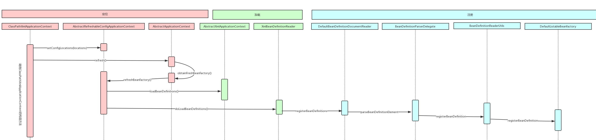
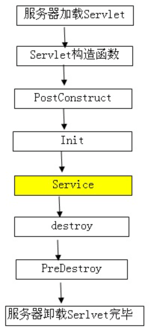
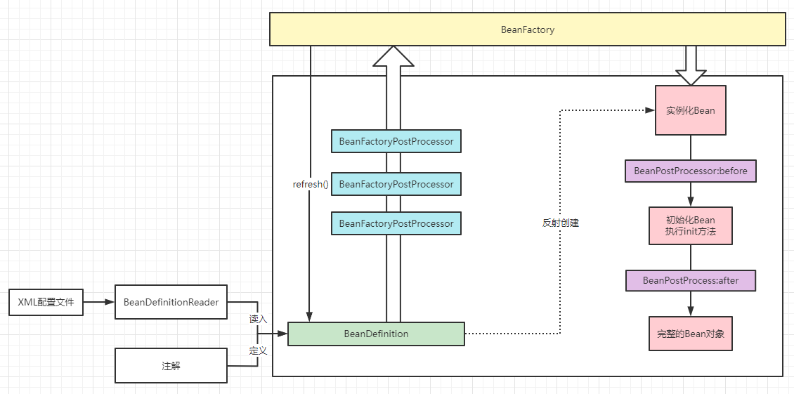

# spring IOC
[[toc]]

## 生命周期


## Spring 注册BeanDefintion时序图



## 初始化回调

1. 实现`org.springframework.beans.factory.InitializingBean`接口里的`void afterPropertiesSet() throws Exception;`方法。使Bean执行初始化工作。建议您不要使用该`InitializingBean`接口，因为它不必要的将代码耦合到Spring

   ```xml
   <bean id="exampleInitBean" class="examples.AnotherExampleBean"/>
   ```

   ```java
   public class AnotherExampleBean implements InitializingBean {
   
       @Override
       public void afterPropertiesSet() {
           // do some initialization work
       }
   }
   ```

2. 在基于 XML 的配置元数据的情况下，可以使用该`init-method`属性来指定具有无效无参数签名的方法的名称。（没有将代码耦合到 Spring）

   ```xml
   <bean id="exampleInitBean" class="examples.ExampleBean" init-method="init"/>
   ```

   ```java
   public class ExampleBean {
   
       public void init() {
           // do some initialization work
       }
   }
   ```

3. 建议使用`@PostConstruct`注解

    @PostContruct是Java自带的注解，在方法上加该注解会在项目启动的时候执行该方法，也可以理解为在spring容器初始化的时候执行该方法。从Java EE5规范开始，Servlet中增加了两个影响Servlet生命周期的注解，@PostConstruct和@PreDestroy，会在服务器加载Servlet时候运行，并且只会被服务器执行一次。PostContruct在构造函数之后，init()方法之前执行。<span style="color:red">这两个注解被用来修饰一个非静态的void（）方法</span>。

   ```java
   import org.springframework.beans.factory.annotation.Autowired;
   import org.springframework.stereotype.Component;
    
   import javax.annotation.PostConstruct;
    
   @Component
   public class MyUtils {
    
       private static MyUtils          staticInstance = new MyUtils();
    
       // 自己定义的类，注入进来
       @Autowired
       private MyMethorClassService    myService;
    
       @PostConstruct
       public void init(){
           // 想在生成对象时完成某些初始化操作,这些初始化操作又依赖于依赖注入。就无法在构造函数中实现，为此可以使用@PostConstruct注解一个方法完成初始化
           staticInstance.myService = myService;
       }
    
       public static Integer invokeBean(){
           return staticInstance.myService.add(10,20);
       }
   }
   ```

   @PostConstruct注解的方法将会在依赖注入完成后被自动调用。Constructor >> @Autowired >> @PostConstruct

> 貌似得扩展下Servlet的部分知识：
>
> 看[Servlet是什么？]()



## 销毁回调

1. 实现该`org.springframework.beans.factory.DisposableBean`接口的`void destroy() throws Exception;`可以让 bean 在包含它的容器被销毁时获得回调。（建议您不要使用，因为它不必要地将代码耦合到 Spring）

   ```xml
   <bean id="exampleInitBean" class="examples.AnotherExampleBean"/>
   ```

   ```java
   public class AnotherExampleBean implements DisposableBean {
   
       @Override
       public void destroy() {
           // do some destruction work (like releasing pooled connections)
       }
   }
   ```

2. 使用基于 XML 的配置元数据，您可以`destroy-method`使用`<bean/>`

   ```xml
   <bean id="exampleInitBean" class="examples.ExampleBean" destroy-method="cleanup"/>
   ```

   ```java
   public class ExampleBean {
   
       public void cleanup() {
           // do some destruction work (like releasing pooled connections)
       }
   }
   ```

3. 在方法上加上@PreDestroy注解

   ```java
   @PostConstruct                                 //方式1
   public void someMethod(){
       ...
   }
   public @PostConstruct void someMethod(){        //方式2
       ...  
   }
   ```

   

## 控制反转流程

Spring如何管理Bean的，如下Spring生成一个Bean的流程


`BeanPostProcessor`接口定义了您可以实现的回调方法，以提供您自己的（或覆盖容器的默认）实例化逻辑、依赖关系解析逻辑等。<span style="color:green">如果你想在 Spring 容器完成实例化、配置和初始化 bean 之后实现一些自定义逻辑，你可以插入一个或多个自定义`BeanPostProcessor`实现</span>。

> `BeanPostProcessor`实例对 bean（或对象）实例进行操作。也就是说，Spring IoC 容器实例化一个 bean 实例，然后`BeanPostProcessor` 实例完成它们的工作。
>
> `BeanPostProcessor`实例的范围是每个容器。这仅在您使用容器层次结构时才相关。如果您`BeanPostProcessor`在一个容器中定义 a，它只会对该容器中的 bean 进行后处理。换句话说，在一个容器中定义的 bean 不会被另一个容器中定义的 bean 进行后处理`BeanPostProcessor`，即使两个容器是同一层次结构的一部分。
>
> 要更改实际的 bean 定义（即定义 bean 的蓝图），您需要使用 a `BeanFactoryPostProcessor`

### `BeanPostProcessor`示例：

一个示例说明了基本用法。该示例显示了一个自定义 `BeanPostProcessor`实现，该实现调用容器创建的每个 bean 的`toString()`方法，并将结果字符串打印到系统控制台。

```java
package scripting;

import org.springframework.beans.factory.config.BeanPostProcessor;

public class InstantiationTracingBeanPostProcessor implements BeanPostProcessor {

    // simply return the instantiated bean as-is
    public Object postProcessBeforeInitialization(Object bean, String beanName) {
        return bean; // we could potentially return any object reference here...
    }

    public Object postProcessAfterInitialization(Object bean, String beanName) {
        System.out.println("Bean '" + beanName + "' created : " + bean.toString());
        return bean;
    }
}
```

```xml
<?xml version="1.0" encoding="UTF-8"?>
<beans xmlns="http://www.springframework.org/schema/beans"
    xmlns:xsi="http://www.w3.org/2001/XMLSchema-instance"
    xmlns:lang="http://www.springframework.org/schema/lang"
    xsi:schemaLocation="http://www.springframework.org/schema/beans
        https://www.springframework.org/schema/beans/spring-beans.xsd
        http://www.springframework.org/schema/lang
        https://www.springframework.org/schema/lang/spring-lang.xsd">

    <lang:groovy id="messenger"
            script-source="classpath:org/springframework/scripting/groovy/Messenger.groovy">
        <lang:property name="message" value="Fiona Apple Is Just So Dreamy."/>
    </lang:groovy>

    <!--
    when the above bean (messenger) is instantiated, this custom
    BeanPostProcessor implementation will output the fact to the system console
    -->
    <bean class="scripting.InstantiationTracingBeanPostProcessor"/>

</beans>
```


### `BeanFactoryPostProcessor`示例

 `org.springframework.beans.factory.config.BeanFactoryPostProcessor`，<span style="color:red">`BeanFactoryPostProcessor`对 bean 配置元数据进行操作</span>。也就是说，Spring IoC 容器允许`BeanFactoryPostProcessor`读取配置元数据并可能在容器实例化除实例之外的任何 bean*之前*`BeanFactoryPostProcessor`更改它。
