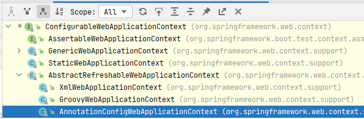

# Spring 容器的启动过程
[[toc]]

::: warning 包含

* 含父子容器，含全注解驱动，含web.xml启动
* ContextLoader源码分析
* SpringBoot容器

:::


## 0.前言

主要介绍Spring容器（父子容器）的启动过程。

当ContextLoaderListener和DispatcherServlet一起使用时, ContextLoaderListener 先创建一个根applicationContext，然后DispatcherSerlvet创建一个子applicationContext并且绑定到根applicationContext

在Spring的应用一启动会加载感兴趣的WebApplicationInitializer接口下的所有组件，这里只有上节我们自己继承`AbstractAnnotationConfigDispatcherServletInitializer`的类MyWebAppInitializer。

```java
if (!waiClass.isInterface() && !Modifier.isAbstract(waiClass.getModifiers()) &&
    WebApplicationInitializer.class.isAssignableFrom(waiClass)) {
    try {
        initializers.add((WebApplicationInitializer)
                         ReflectionUtils.accessibleConstructor(waiClass).newInstance());
    }
    catch (Throwable ex) {
        throw new ServletException("Failed to instantiate WebApplicationInitializer class", ex);
    }
}

...

// 排序后，循环调用onStartup方法，进行初始化
AnnotationAwareOrderComparator.sort(initializers);
for (WebApplicationInitializer initializer : initializers) {
    initializer.onStartup(servletContext);
}
```

接下来看看onStart()方法的实现`AbstractDispatcherServletInitializer#onStartup`：

```java
public void onStartup(ServletContext servletContext) throws ServletException {
    super.onStartup(servletContext);
    registerDispatcherServlet(servletContext);
}
// super
public void onStartup(ServletContext servletContext) throws ServletException {
    registerContextLoaderListener(servletContext);
}
```

到此我们发现我们注解驱动，和我们的web.xml驱动可以说就一样了。分两步了：

1. registerContextLoaderListener(servletContext)：注册ContextLoaderListener监听器，让它去初始化Spring父容器
2. registerDispatcherServlet(servletContext);注册DispatcherServlet，让它去初始化Spring MVC的子容器

```java
protected void registerContextLoaderListener(ServletContext servletContext) {
    // 创建父容器
    WebApplicationContext rootAppContext = createRootApplicationContext();
    if (rootAppContext != null) {
        // 创建listener 并且把已经创建好的容器放进去
        ContextLoaderListener listener = new ContextLoaderListener(rootAppContext);
        // //放入监听器需要的一些上下文，此处木有。一般都为null即可~~~。若有需要（自己定制），子类复写此方法即可
        listener.setContextInitializers(getRootApplicationContextInitializers());
        // 把监听器加入进来  这样该监听器就能监听ServletContext了，并且执行contextInitialized方法
        servletContext.addListener(listener);
    }
    else {
        logger.debug("No ContextLoaderListener registered, as " +
                     "createRootApplicationContext() did not return an application context");
    }
}
```

> 监听器是是干啥的：未来会通过这个叫监听器的东西搞些事情
>
> [发布订阅模式](springevent.md)


`createRootApplicationContext`：如下，创建了一个`AnnotationConfigWebApplicationContext`并且把配置文件注册进去了

```java
@Override
@Nullable //Spring告诉我们，这个是允许返回null的，也就是说是允许返回null的，后面会专门针对这里如果返回null会是怎么样处理说明
protected WebApplicationContext createRootApplicationContext() {
    Class<?>[] configClasses = getRootConfigClasses();
    if (!ObjectUtils.isEmpty(configClasses)) {
        AnnotationConfigWebApplicationContext context = new AnnotationConfigWebApplicationContext();
        context.register(configClasses);
        return context;
    }
    else {
        return null;
    }
}
```


继续往下走：执行`registerDispatcherServlet`

```java
protected void registerDispatcherServlet(ServletContext servletContext) {
    //Servlet名称 一般用系统默认的即可(dispatcher)，否则自己复写此方法也成
    String servletName = getServletName();
    Assert.hasLength(servletName, "getServletName() must not return null or empty");

    //创建web的子容易。创建的代码和上面差不多，也是使用调用者提供的配置文件，创建AnnotationConfigWebApplicationContext.  备注：此处不可能为null
    WebApplicationContext servletAppContext = createServletApplicationContext();
    Assert.notNull(servletAppContext, "createServletApplicationContext() must not return null");

    //创建DispatcherServlet，并且把子容器传进去了。其实就是new一个出来，最后加到容器里，就能够执行一些init初始化方法了~
    FrameworkServlet dispatcherServlet = createDispatcherServlet(servletAppContext);
    Assert.notNull(dispatcherServlet, "createDispatcherServlet(WebApplicationContext) must not return null");

    //同样的 getServletApplicationContextInitializers()一般也为null即可
    dispatcherServlet.setContextInitializers(getServletApplicationContextInitializers());

    //注册servlet到web容器里面，这样就可以接收请求了
    ServletRegistration.Dynamic registration = servletContext.addServlet(servletName, dispatcherServlet);
    if (registration == null) {
        throw new IllegalStateException("Failed to register servlet with name '" + servletName + "'. " +
                                        "Check if there is another servlet registered under the same name.");
    }

    //1表示立马执行哦，没有第一次惩罚了
    registration.setLoadOnStartup(1);
    registration.addMapping(getServletMappings());//调用者必须实现
    registration.setAsyncSupported(isAsyncSupported());//默认就是开启了支持异步的

    //处理自定义的Filter进来，一般我们Filter不这么加进来，而是自己@WebFilter，或者借助Spring，  
    // 备注：这里添加进来的Filter都仅仅只拦截过滤上面注册的dispatchServlet
    Filter[] filters = getServletFilters();
    if (!ObjectUtils.isEmpty(filters)) {
        for (Filter filter : filters) {
            registerServletFilter(servletContext, filter);
        }
    }

    //这个很清楚：调用者若相对dispatcherServlet有自己更个性化的参数设置，复写此方法即可
    customizeRegistration(registration);
}
```

然后继续执行，就来到了`ContextLoaderListener#contextInitialized`执行此监听器的初始化方法（**注意：到了此处，就和web.xml方式一模一样了**）

但是不一样的是，注解驱动的此时候，我们的`ContextLoaderListener`对象已经持有`WebApplicationContext的引用了（但是还没有放进ServletContext里面去，需要注意）`，所以会稍微有点不一样。




```java
public WebApplicationContext initWebApplicationContext(ServletContext servletContext) {
    // 虽然注解驱动传进来的监听器对象持有WebApplicationContext的引用，但是并没有放进ServletContext容器
    if (servletContext.getAttribute(WebApplicationContext.ROOT_WEB_APPLICATION_CONTEXT_ATTRIBUTE) != null) {
        throw new IllegalStateException(
            "Cannot initialize context because there is already a root application context present - " +
            "check whether you have multiple ContextLoader* definitions in your web.xml!");
    }

    servletContext.log("Initializing Spring root WebApplicationContext");
    Log logger = LogFactory.getLog(ContextLoader.class);
    if (logger.isInfoEnabled()) {
        logger.info("Root WebApplicationContext: initialization started");
    }
    long startTime = System.currentTimeMillis();

    try {
        // Store context in local instance variable, to guarantee that
        // it is available on ServletContext shutdown.
        if (this.context == null) {
            this.context = createWebApplicationContext(servletContext);
        }
        if (this.context instanceof ConfigurableWebApplicationContext) {
            ConfigurableWebApplicationContext cwac = (ConfigurableWebApplicationContext) this.context;
            if (!cwac.isActive()) {
                // The context has not yet been refreshed -> provide services such as
                // setting the parent context, setting the application context id, etc
                if (cwac.getParent() == null) {
                    // The context instance was injected without an explicit parent ->
                    // determine parent for root web application context, if any.
                    ApplicationContext parent = loadParentContext(servletContext);
                    cwac.setParent(parent);
                }
                configureAndRefreshWebApplicationContext(cwac, servletContext);
            }
        }
        servletContext.setAttribute(WebApplicationContext.ROOT_WEB_APPLICATION_CONTEXT_ATTRIBUTE, this.context);

        ClassLoader ccl = Thread.currentThread().getContextClassLoader();
        if (ccl == ContextLoader.class.getClassLoader()) {
            currentContext = this.context;
        }
        else if (ccl != null) {
            currentContextPerThread.put(ccl, this.context);
        }

        if (logger.isInfoEnabled()) {
            long elapsedTime = System.currentTimeMillis() - startTime;
            logger.info("Root WebApplicationContext initialized in " + elapsedTime + " ms");
        }

        return this.context;
    }
    catch (RuntimeException | Error ex) {
        logger.error("Context initialization failed", ex);
        servletContext.setAttribute(WebApplicationContext.ROOT_WEB_APPLICATION_CONTEXT_ATTRIBUTE, ex);
        throw ex;
    }
}
```

