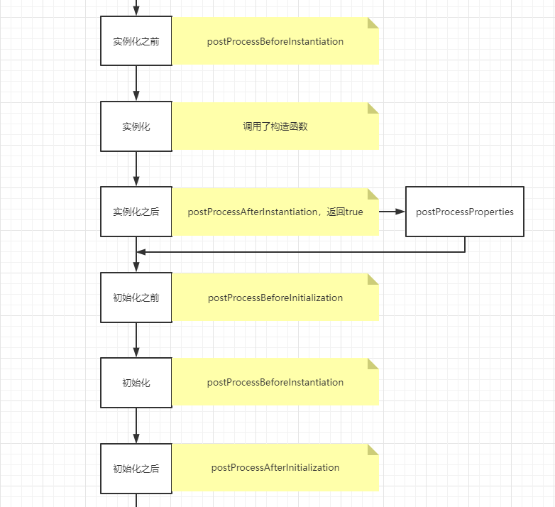

# InstantiationAwareBeanPostProcessor接口介绍
[[toc]]

InstantiationAwareBeanPostProcessor接口是BeanPostProcessor的子接口，通过接口字面意思翻译该接口的作用是感知Bean实例话的处理器。

实际上该接口的作用也是确实如此。

## 接口方法
从源码中我们可以获知的信息是该接口除了具有父接口中的两个方法以外还自己额外定义了四个方法，一个已弃用。所以该接口一共定义了6个方法。

父接口：postProcessBeforeInitialization、postProcessAfterInitialization

子接口：postProcessBeforeInstantiation、postProcessAfterInstantiation、postProcessProperties、postProcessPropertyValues
::: tip 注意不一样哦
一个是初始化(Initialization)
一个是实例化(Instantiation)
:::

|方法|描述|
|--|--|
|postProcessBeforeInitialization|在Bean的自定义初始化方法之前执行|
|postProcessAfterInitialization|在Bean的自定义初始化方法执行完成之后执行|
|postProcessBeforeInstantiation|自身方法，是最先执行的方法。它在目标对象实例化之前调用|
|postProcessAfterInstantiation|在目标对象实例化之后调用，这个时候对象已经被实例化，但是该实例的属性还未被设置，都是null|
|postProcessProperties|对属性值进行修改，如果postProcessAfterInstantiation方法返回false，该方法可能不会被调用。|
|postProcessPropertyValues|一个中间版本，对它的调用在postProcessProperties()方法返回null时发生，作用一致|

调用顺序



```java
public interface InstantiationAwareBeanPostProcessor extends BeanPostProcessor {

	/**
	 * 在目标 bean 被实例化之前应用这个 BeanPostProcessor。
     * 返回的 bean 对象可能是要使用的代理而不是目标 bean，从而有效地抑制了目标 bean 的默认实例化。
     * 由于这个时候目标对象还未实例化，所以这个返回值可以用来代替原本该生成的目标对象的实例(比如代理对象)
     * 如果该方法的返回值代替原本该生成的目标对象，后续只有postProcessAfterInitialization方法会调用，其它方法不再调用；否则按照正常的流程走
	 */
	@Nullable
	default Object postProcessBeforeInstantiation(Class<?> beanClass, String beanName) throws BeansException {
		return null;
	}

	/**
	 * 在通过构造函数或工厂方法实例化 bean 之后，但在 Spring 属性填充（来自显式属性或自动装配）发生之前执行操作。
     * 这是在给定 bean 实例上执行自定义字段注入的理想回调，就在 Spring 的自动装配开始之前。
     * 默认实现返回true 
	 */
	default boolean postProcessAfterInstantiation(Object bean, String beanName) throws BeansException {
		return true;
	}

	/**
	 * 在工厂将给定的属性值应用到给定的 bean 之前对其进行后处理，而不需要任何属性描述符。
     * 如果实现提供自定义postProcessPropertyValues实现，则应返回null （默认值），否则应返回pvs 。
     * 在此接口的未来版本中（删除了postProcessPropertyValues ），默认实现将直接返回给定的pvs 

     * 因为它的返回值是决定要不要调用postProcessPropertyValues方法的其中一个因素（因为还有一个因素是mbd.getDependencyCheck()）；
     * 如果该方法返回false,并且不需要check，那么postProcessPropertyValues就会被忽略不执行；如果返回true，postProcessPropertyValues就会被执行
	 */
	@Nullable
	default PropertyValues postProcessProperties(PropertyValues pvs, Object bean, String beanName)
			throws BeansException {

		return null;
	}

	/**
	 * 在工厂将给定的属性值应用于给定的 bean 之前对其进行后处理
     * 已弃用
	 */
	@Deprecated
	@Nullable
	default PropertyValues postProcessPropertyValues(
			PropertyValues pvs, PropertyDescriptor[] pds, Object bean, String beanName) throws BeansException {

		return pvs;
	}

}
```

## 举例说明
### 创建接口实现类
```java
package learn.note.springlearn.AOP.beanpostprocessor;

import org.springframework.beans.BeansException;
import org.springframework.beans.PropertyValues;
import org.springframework.beans.factory.config.InstantiationAwareBeanPostProcessor;

/**
 * @Author Wang WenLei
 * @Date 2022/7/16 14:54
 * @Version 1.0
 **/
public class MyBeanPostProcessor implements InstantiationAwareBeanPostProcessor {

    /**
     * BeanPostProcessor接口中的方法
     * 在Bean的自定义初始化方法之前执行
     * Bean对象已经存在了
     */
    @Override
    public Object postProcessBeforeInitialization(Object bean, String beanName) throws BeansException {
        System.out.println(">>postProcessBeforeInitialization");
        return bean;
    }

    /**
     * BeanPostProcessor接口中的方法
     * 在Bean的自定义初始化方法执行完成之后执行
     * Bean对象已经存在了
     */
    @Override
    public Object postProcessAfterInitialization(Object bean, String beanName) throws BeansException {
        System.out.println("<<postProcessAfterInitialization");
        return bean;
    }

    @Override
    public Object postProcessBeforeInstantiation(Class<?> beanClass, String beanName) throws BeansException {
        System.out.println("执行了  postProcessBeforeInstantiation --->");
        return InstantiationAwareBeanPostProcessor.super.postProcessBeforeInstantiation(beanClass, beanName);
    }

    @Override
    public boolean postProcessAfterInstantiation(Object bean, String beanName) throws BeansException {
        System.out.println("执行了  postProcessAfterInstantiation --->");
        return InstantiationAwareBeanPostProcessor.super.postProcessAfterInstantiation(bean, beanName);
    }

    @Override
    public PropertyValues postProcessProperties(PropertyValues pvs, Object bean, String beanName) throws BeansException {
        System.out.println("执行了  postProcessProperties --->");
        return InstantiationAwareBeanPostProcessor.super.postProcessProperties(pvs, bean, beanName);
    }
}
```
### 创建目标类
```java
package learn.note.springlearn.AOP.beanpostprocessor;

/**
 * @Author Wang WenLei
 * @Date 2022/7/16 15:04
 * @Version 1.0
 **/
public class Test {
    private String name;

    public Test() {
        System.out.println("Test 调用了构造函数");
    }

    public String getName() {
        return name;
    }

    public void setName(String name) {
        System.out.println("调用了setName方法");
        this.name = name;
    }

    public void start() {
        System.out.println("自定义初始化的方法....");
    }

    @Override
    public String toString() {
        return "Test{" + "name='" + name + '\'' + '}';
    }
}
```

### 配置文件注册
```java
<?xml version="1.0" encoding="UTF-8"?>
<!-- xmlns 默认命名空间：XML文档携带者beans信息-->
<!--  XML 解析器可以根据 一个 XSD 文件的内容来解析另一个 XML 文件， 判断该文件的结构是否和 XSD 文件中定义的一致-->
<!-- 前一个命名空间所对应的 XSD 文件的位置， xml parser 可以利用这个信息获取到 XSD 文件， 从而通过 XSD 文件对所有属于命名空间的元素结构进行校验-->
<!-- 添加 xmlns:p 就可以使用更简洁的xml配置spring的bean-->
<beans xmlns="http://www.springframework.org/schema/beans"
       xmlns:xsi="http://www.w3.org/2001/XMLSchema-instance"
       xmlns:p="http://www.springframework.org/schema/p"
       xsi:schemaLocation="http://www.springframework.org/schema/beans
        http://www.springframework.org/schema/beans/spring-beans.xsd">

    <bean id="test" class="learn.note.springlearn.AOP.beanpostprocessor.Test">
        <!-- name对应类里的成员变量，ref对应填充其他对象，value直接赋值-->
        <property name="name" value="wangwenlei"></property>
    </bean>
    <!-- 注册InstantiationAwareBeanPostProcessor对象 -->
    <bean class="learn.note.springlearn.AOP.beanpostprocessor.MyBeanPostProcessor"></bean>
</beans>
```
### 调用方式
```java
public static void main(String[] args) {
    ClassPathXmlApplicationContext ac = new ClassPathXmlApplicationContext("service-learn.xml");
    Test test = ac.getBean(Test.class);
    System.out.println(test.toString());
    // 关闭销毁
    ac.registerShutdownHook();
}
```
### 执行结果
```
执行了  postProcessBeforeInstantiation --->
Test 调用了构造函数
执行了  postProcessAfterInstantiation --->
执行了  postProcessProperties --->
调用了setName方法
>>postProcessBeforeInitialization
<<postProcessAfterInitialization
Test{name='wangwenlei'}
```

## 分析
### postProcessBeforeInstantiation
该方法返回的结果如果为null,后面的方法都正常执行了，但是如果该方法返回了实例对象了呢？我们来看下
```java
/**
 * InstantiationAwareBeanPostProcessor中自定义的方法 在方法实例化之前执行 Bean对象还没有
 */
@Override
public Object postProcessBeforeInstantiation(Class<?> beanClass, String beanName) throws BeansException {
    System.out.println("执行了  postProcessBeforeInstantiation --->");
    if (beanClass == Test.class) {
        Enhancer e = new Enhancer();
        e.setSuperclass(beanClass);
        e.setCallback(new MethodInterceptor() {
            @Override
            public Object intercept(Object obj, Method method, Object[] objects, MethodProxy methodProxy) throws Throwable {
                System.out.println("目标方法执行前:" + method);
                Object object = methodProxy.invokeSuper(obj, objects);
                System.out.println("目标方法执行后:" + method);
                return object;
            }
        });

        Test test = (Test)e.create();
        return test;
    }
    return null;
}
```
执行结果
```
执行了  postProcessBeforeInstantiation --->
Test 调用了构造函数
<<postProcessAfterInitialization
目标方法执行前:public java.lang.String learn.note.springlearn.AOP.beanpostprocessor.Test.toString()
目标方法执行后:public java.lang.String learn.note.springlearn.AOP.beanpostprocessor.Test.toString()
Test{name='null'}
```
通过数据结果我们发现，postProcessBeforeInstantiation方法返回实例对象后跳过了对象的初始化操作，直接执行了postProcessAfterInitialization(该方法在自定义初始化方法执行完成之后执行)跳过了postProcessAfterInstantiation

这是为什么？
看下源码：

在AbstractBeanFactory中的对InstantiationAwareBeanPostProcessor实现该接口的BeanPostProcessor 设置了标志
```java
@Override
public void addBeanPostProcessor(BeanPostProcessor beanPostProcessor) {
	Assert.notNull(beanPostProcessor, "BeanPostProcessor must not be null");
	this.beanPostProcessors.remove(beanPostProcessor);
	this.beanPostProcessors.add(beanPostProcessor);
	if (beanPostProcessor instanceof InstantiationAwareBeanPostProcessor) {
		this.hasInstantiationAwareBeanPostProcessors = true;
	}
	if (beanPostProcessor instanceof DestructionAwareBeanPostProcessor) {
		this.hasDestructionAwareBeanPostProcessors = true;
	}
}
```

在AbstractAutowireCapableBeanFactory类中有个createBean方法，

```java
protected Object createBean(String beanName, RootBeanDefinition mbd, Object[] args) throws BeanCreationException {
       // ... 省略
	try {
		// Give BeanPostProcessors a chance to return a proxy instead of the target bean instance.
		Object bean = resolveBeforeInstantiation(beanName, mbdToUse);
		if (bean != null) {
				return bean;
		}
       // ... 省略
	Object beanInstance = doCreateBean(beanName, mbdToUse, args);
	if (logger.isDebugEnabled()) {
		logger.debug("Finished creating instance of bean '" + beanName + "'");
	}
	return beanInstance;
}
```

Object bean = resolveBeforeInstantiation(beanName, mbdToUse);这行代码之后之后根据bean判断如果不为空null就直接返回了，而不执行doCreateBean()方法了，而该方法是创建Bean对象的方法。

```java
protected Object resolveBeforeInstantiation(String beanName, RootBeanDefinition mbd) {
	Object bean = null;
	// //如果beforeInstantiationResolved还没有设置或者是false（说明还没有需要在实例化前执行的操作）
	if (!Boolean.FALSE.equals(mbd.beforeInstantiationResolved)) {
		// 判断是否有注册过InstantiationAwareBeanPostProcessor类型的bean
		if (!mbd.isSynthetic() && hasInstantiationAwareBeanPostProcessors()) {
			Class<?> targetType = determineTargetType(beanName, mbd);
			if (targetType != null) {
				bean = applyBeanPostProcessorsBeforeInstantiation(targetType, beanName);
				if (bean != null) {
					// 直接执行自定义初始化完成后的方法,跳过了其他几个方法
					bean = applyBeanPostProcessorsAfterInitialization(bean, beanName);
				}
			}
		}
		mbd.beforeInstantiationResolved = (bean != null);
	}
	return bean;
}
```

```java
protected Object applyBeanPostProcessorsBeforeInstantiation(Class<?> beanClass, String beanName) {
	for (BeanPostProcessor bp : getBeanPostProcessors()) {
		if (bp instanceof InstantiationAwareBeanPostProcessor) {
			InstantiationAwareBeanPostProcessor ibp = (InstantiationAwareBeanPostProcessor) bp;
			Object result = ibp.postProcessBeforeInstantiation(beanClass, beanName); 
			//只要有一个result不为null；后面的所有 后置处理器的方法就不执行了，直接返回(所以执行顺序很重要)
			if (result != null) {
				return result;
			}
		}
	}
	return null;
}
```

```java
@Override
public Object applyBeanPostProcessorsAfterInitialization(Object existingBean, String beanName)
		throws BeansException {

	Object result = existingBean;
	for (BeanPostProcessor processor : getBeanPostProcessors()) {
		result = processor.postProcessAfterInitialization(result, beanName);
		 //如果返回null；后面的所有 后置处理器的方法就不执行，直接返回(所以执行顺序很重要)
		if (result == null) {
			return result;
		}
	}
	return result;
}
```

1. 如果postProcessBeforeInstantiation方法返回了Object是null;那么就直接返回，调用doCreateBean方法();
2. 如果postProcessBeforeInstantiation返回不为null;说明修改了bean对象;然后这个时候就立马执行postProcessAfterInitialization方法(注意这个是初始化之后的方法,也就是通过这个方法实例化了之后，直接执行初始化之后的方法;中间的实例化之后 和 初始化之前都不执行);
3. 在调用postProcessAfterInitialization方法时候如果返回null;那么就直接返回，调用doCreateBean方法();(初始化之后的方法返回了null,那就需要调用doCreateBean生成对象了)
4. 在调用postProcessAfterInitialization时返回不为null;那这个bean就直接返回给ioc容器了初始化之后的操作是这里面最后一个方法了；


### postProcessAfterInstantiation
在同一个方法
```java
protected void populateBean(String beanName, RootBeanDefinition mbd, @Nullable BeanWrapper bw) {
    // 省略...

    if (!mbd.isSynthetic() && hasInstantiationAwareBeanPostProcessors()) {
        for (BeanPostProcessor bp : getBeanPostProcessors()) {
            if (bp instanceof InstantiationAwareBeanPostProcessor) {
                InstantiationAwareBeanPostProcessor ibp = (InstantiationAwareBeanPostProcessor) bp;
                // 此处执行 postProcessAfterInstantiation方法
                if (!ibp.postProcessAfterInstantiation(bw.getWrappedInstance(), beanName)) {
                    // postProcessAfterInstantiation 这个方法返回true，后面的处理器才会继续执行，但返回false，直接return了
                    // 处理器若告知说不用继续赋值了，那就以处理器的结果为准即可
                    return;
                }
            }
        }
    }

    PropertyValues pvs = (mbd.hasPropertyValues() ? mbd.getPropertyValues() : null);

    // 省略...

    boolean hasInstAwareBpps = hasInstantiationAwareBeanPostProcessors();
    boolean needsDepCheck = (mbd.getDependencyCheck() != AbstractBeanDefinition.DEPENDENCY_CHECK_NONE);

    PropertyDescriptor[] filteredPds = null;
    if (hasInstAwareBpps) {
        if (pvs == null) {
            pvs = mbd.getPropertyValues();
        }
        for (BeanPostProcessor bp : getBeanPostProcessors()) {
            if (bp instanceof InstantiationAwareBeanPostProcessor) {
                InstantiationAwareBeanPostProcessor ibp = (InstantiationAwareBeanPostProcessor) bp;
                // 调用 postProcessProperties方法
                PropertyValues pvsToUse = ibp.postProcessProperties(pvs, bw.getWrappedInstance(), beanName);
                // 如果返回null,调用 postProcessPropertyValues 方法
                if (pvsToUse == null) {
                    if (filteredPds == null) {
                        filteredPds = filterPropertyDescriptorsForDependencyCheck(bw, mbd.allowCaching);
                    // 调用 postProcessPropertyValues方法
                    pvsToUse = ibp.postProcessPropertyValues(pvs, filteredPds, bw.getWrappedInstance(), beanName);
                    if (pvsToUse == null) {
                        return;
                    }
                }
                pvs = pvsToUse;
            }
        }
    }
    if (needsDepCheck) {
        if (filteredPds == null) {
            filteredPds = filterPropertyDescriptorsForDependencyCheck(bw, mbd.allowCaching);
        }
        checkDependencies(beanName, mbd, filteredPds, pvs);
    }
    // 真正设置属性的方法。
    if (pvs != null) {
        applyPropertyValues(beanName, mbd, bw, pvs);
    }
}
```

## 总结一下
1. InstantiationAwareBeanPostProcessor接口继承BeanPostProcessor接口，它内部提供了3个方法，再加上BeanPostProcessor接口内部的2个方法，所以实现这个接口需要实现5个方法。
2. InstantiationAwareBeanPostProcessor接口的主要作用在于目标对象的实例化过程中需要处理的事情，包括实例化对象的前后过程以及实例的属性设置
3. postProcessBeforeInstantiation方法是最先执行的方法，它在目标对象实例化之前调用，该方法的返回值类型是Object，我们可以返回任何类型的值。
由于这个时候目标对象还未实例化，所以这个返回值可以用来代替原本该生成的目标对象的实例(比如代理对象)。如果该方法的返回值代替原本该生成的目标对象，
后续只有postProcessAfterInitialization方法会调用，其它方法不再调用；否则按照正常的流程走
4. postProcessAfterInstantiation方法在目标对象实例化之后调用，这个时候对象已经被实例化，但是该实例的属性还未被设置，都是null。
因为它的返回值是决定要不要调用postProcessPropertyValues方法的其中一个因素（因为还有一个因素是mbd.getDependencyCheck()）；
如果该方法返回false,并且不需要check，那么postProcessPropertyValues就会被忽略不执行；如果返回true, postProcessPropertyValues就会被执行
5. postProcessPropertyValues方法对属性值进行修改(这个时候属性值还未被设置，但是我们可以修改原本该设置进去的属性值)。如果postProcessAfterInstantiation方法返回false，该方法可能不会被调用。可以在该方法内对属性值进行修改
父接口BeanPostProcessor的2个方法postProcessBeforeInitialization和postProcessAfterInitialization都是在目标对象被实例化之后，并且属性也被设置之后调用的

> 文章摘自 波波烤鸭 https://cloud.tencent.com/developer/article/1409273
