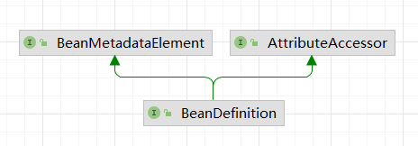
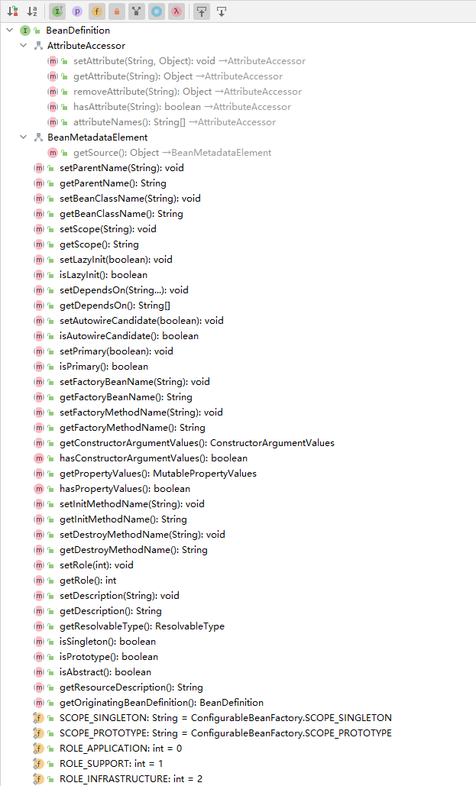

# BeanDefinition源码阅读
[[toc]]
Bean的定义

## BeanDefinition接口
作用：BeanDefinition 描述了一个 bean 实例，它具有属性值、构造函数参数值以及具体实现提供的更多信息。

这只是一个最小的接口：主要目的是允许BeanFactoryPostProcessor内省和修改属性值和其他 bean 元数据。



继承了2个接口AttributeAccessor、BeanMetadataElement。就具扩展了Attribute（属性）处理和获取Bean元数据的功能

AttributeAccessor：属性访问器，有getAttribute()、setAttribute()、removeAttribute()、hasAttribute()、attributeNames()方法

BeanMetadataElement：Bean 元数据元素，有getSource()方法。由承载配置源对象的 bean 元数据元素实现的接口。

看下方法汇总



```java
package org.springframework.beans.factory.config;

import org.springframework.beans.BeanMetadataElement;
import org.springframework.beans.MutablePropertyValues;
import org.springframework.core.AttributeAccessor;
import org.springframework.core.ResolvableType;
import org.springframework.lang.Nullable;

public interface BeanDefinition extends AttributeAccessor, BeanMetadataElement {

	/**
	 * 标准单例范围的范围标识符：“单例”  singleton
	 */
	String SCOPE_SINGLETON = ConfigurableBeanFactory.SCOPE_SINGLETON;

	/**
	 * 标准原型范围的范围标识符：“原型” prototype
	 */
	String SCOPE_PROTOTYPE = ConfigurableBeanFactory.SCOPE_PROTOTYPE;

	/**
	 * 指示BeanDefinition是应用程序主要部分的角色提示。通常对应于用户定义的 bean
	 */
	int ROLE_APPLICATION = 0;

	/**
	 * 角色提示表明BeanDefinition是一些较大配置的支持部分，
     * 通常是外部org.springframework.beans.factory.parsing.ComponentDefinition 
     * SUPPORT bean 被认为足够重要，
     * 以便在更仔细地查看特定org.springframework.beans.factory.parsing.ComponentDefinition时意识到这一点，
     * 但在查看应用程序的整体配置时则不然。
	 */
	int ROLE_SUPPORT = 1;

	/**
	 * 指示BeanDefinition提供完全后台角色且与最终用户无关的角色提示。
     * 当注册完全属于org.springframework.beans.factory.parsing.ComponentDefinition内部工作的 bean 时，会使用此提示
	 */
	int ROLE_INFRASTRUCTURE = 2;


	// Modifiable attributes

	/**
	 * 设置此 bean 定义的父定义的名称（如果有）
	 */
	void setParentName(@Nullable String parentName);

	/**
	 * 返回此 bean 定义的父定义的名称（如果有）。
	 */
	String getParentName();

	/**
	 * 指定此 bean 定义的 bean 类名。
	 */
	void setBeanClassName(@Nullable String beanClassName);

	/**
	 * 返回此 bean 定义的当前 bean 类名。
	 */
	@Nullable
	String getBeanClassName();

	/**
	 * 覆盖此 bean 的目标范围，指定一个新的范围名称
	 */
	void setScope(@Nullable String scope);

	/**
	 * 返回此 bean 的当前目标范围的名称，如果尚不知道，则返回null 。
	 */
	@Nullable
	String getScope();

	/**
	 * 设置这个 bean 是否应该被延迟初始化。
	 */
	void setLazyInit(boolean lazyInit);

	/**
	 * 返回此 bean 是否应该延迟初始化，即在启动时不急切地实例化。仅适用于单例 bean。
	 */
	boolean isLazyInit();

	/**
	 * 设置此 bean 初始化所依赖的 bean 的名称。 bean 工厂将保证这些 bean 首先被初始化。
	 */
	void setDependsOn(@Nullable String... dependsOn);

	/**
	 * 返回此 bean 所依赖的 bean 名称。
	 */
	@Nullable
	String[] getDependsOn();

	/**
	 * 设置此 bean 是否是自动装配到其他 bean 的候选对象。
     * 请注意，此标志旨在仅影响基于类型的自动装配。它不会影响按名称的显式引用，
     * 即使指定的 bean 未标记为自动装配候选者，也会得到解决。
     * 因此，如果名称匹配，按名称自动装配仍然会注入一个 bean。
	 */
	void setAutowireCandidate(boolean autowireCandidate);

	/**
	 * 返回此 bean 是否是自动装配到其他 bean 的候选对象。
	 */
	boolean isAutowireCandidate();

	/**
	 * 设置此 bean 是否是主要的自动装配候选者。
     * 如果该值对于多个匹配候选者中的一个 bean 为true ，
     * 则它将作为主要的自动装配候选者。
	 */
	void setPrimary(boolean primary);

	/**
	 * 返回此 bean 是否是主要的自动装配候选者。
	 */
	boolean isPrimary();

	/**
	 * 指定要使用的工厂 bean（如果有）。这是要调用指定工厂方法的 bean 的名称。
	 */
	void setFactoryBeanName(@Nullable String factoryBeanName);

	/**
	 * 返回工厂 bean 名称（如果有）
	 */
	@Nullable
	String getFactoryBeanName();

	/**
	 * 指定工厂方法（如果有）。将使用构造函数参数调用此方法，如果未指定参数，则不使用任何参数。
     * 该方法将在指定的工厂 bean 上调用，如果有的话，或者作为本地 bean 类的静态方法。
	 */
	void setFactoryMethodName(@Nullable String factoryMethodName);

	/**
	 * 返回一个工厂方法，如果有的话。
	 */
	@Nullable
	String getFactoryMethodName();

	/**
	 * 返回此 bean 的构造函数参数值。返回的实例可以在 bean 工厂后处理期间进行修改。
	 */
	ConstructorArgumentValues getConstructorArgumentValues();

	/**
	 * 如果有为此 bean 定义的构造函数参数值，则返回。
	 */
	default boolean hasConstructorArgumentValues() {
		return !getConstructorArgumentValues().isEmpty();
	}

	/**
	 * 返回要应用于 bean 的新实例的属性值。
	 * 返回的实例可以在 bean 工厂后处理期间进行修改。
	 */
	MutablePropertyValues getPropertyValues();

	/**
	 * 如果有为此 bean 定义的属性值，则返回。
	 */
	default boolean hasPropertyValues() {
		return !getPropertyValues().isEmpty();
	}

	/**
	 * 设置初始化方法的名称。
	 */
	void setInitMethodName(@Nullable String initMethodName);

	/**
	 * 返回初始化方法的名称。
	 */
	@Nullable
	String getInitMethodName();

	/**
	 * 设置销毁方法的名称。
	 */
	void setDestroyMethodName(@Nullable String destroyMethodName);

	/**
	 * 返回销毁方法的名称。
	 */
	@Nullable
	String getDestroyMethodName();

	/**
	 * 为此BeanDefinition设置角色提示。
	 */
	void setRole(int role);

	/**
	 * 获取此BeanDefinition的角色提示。
     * 角色提示为框架和工具提供了特定BeanDefinition的角色和重要性的指示。
	 */
	int getRole();

	/**
	 * 设置此 bean 定义的描述
	 */
	void setDescription(@Nullable String description);

	/**
	 * 返回此 bean 定义的描述。
	 */
	@Nullable
	String getDescription();

	// Read-only attributes

	/**
	 * 根据 bean 类或其他特定元数据，返回此 bean 定义的可解析类型。
	 */
	ResolvableType getResolvableType();

	/**
	 * 返回这是否是Singleton ，在所有调用中都返回一个共享实例。
	 */
	boolean isSingleton();

	/**
	 * 返回这是否是Prototype ，每次调用都返回一个独立的实例。
	 */
	boolean isPrototype();

	/**
	 * 返回此 bean 是否是“抽象的”，即不打算实例化
	 */
	boolean isAbstract();

	/**
	 * 返回此 bean 定义来自的资源的描述（为了在出现错误时显示上下文）。
	 */
	@Nullable
	String getResourceDescription();

	/**
	 * 返回原始 BeanDefinition，如果没有则返回null 。允许检索修饰的 bean 定义（如果有）。
     * 此方法返回直接发起者。遍历 originator 链以找到用户定义的原始 BeanDefinition。
	 */
	@Nullable
	BeanDefinition getOriginatingBeanDefinition();

}
```
