# LaTeX的公式篇
[[toc]]

LaTeX，始于公式，忠于优雅...

很长一段时间，数学公式的编辑都是采用MathType解决的，但是直到我遇到了LaTeX的公式便一见倾心、久久不能释怀…

## 简介

相信很多做学术的科研狗应该都是听过LaTeX排版写出来的Paper是多么的好看，颜值高。其实LaTeX简单来说就是一种文字处理软件/计算机标记语言。本文作为入门教程，不去过多解释其家族TeX、LaTeX、CTeX等等之间的伦理关系。一方面，用过Word的人都知道，排版的时间有的时候比写一篇文章的时间还长。更有甚者会遇到一些无解的玄学问题；另一方面，对于很多顶级期刊、会议对于投稿论文格式明确要求是LaTeX，拒收Word格式

LaTeX，作为广义上的计算机标记语言（比如HTML），它继承了计算机语言的光荣传统，通过一些简单的代码表达出精确的含义，具有不二义性。其文章排版的结果可以完全按照你的想法来，不仅解决了玄学问题，渲染出来的文章优美；同时，其还可以通过简单的语法写出优雅高贵的数学公式，目前Markdown也已经支持LaTeX语法的公式

## 数学模式

在LaTeX数学模式中，公式有两种形式——行内公式和行间公式。前者公式嵌入在行内，适用于简单短小的公式；后者居中独占一行，适用于比较长或重要的公式。公式中的空格均会被忽略，可以使用命令\quad或\qquad实现
在行间公式中，命令\tag{n}可以进行手动编号

**行内公式，单个$包裹**

```
f(x) = a+b 
```

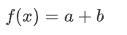

**行间公式，两个$包裹**

```
f(x) = a+b
```

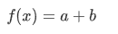


**手动编号**

```
f(x) = a - b \tag{1.1}
```

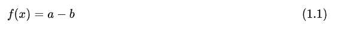

## 数学结构

### 简单运算

拉丁字母、阿拉伯数字和 +-*/= 运算符均可以直接输入获得，命令\cdot表示乘法的圆点，命令\neq表示不等号，命令\equiv表示恒等于，命令\bmod表示取模

```
x+2-3*4/6=4/y + x\cdot y
```


```
0 \neq 1 \quad x \equiv x \quad 1 = 9 \bmod 2
```

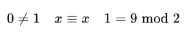


```
\ln2*\lg2*\log2
```

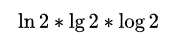

### 分子分母

二分之一的表达

```
\frac{1}{2}
```

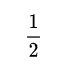

### 上下标

语法_表示下标、^表示上标，但上下标内容不止一个字符时，需用大括号括起来。单引号'表示求导

```
a_{ij}^{2} + b^3_{2}=x^{t} + y' + x''_{12}
```

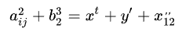

### 根号、分式

命令：\sqrt表示平方根，\sqrt[n]表示n次方根，\frac表示分式

```
\sqrt{x} + \sqrt{x^{2}+\sqrt{y}} = \sqrt[3]{k_{i}} - \frac{x}{m}
```

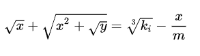

### 上下标记

命令：\overline, \underline 分别在表达式上、下方画出水平线

```
\overline{x+y} \qquad \underline{a+b}
```

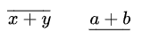

命令：\overbrace, \underbrace 分别在表达式上、下方给出一个水平的大括号

```
\overbrace{1+2+\cdots+n}^{n个} \qquad \underbrace{a+b+\cdots+z}_{26}
```

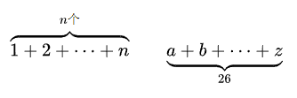

### 向量

命令：\vec表示向量，\overrightarrow表示箭头向右的向量，\overleftarrow表示箭头向左的向量

```
\vec{a} + \overrightarrow{AB} + \overleftarrow{DE}
```

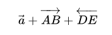

### 积分、极限、求和、乘积

命令：\int表示积分，\lim表示极限， \sum表示求和，\prod表示乘积，^、_表示上、下限

```
\lim_{x \to \infty} x^2_{22} - \int_{1}^{5}x\mathrm{d}x + \sum_{n=1}^{20} n^{2} = \prod_{j=1}^{3} y_{j}  + \lim_{x \to -2} \frac{x-2}{x}
```

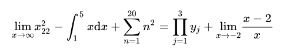

### 三圆点

命令：\ldots点位于基线上，\cdots点设置为居中，\vdots使其垂直，\ddots对角线排列

```
x_{1},x_{2},\ldots,x_{5}  \quad x_{1} + x_{2} + \cdots + x_{n}
```

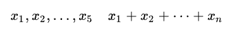

### 重音符号

常用命令如下：

```
\hat{x}
```

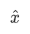

```
\bar{x}
```

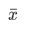

```
\tilde{x}
```

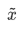

### 矩阵

其采用矩阵环境实现矩阵排列，常用的矩阵环境有matrix、bmatrix、vmatrix、pmatrix，其区别为在于外面的括号不同：

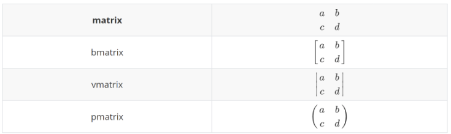

下列代码中，&用于分隔列，\用于分隔行

```
\begin{bmatrix} 1 & 2 & \cdots \\ 67 & 95 & \cdots \\ \vdots  & \vdots & \ddots \\ \end{bmatrix}
```

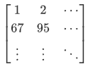

### 希腊字母

希腊字母无法直接通过美式键盘输入获得。在LaTeX中通过反斜杠\加上其字母读音实现，将读音首字母大写即可输入其大写形式，详见下表

```
\alpha^{2} + \beta = \Theta
```

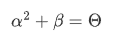

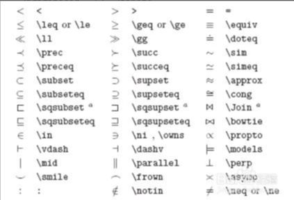


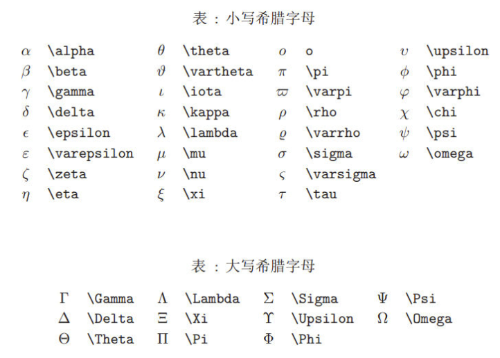

箭头的英文是“arrow”，最常见的箭头不外乎向左、右、上、下四个方向，那么它们的关键词刚好就是leftarrow,rightarrow,uparrow,downarrow。

\xleftarrow[下方公式]{上方公式}

和

\xrightarrow[下方公式]{上方公式}

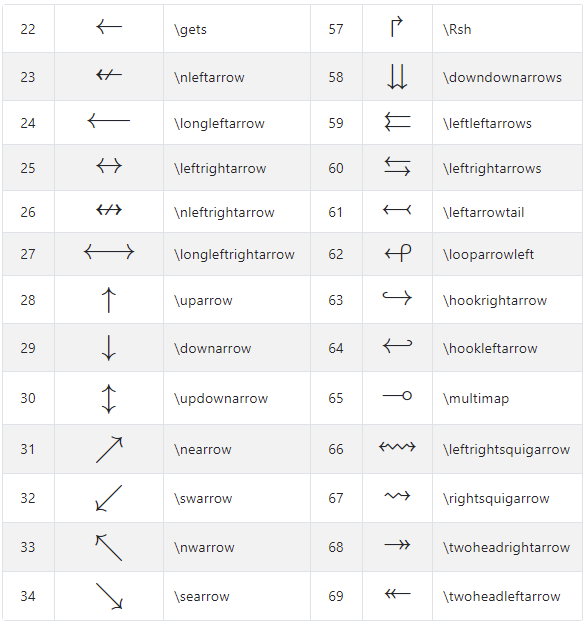

## 多行公式

### 公式组合

通过cases环境实现公式的组合，&分隔公式和条件，还可以通过\limits来让x→0位于lim的正下方而非默认在lim符号的右下方显示

```
D(x) = \begin{cases} \lim\limits_{x \to 0} \frac{a^x}{b+c}, & x<3 \\ \pi, & x=3 \\ \int_a^{3b}x_{ij}+e^2 \mathrm{d}x,& x>3 \\ \end{cases}
```

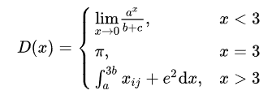

### 拆分单个公式

通过split环境实现公式拆分

```
\begin{split} \cos 2x &= \cos^2x - \sin^2x \\ &=2\cos^2x-1 \end{split}
```

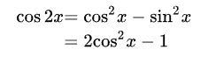

---
#工具 #LateX #md #公式

完~