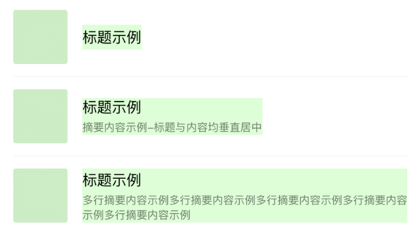
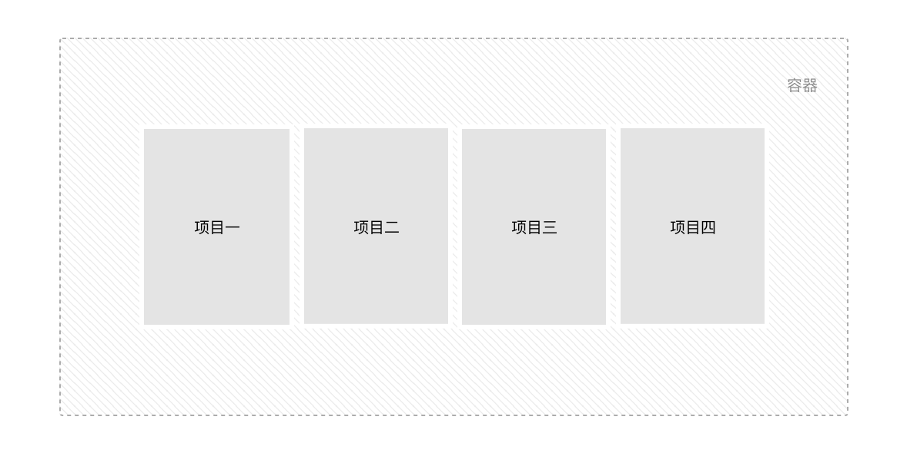
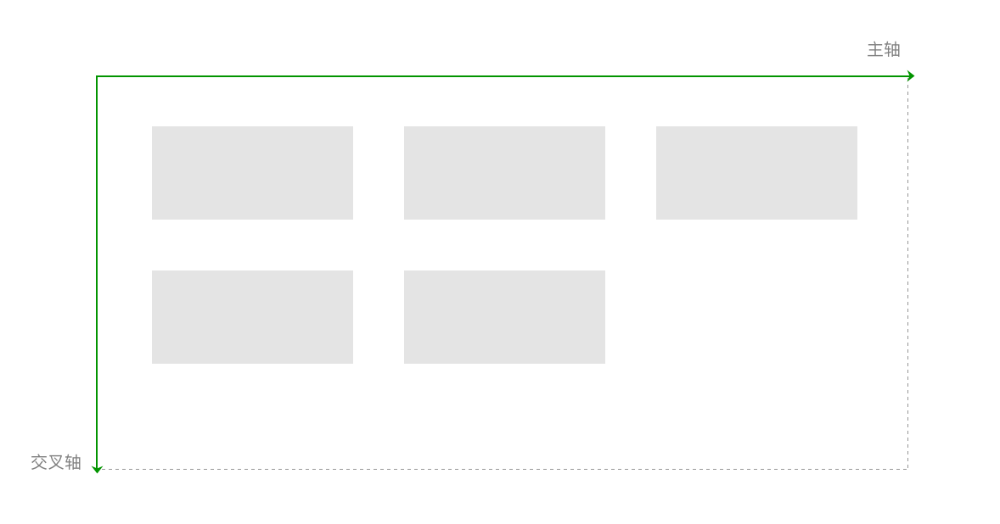
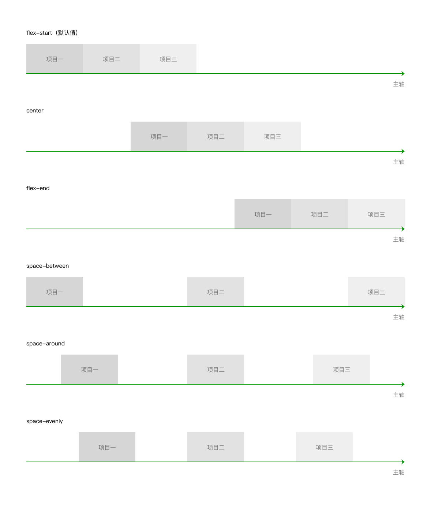
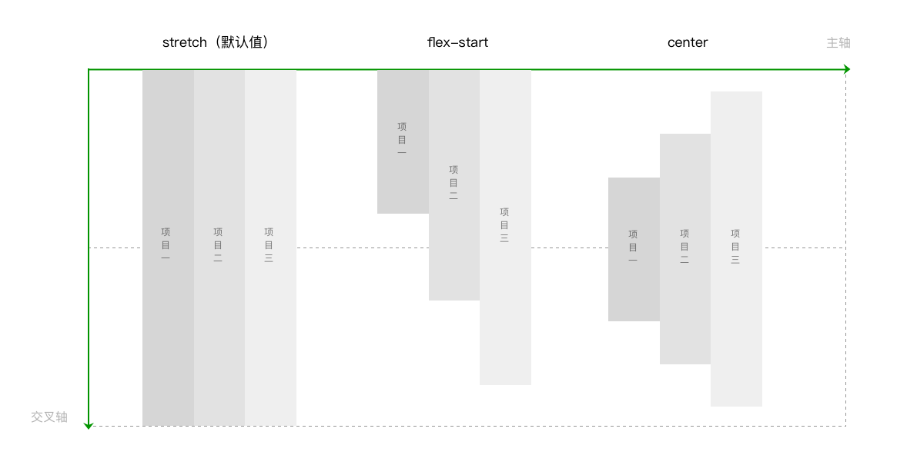
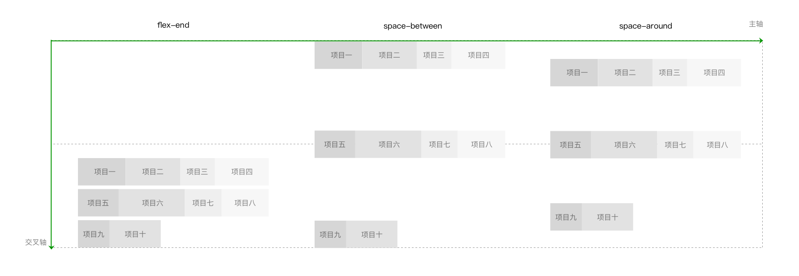
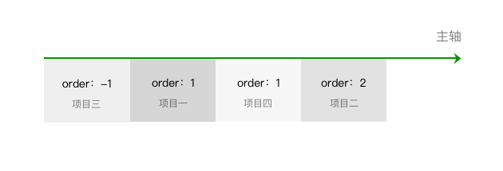

# flex布局
[[toc]]

在传统网页开发，我们用的是盒模型，通过display:inline | block | inline-block、 position、float来实现布局，
缺乏灵活性且有些适配效果难以实现。比如像下面这种常见的信息列表，要求内容高度不确定下保持垂直居中：



这种情况下，flex布局更好用。
在开始介绍flex之前，为了表述方便，我们约定以下术语：采用flex布局的元素，简称为“容器”，在代码示例中以container表示容器的类名。容器内的元素简称为“项目”，在代码示例中以item表示项目的类名。



## 基本概念

flex的概念最早是在2009年被提出，目的是提供一种更灵活的布局模型，使容器能通过改变里面项目的高宽、顺序，来对可用空间实现最佳的填充，方便适配不同大小的内容区域。

在不固定高度信息的例子中，我们只需要在容器中设置以下两个属性即可实现内容不确定下的垂直居中。

```css
.container{

  display: flex;

  flex-direction: column;

  justify-content: center;

}
```
flex不单是一个属性，它包含了一套新的属性集。属性集包括用于设置容器，和用于设置项目两部分。

设置容器的属性有：

```css
display:flex;

flex-direction:row（默认值） | row-reverse | column |column-reverse

flex-wrap:nowrap（默认值） | wrap | wrap-reverse

justify-content:flex-start（默认值） | flex-end | center |space-between | space-around | space-evenly

align-items:stretch（默认值） | center  | flex-end | baseline | flex-start

align-content:stretch（默认值） | flex-start | center |flex-end | space-between | space-around | space-evenly
```
设置项目的属性有：
```css
order:0（默认值） | <integer>

flex-shrink:1（默认值） | <number>

flex-grow:0（默认值） | <number>

flex-basis:auto（默认值） | <length>

flex:none | auto | @flex-grow @flex-shrink @flex-basis

align-self:auto（默认值） | flex-start | flex-end |center | baseline| stretch
```
在开始介绍各个属性之前，我们需要先明确一个坐标轴。默认的情况下，水平方向的是主轴（main axis），垂直方向的是交叉轴（cross axis）。


项目是在主轴上排列，排满后在交叉轴方向换行。需要注意的是，交叉轴垂直于主轴，它的方向取决于主轴方向。



接下来的例子如无特殊声明，都以默认情况下的坐标轴为例。

## 容器属性
设置容器，用于统一管理容器内项目布局，也就是管理项目的排列方式和对齐方式。

### flex-direction 属性
通过设置坐标轴，来设置项目排列方向。
```css
.container{
  flex-direction: row（默认值） | row-reverse | column | column-reverse
}
```
row（默认值）：主轴横向，方向为从左指向右。项目沿主轴排列，从左到右排列。

row-reverse：row的反方向。主轴横向，方向为从右指向左。项目沿主轴排列，从右到左排列。

column：主轴纵向，方向从上指向下。项目沿主轴排列，从上到下排列。

column-reverse：column的反方向。主轴纵向，方向从下指向上。项目沿主轴排列，从下到上排列。


### flex-wrap 属性
设置是否允许项目多行排列，以及多行排列时换行的方向。
```css
.container{
    flex-wrap: nowrap（默认值） | wrap | wrap-reverse
}
```
nowrap（默认值）：不换行。如果单行内容过多，则溢出容器。
wrap：容器单行容不下所有项目时，换行排列。
wrap-reverse：容器单行容不下所有项目时，换行排列。换行方向为wrap时的反方向。


### justify-content 属性
设置项目在主轴方向上对齐方式，以及分配项目之间及其周围多余的空间。
```css
.container{
    justify-content: flex-start（默认值） | flex-end | center | space-between | space-around| space-evenly
}
```
flex-start（默认值）：项目对齐主轴起点，项目间不留空隙。
center：项目在主轴上居中排列，项目间不留空隙。主轴上第一个项目离主轴起点距离等于最后一个项目离主轴终点距离。
flex-end：项目对齐主轴终点，项目间不留空隙。
space-between：项目间间距相等，第一个项目离主轴起点和最后一个项目离主轴终点距离为0。
space-around：与space-between相似。不同点为，第一个项目离主轴起点和最后一个项目离主轴终点距离为中间项目间间距的一半。
space-evenly：项目间间距、第一个项目离主轴起点和最后一个项目离主轴终点距离等于项目间间距。


### align-items 属性

设置项目在行中的对齐方式。
```css
.container{
    align-items:stretch（默认值） | flex-start | center | flex-end | baseline
}
```
stretch（默认值）：项目拉伸至填满行高。
flex-start：项目顶部与行起点对齐。
center：项目在行中居中对齐。
flex-end：项目底部与行终点对齐。
baseline：项目的第一行文字的基线对齐。



### align-content 属性
多行排列时，设置行在交叉轴方向上的对齐方式，以及分配行之间及其周围多余的空间。

```css
.container{
    align-content: stretch（默认值） | flex-start | center | flex-end | space-between |space-around | space-evenly
}
```
stretch（默认值）：当未设置项目尺寸，将各行中的项目拉伸至填满交叉轴。当设置了项目尺寸，项目尺寸不变，项目行拉伸至填满交叉轴。
flex-start：首行在交叉轴起点开始排列，行间不留间距。
center：行在交叉轴中点排列，行间不留间距，首行离交叉轴起点和尾行离交叉轴终点距离相等。
flex-end：尾行在交叉轴终点开始排列，行间不留间距。
space-between：行与行间距相等，首行离交叉轴起点和尾行离交叉轴终点距离为0。
space-around：行与行间距相等，首行离交叉轴起点和尾行离交叉轴终点距离为行与行间间距的一半。
space-evenly：行间间距、以及首行离交叉轴起点和尾行离交叉轴终点距离相等。



## 项目属性
设置项目，用于设置项目的尺寸、位置，以及对项目的对齐方式做特殊设置。

### order 属性
设置项目沿主轴方向上的排列顺序，数值越小，排列越靠前。属性值为整数。
```css
.item{
    order: 0（默认值） | <integer>
}
```


### flex-shrink 属性

当项目在主轴方向上溢出时，通过设置项目收缩因子来压缩项目适应容器。属性值为项目的收缩因子，属性值取非负数。
```css
.item{
    flex-shrink: 1（默认值） | <number>
}

.item1{
    width: 120px;
    flex-shrink: 2;
}

.item2{
    width: 150px;
    flex-shrink: 3;
}
.item3{// 项目3未设置flex-shrink，默认flex-shrink值为1
    width: 180px;
}
```

为了加深理解，举个例子：

一个宽度为400px的容器，里面的三个项目width分别为120px，150px，180px。分别对这项目1和项目2设置flex-shrink值为2和3。
```css
.container{
    display: flex;
    
    width: 400px; // 容器宽度为400px
}
```
在这个例子中，项目溢出 400 - (120 + 150 + 180) = -50px。计算压缩量时总权重为各个项目的宽度乘以flex-shrink的总和，这个例子压缩总权重为120 * 2 + 150 * 3+ 180 * 1 = 870。各个项目压缩空间大小为总溢出空间乘以项目宽度乘以flex-shrink除以总权重：

item1的最终宽度为：120 - 50 * 120 * 2 / 870 ≈ 106px

item2的最终宽度为：150 - 50 * 150 * 3 / 870 ≈ 124px

item3的最终宽度为：180 - 50 * 180 * 1 / 870 ≈ 169px

其中计算时候值如果为小数，则向下取整。


需要注意一点，当项目的压缩因子相加小于1时，参与计算的溢出空间不等于完整的溢出空间。在上面例子的基础上，我们改变各个项目的flex-shrink。
```css

.container{

    display: flex;
    
    width: 400px; // 容器宽度为400px

}

.item1{

    width: 120px;
    
    flex-shrink: 0.1;

}

.item2{

    width: 150px;
    
    flex-shrink: 0.2;

}

.item3{
    
    width: 180px;
    
    flex-shrink: 0.3;

}
```
总权重为：120 * 0.1 + 150 * 0.2 + 180 * 0.3 = 96。参与计算的溢出空间不再是50px，而是50 * (0.1 + 0.2 + 0.3) / 1 =30：

item1的最终宽度为：120 - 30 * 120 * 0.1 / 96 ≈ 116px

item2的最终宽度为：150 - 30 * 150 * 0.2 / 96 ≈ 140px

item3的最终宽度为：180 - 30 * 180 * 0.3 / 96 ≈ 163px

### flex-grow 属性

当项目在主轴方向上还有剩余空间时，通过设置项目扩张因子进行剩余空间的分配。属性值为项目的扩张因子，属性值取非负数。
```css
.item{

    flex-grow: 0（默认值） | <number>

}
```
为了加深理解，我们举个例子：

一个宽度为400px的容器，里面的三个项目width分别为80px，120px，140px。分别对这项目1和项目2设置flex-grow值为3和1。
```css
.container{

    display: flex;
    
    width: 400px; // 容器宽度为400px

}

.item1{

    width: 80px;
    
    flex-grow: 3;

}

.item2{

    width: 120px;
    
    flex-grow: 1;

}

.item3{// 项目3未设置flex-grow，默认flex-grow值为0

    width: 140px;

}
```
在这个例子中，容器的剩余空间为 400 - (80 + 120 + 140) = 60px。剩余空间按 60 / (3 + 1 + 0) = 15px进行分配：

item1的最终宽度为：80+ (15 * 3) = 125px

item2的最终宽度为：120 + (15 * 1) = 135px

item3的最终宽度为：140 + (15 * 0) =140px


需要注意一点，当项目的扩张因子相加小于1时，剩余空间按除以1进行分配。在上面例子的基础上，我们改变各个项目的flex-grow。
```css

.container{

    display: flex;
    
    width: 400px; // 容器宽度为400px

}

.item1{

    width: 50px;
    
    flex-grow: 0.1;

}

.item2{

    width: 80px;
    
    flex-grow: 0.3;

}

.item3{

    width: 110px;
    
    flex-grow: 0.2;

}
```
在这个例子中，容器的剩余空间为 400 - (50 + 80 + 110) = 160px。由于项目的flex-grow相加0.1 + 0.3 + 0.2 = 0.6小于1，剩余空间按 160 / 1 = 160px划分。例子中的项目宽度分别为：

item1的最终宽度为：50 + (160 * 0.1) = 66px

item2的最终宽度为：80 + (160 * 0.3) = 128px

item3的最终宽度为：110 + (160 * 0.2) = 142px

### flex-basis 属性

当容器设置flex-direction为row或row-reverse时，flex-basis和width同时存在，flex-basis优先级高于width，也就是此时flex-basis代替项目的width属性。

当容器设置flex-direction为column或column-reverse时，flex-basis和height同时存在，flex-basis优先级高于height，也就是此时flex-basis代替项目的height属性。

需要注意的是，当flex-basis和width（或height），其中一个属性值为auto时，非auto的优先级更高。
```css
.item{
    flex-basis: auto（默认值） | <number>px
}
```


### flex 属性

是flex-grow，flex-shrink，flex-basis的简写方式。值设置为none，等价于00 auto。值设置为auto，等价于1 1 auto。
```css
.item{

    flex: none | auto | @flex-grow @flex-shrink@flex-basis

}
```
### align-self 属性

设置项目在行中交叉轴方向上的对齐方式，用于覆盖容器的align-items，这么做可以对项目的对齐方式做特殊处理。默认属性值为auto，继承容器的align-items值，当容器没有设置align-items时，属性值为stretch。
```css
.item{
    align-self: auto（默认值） | flex-start | center | flex-end | baseline |stretch
}
```

---
文章摘自微信小程序
