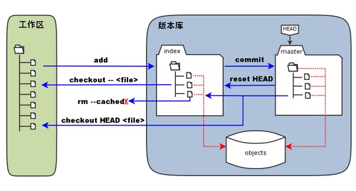
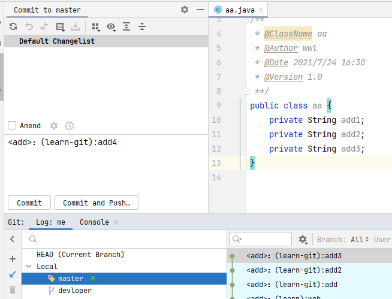
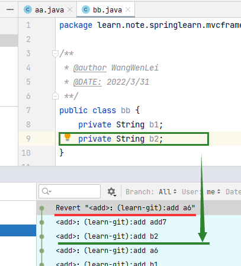

# git reset与revert的区别
[[toc]]

## 0.基础知识铺垫
搞懂了三个区域，才能更好理解这些Git命令是在干什么

* Workspace：工作区
* Index / Stage：暂存区
* Repository：仓库区（或本地仓库）（或版本库）



左侧为工作区，右侧为版本库。

在版本库中标记为 "index" 的区域是暂存区（stage/index）

标记为 "master" 的是 master 分支所代表的目录树。

直观理解下
一个文件添加改动


感觉这里IDEA自动把文件使用了 `git add .`了
文件使用`git add .`会把文件放入暂存区

## 1. reset
### reset命令的作用？
reset命令把当前分支指向另外一个位置（提交的ID版本号），并且有选择性的变动暂存区和工作区的内容。

原理是基于本地仓库的文件去覆盖暂存区或工作区的内容

当执行 git reset HEAD 命令时，暂存区的目录树会被重写，被 master 分支指向的目录树所替换，但是工作区不受影响。

### 3个


* mixed（默认）
默认的时候，只有暂存区变化
soft参数告诉Git重置HEAD到另外一个commit，但也到此为止。如果你指定--soft参数，Git将停止在那里而什么也不会根本变化。这意味着stage(index),Workspace都不会做任何变化，所有的在original HEAD和你重置到的那个commit之间的所有变更集都放在stage(index)区域中。

* hard参数
如果使用--hard参数，那么工作区也会变化

* soft
如果使用--soft参数，那么暂存区和工作区都不会变化
mixed是reset的默认参数，也就是当你不指定任何参数时的参数。它将重置HEAD到另外一个commit,并且重置index以便和HEAD相匹配，但是也到此为止。Workspace不会被更改。所有该branch上从original HEAD（commit）到你重置到的那个commit之间的所有变更将作为local modifications保存在working area中，（被标示为local modification or untracked via git status)，但是并未staged的状态，你可以重新检视然后再做修改和commit

### 分别举例子
准备几个提交的分支，如下


#### 1. soft 软的（暂存区和工作区都不会变化）
这个不会变化是保持现在没有回滚前的文件不变
先针对4的提交进行回退使用`soft`
用IDE看下使用效果


点击`Soft`，后点击`Reset`


发现，暂存区保留了回滚版本的代码，变成了待`commit`的状态（这个是跟版本库比较）


#### 2. hard 硬的（暂存区和工作区都变化）


步骤一致选择Hard



发现，任何本地的文件都回退，没有任何保留，直接到目标commit

#### 3. mixed 混合的（只有暂存区变化）


步骤一致选择Mixed


发现，暂存区保留了回滚版本的代码，变成了待`commit`的状态（这个是跟版本库比较）

#### 小结
这么看来，Mixed和Soft好像没什么区别，其实不然。他们对Index和Workspace的影响不同

> 详情查看：https://www.cnblogs.com/kidsitcn/p/4513297.html

## revert

`revert`命令撤销指定的`commit`并且新建一个`commit`，新建`comment`的内容由指定`commit`前一个提交内容保持一致

一种情况：


再一种情况：


回滚到a6，看下b2是否还在


发现b2还在，表示不会影响到别的提交




## 回滚大法
在使用Git的过程中，有时候会因为一些误操作，比如reset、rebase、merge等。特别是在Commit之后又执行了git reset --hard HEAD强制回滚本地记录以及文件到服务器版本，导致本地做的修改全部恢复到Git当前分支的服务器版本，同时自己的Commmit记录也消失了。碰到这种情况，不要慌，我们在Git上做的任何操作都只是在原来之前的操作上做修改，并且会被记录下来保存，也就是说无论你做了什么，对于Git来说都可以进行回滚操作。
你现在看git的历史记录，你可以看到两次提交：
```
$ git log
* 98abc5a (HEAD, master) more stuff added to foo
* b7057a9 initial commit
```
现在让我们来重置回第一次提交的状态：
```
$ git reset --hard b7057a9
$ git log
* b7057a9 (HEAD, master) initial commit
```

这看起来我们是丢掉了我们第二次的提交，本地的修改也消失了，没有办法找回来了。 **但是 reflog 就是用来解决这个问题的。简单的说，它会记录所有HEAD的历史，也就是说当你做 reset，checkout等操作的时候，这些操作会被记录在reflog中** 。
```
$ git reflog
b7057a9 HEAD@{0}: reset: moving to b7057a9
98abc5a HEAD@{1}: commit: more stuff added to foo
b7057a9 HEAD@{2}: commit (initial): initial commit
```
所以，我们要找回我们第二commit，只需要做如下操作：
```
$ git reset --hard 98abc5a
```

再来看一下 git 记录：
```
$ git log
* 98abc5a (HEAD, master) more stuff added to foo
* b7057a9 initial commit
```

## 合并某个分支上的单个commit
```
使用git log或查git log --graph --pretty=oneline --abbrev-commit 查看提交的信息,记住commit id.

git checkout [branch-name] 切换到合并的分支
git cherry-pick <commit-id> 把某个commit id提交合并到当前分支
```
如：
```
dd2e86 - 946992 -9143a9 - a6fd86 - 5a6057 [master]
    \
    76cada - 62ecb3 - b886a0 [feature]
```
比如，feature 分支上的commit 62ecb3 非常重要，它含有一个bug的修改，或其他人想访问的内容。无论什么原因，你现在只需要将62ecb3 合并到master，而不合并feature上的其他commits，所以我们用git cherry-pick命令来做：
```
git checkout master  先切换到master分支
git cherry-pick 62ecb3  再使用cherry-pick命令
```
现在62ecb3 就被合并到master分支，并在master中添加了commit（作为一个新的commit）。cherry-pick 和merge比较类似，如果git不能合并代码改动（比如遇到合并冲突），git需要你自己来解决冲突并手动添加commit。

## 合并某个分支上的一系列commits
在一些特性情况下，合并单个commit并不够，你需要合并一系列相连的commits。这种情况下就不要选择cherry-pick了，rebase 更适合。

```
git checkout -b <newBranchName> <to-commit-id>
创建一个新的分支，指明新分支的最后一个commit

git rebase --onto <branchName> <from-commit-id>
变基这个新的分支到最终要合并到的分支，指明从哪个特定的commit开始
```
如： 还以上面的为例，假设你需要合并feature分支的commit 76cada ~62ecb3 到master分支。 首先需要基于feature创建一个新的分支，并指明新分支的最后一个commit：
```
git checkout -b <newbranch> 62ecb3
```

然后，rebase这个新分支的commit到master（–onto master）。76cada^ 指明你想从哪个特定的commit开始。
```
git rebase --onto master 76cada^
```

得到的结果就是feature分支的commit 76cada ~62ecb3 都被合并到了master分支。

再合并的过程中可能出现冲突，出现冲突，必须手动解决后，然后 运行git rebase --continue。

```
系统对冲突的提示：
fix conflicts and then run "git rebase --continue"
use "git rebase --skip" to skip this patch
use "git rebase --abort" to check out the original branch
```
