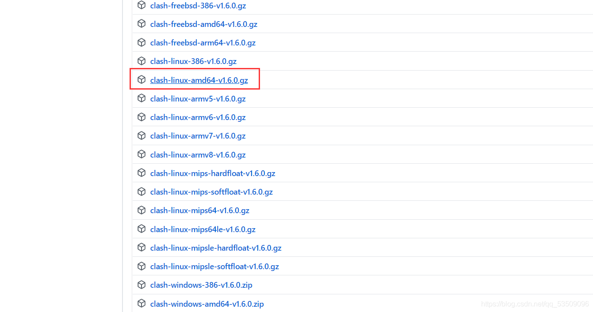
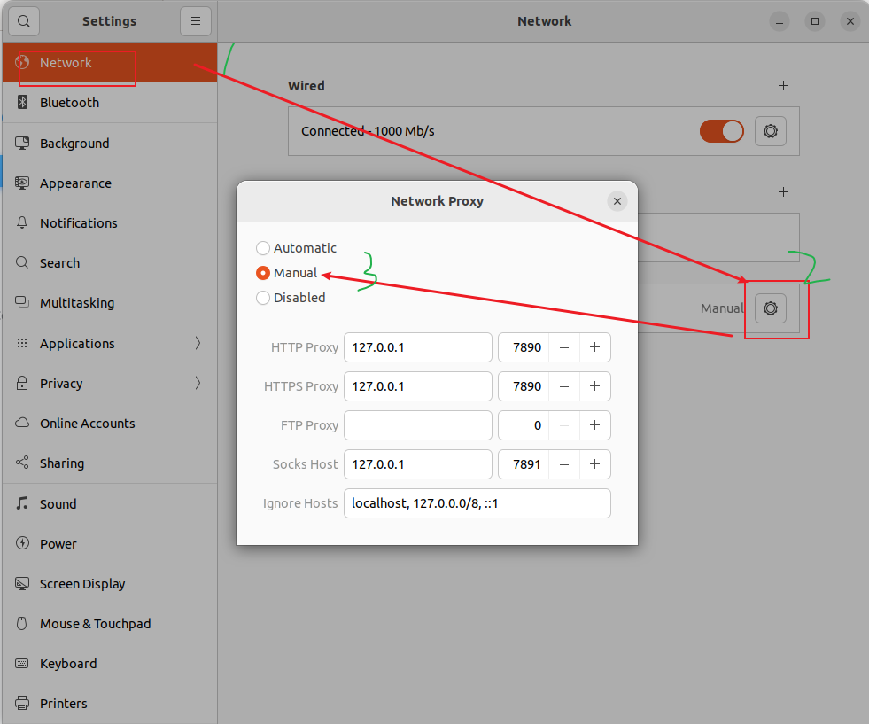

# Ubuntu虚拟机使用clash代理及其配置
[[toc]]
运行环境：Ubuntu 20.04 LTS

运行环境：Ubuntu 20.04 LTS

Ubuntu是用VMWare Work Station搭建的一个虚拟机，版本是20.04 LTS，想实现虚拟机的代理，因此搭建一个clash并配置订阅地址。

## 1、安装clash
从github上能找到各种版本的开源clash，如https://github.com/Dreamacro/clash/releases

找到对应自己版本的下载，我的是：



点击下载到本地，通过VMware Tools上传到虚拟机。

```
# 来到用户主目录下
cd ~
# 创建文件夹 clash
mkdir clash 
cd clash
# 将刚才下载的文件拷贝到 ~/clash中后，解压
rm clash-linux-amd64-v1.6.0.gz clash  # 改名是为了更方便进行后续操作
gzip -d clash
```
然后就得到了可以运行的 clash 。

## 2、clash订阅地址，配置文件
先运行一次 clash
> ./clash

第一次运行clash 会创建~/.config/clash 文件夹，以及其中的两个文件config.yaml 和 Country.mmdb，Country.mmdb不用管，

config.yaml 是我们需要修改的配置文件，默认下载下来的config.yaml没用，需要通过wget 或 curl 从订阅地址处获取配置文件

```
# 先删除原先的配置文件
rm config.yaml 

# 再下载配置文件放入位置，上传也行
wget --no-check-certificate -O ~/.config/clash/ 你的订阅地址
```

## 3、运行clash
再次运行clash
```
cd ~/clash
./clash
```

## 4、配置代理

需要对 Ubuntu 的系统代理进行配置：



一般都是这样。如果不一样的话，根据你自己的clash和配置文件中的配置进行修改就行了。

在 ./clash 进程仍在运行的情况下，打开浏览器，输入网址：http://clash.razord.top/#/proxies 可以看到 clash 的 UI 界面。

 

这样就初步大功告成了！

提醒：当关闭 clash 进程后，要再把系统代理从 Manual 调成 Automatic，否则上不了网。
