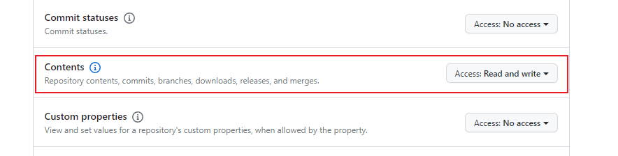

# Github+jsDelivr+PicGo 打造稳定快速、高效免费图床

网上有很多教程

[Github + jsDelivr + PicGo 打造稳定快速、高效免费图床](https://www.itbob.cn/article/006/)

[如何搭建自己的图床(GitHub版)](https://blog.csdn.net/qq_44231797/article/details/131658184)

这里说下为什么用这个方案和我遇到的坑

[下载PicGO](https://github.com/Molunerfinn/picgo/releases)

设置token时一定要设置权限

