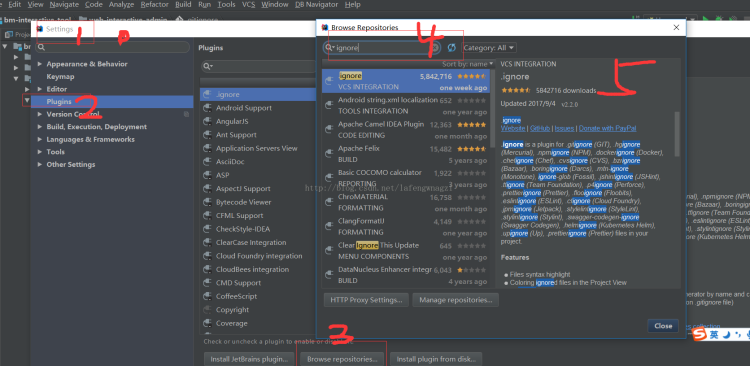
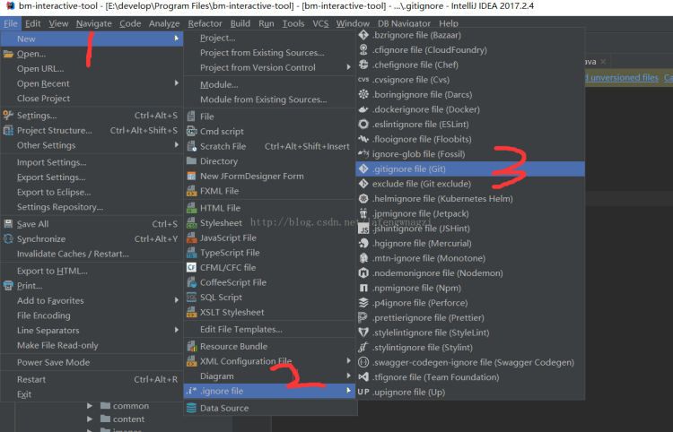
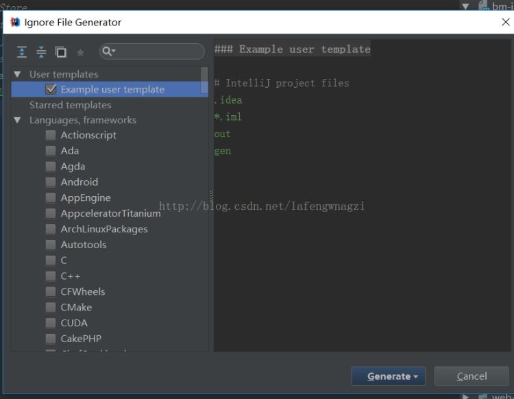
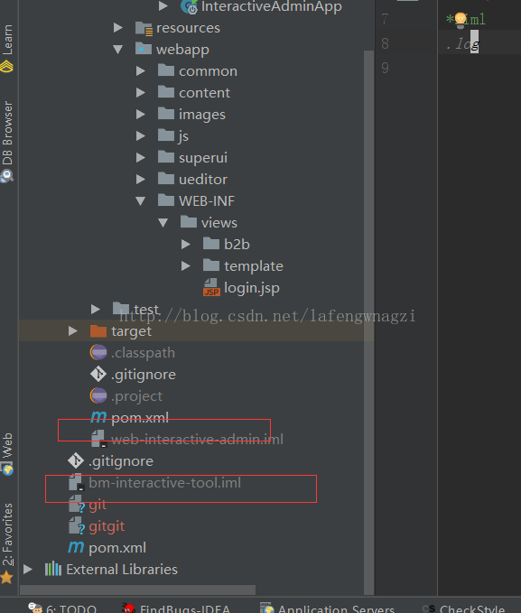

# IDEA如何优雅的添加.ignore忽略不必要提交的文件

最近有点时间然后就跑去搜了下idea热门的插件，一不小心发现了一个.ignore插件。有过在idea使用git都知道.gitignore文件，而这个插件就是能优雅的帮我们做这件事.

首先先讲下安装这个插件：

跟着这张图操作大家就明白啦，就不仔细讲解了。

怎么使用这个插件呢 

选择当前项目，new file

然后选择要忽略的文件

然后就会看到了文件置灰了。相信知道.gitignore文件都懂的

---
#IDEA #工具 
