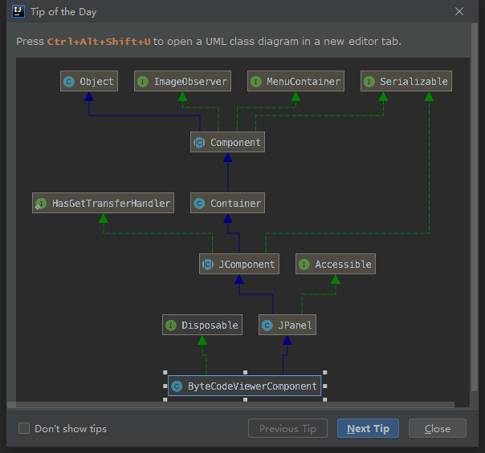
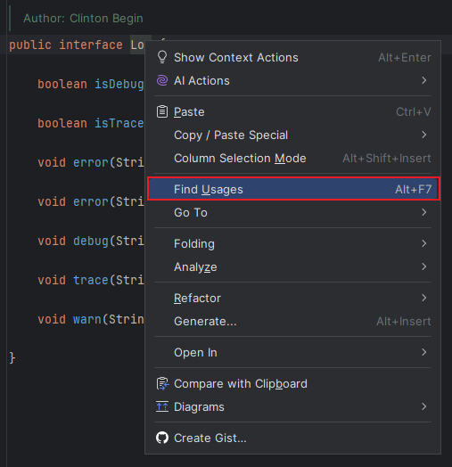
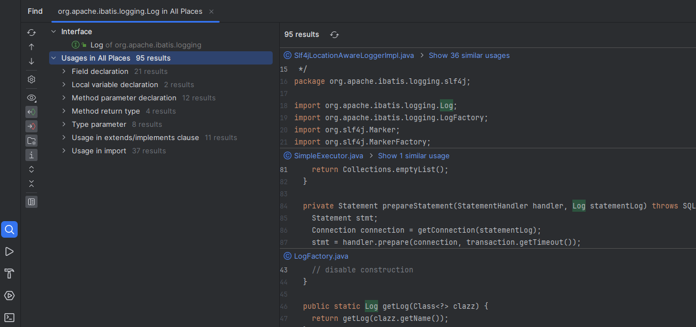
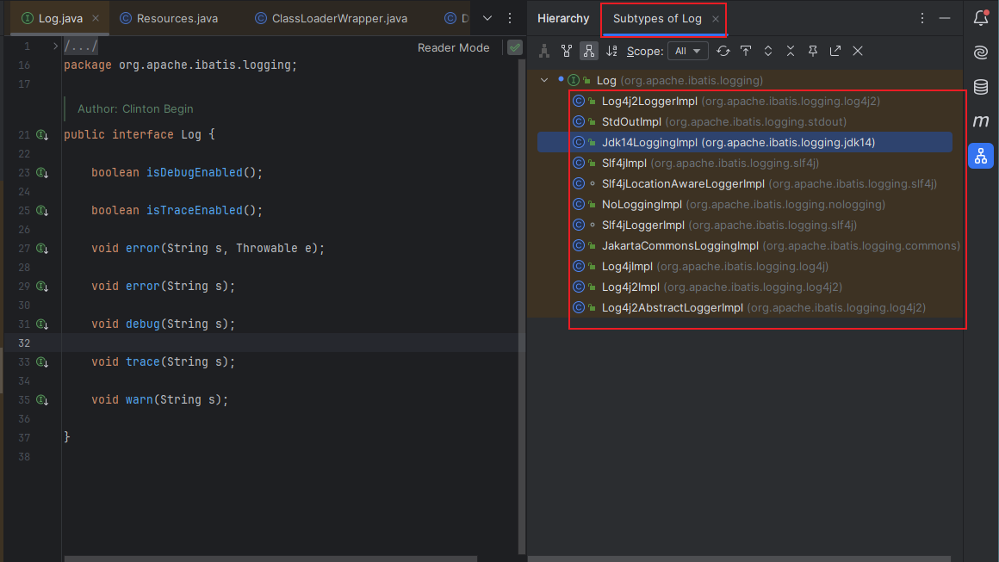

# IDEA快捷键

Press Ctrl+Alt+Shift+U to open a UML class diagram in a new editor tab.

按Ctrl+Alt+Shift+U在一个新的编辑器选项卡中打开一个UML类图。

## 发现一个接口的使用位置

对准接口类右键或者 `alt + F7`

会在下面弹出，我们可以在这里看到项目中哪些地方使用到了这个接口。

## 查看类的子类型

看看接口有哪些实现或者抽象类有哪些子类

---
#IDEA
