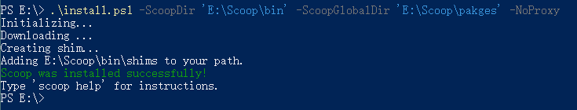
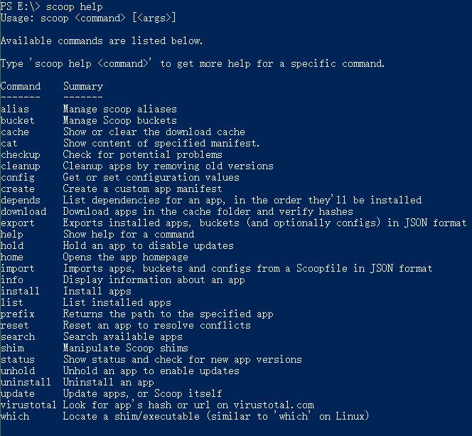
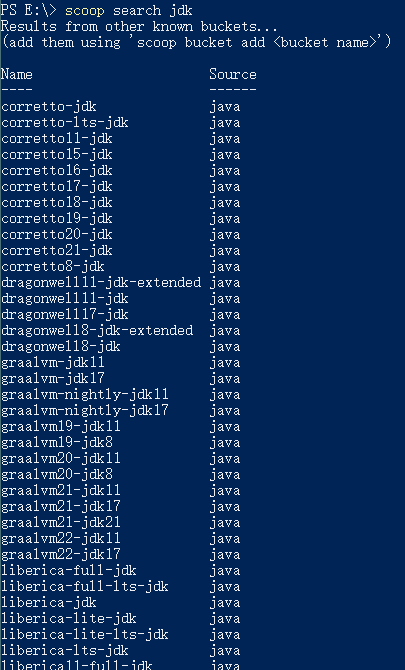
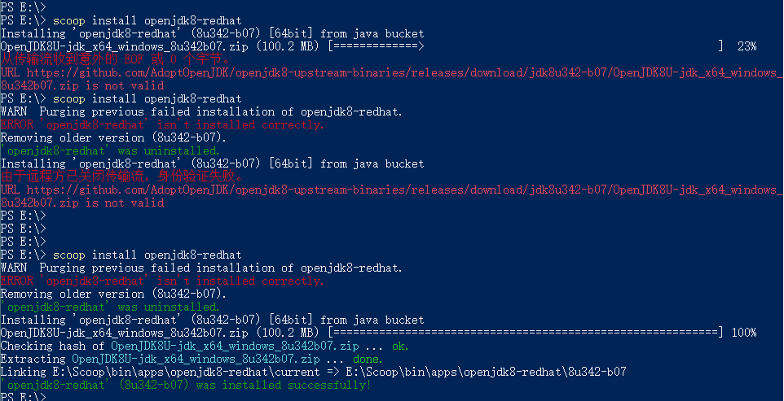
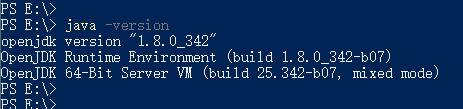

# Win 包管理器


检查


执行如下命令会在当前目录下下载一个`install.ps1`的文件


自定义安装



查看帮助命令:



搜索JDK有各个版本的JDK



搜索到后，直接安装。报没有找到
根据[Java · ScoopInstaller/Scoop Wiki (github.com)](https://github.com/ScoopInstaller/Scoop/wiki/Java) 指引添加上java的bucket


再次尝试，时间卡在快凌晨估计网络问题，前两次失败，第三次成功



查看下java版本



关于多个Java版本管理
[Home · ScoopInstaller/Java Wiki --- 首页 ·ScoopInstaller/Java 维基 (github.com)](https://github.com/ScoopInstaller/Java/wiki)

```
PS C:> scoop install oraclejdk
Installing 'oraclejdk' (12.0.2-10) [64bit]

PS C:> scoop install zulu6
Installing 'zulu6' (6.18.1.5) [64bit]

PS C:> scoop install openjdk10
Installing 'openjdk10' (10.0.1) [64bit]

PS C:> java -version
openjdk version "10.0.1" 2018-04-17
OpenJDK Runtime Environment (build 10.0.1+10)
OpenJDK 64-Bit Server VM (build 10.0.1+10, mixed mode)

PS C:> scoop reset zulu6
Resetting zulu6 (6.18.1.5).
Linking ~\scoop\apps\zulu6\current => ~\scoop\apps\zulu6\6.18.1.5

PS C:> java -version
openjdk version "1.6.0-99"
OpenJDK Runtime Environment (Zulu 6.18.1.5-win64) (build 1.6.0-99-b99)
OpenJDK 64-Bit Server VM (Zulu 6.18.1.5-win64) (build 23.77-b99, mixed mode)

PS C:> scoop reset oraclejdk

PS C:> java -version
java version "12.0.2" 2019-07-16
Java(TM) SE Runtime Environment (build 12.0.2+10)
Java HotSpot(TM) 64-Bit Server VM (build 12.0.2+10, mixed mode, sharing)
```


---

> [Scoop——也许是Windows平台最好用的软件（包）管理器 - 知乎 (zhihu.com)](https://zhuanlan.zhihu.com/p/463284082)
> 
> [Quick Start · ScoopInstaller/Scoop Wiki (github.com)](https://github.com/ScoopInstaller/Scoop/wiki/Quick-Start)

