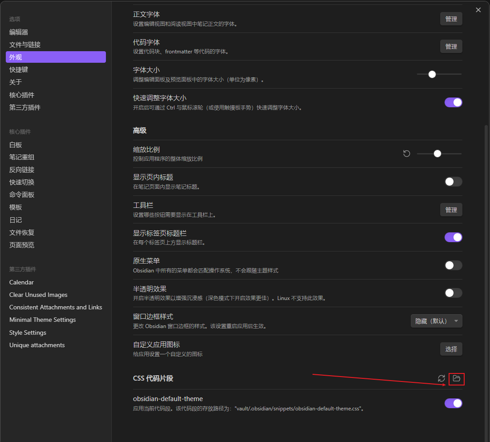
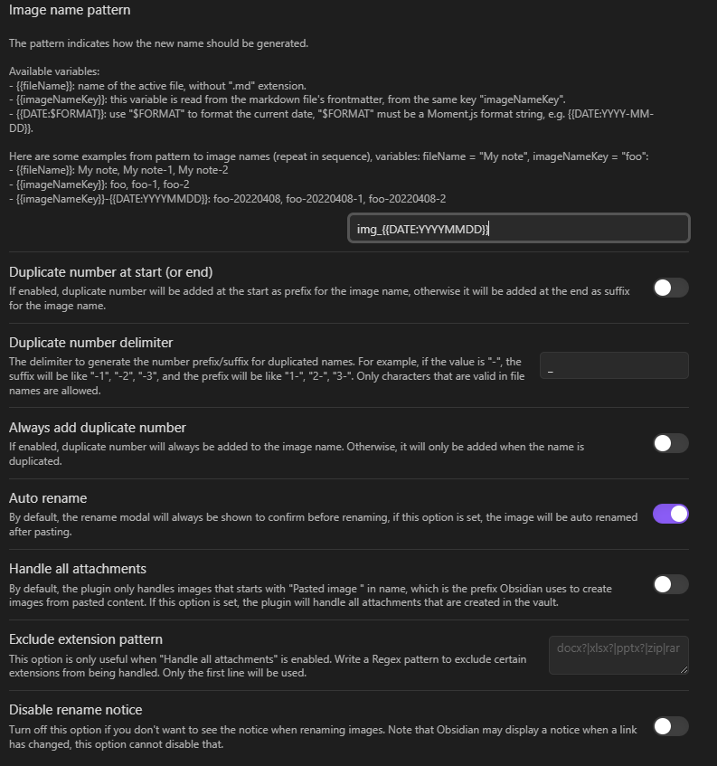
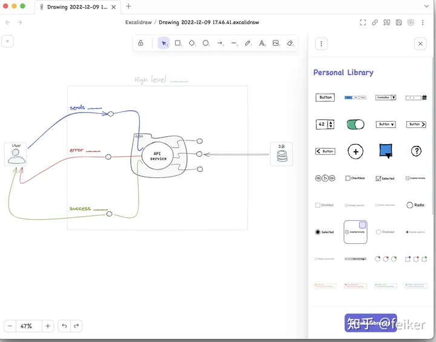

# 使用过程中遇到的问题记录
## 解决代码块不自动换行

先看这里提供了描述：[代码块如何不自动换行](https://forum-zh.obsidian.md/t/topic/3523)
看这里实际解决：[Disable word wrap for code blocks?](https://forum.obsidian.md/t/disable-word-wrap-for-code-blocks/13210)

# 不知道CSS文件应该创建在哪
点击这个按钮就打开了

# 好用的插件
Calendar 日历
Clear Unused Images 清除没有链接的图片
Unique attachments 重命名图片让格式统一  **这个放弃**
consistent attachments and links 移动文章附件跟着一起移动
mage Toolkit点击图片放大之类的功能，比较像一般的图片浏览器的工具栏。
Find and replace in selection：如字面意思，只在选中的区域进行查找和替换。
Remember Cursor Position：记住上次打开文件时光标的位置。当然了笔记是不推荐太长的，不过如果你比较习惯这样子可以试试

paste image rename:粘贴图片重新命名
设置如下：

Recent Files：增加一个最近打开文件的面板，可以自己设置显示几个。

ExcaliDraw：把 [excalidraw](https://www.zhihu.com/search?q=excalidraw&search_source=Entity&hybrid_search_source=Entity&hybrid_search_extra=%7B%22sourceType%22%3A%22answer%22%2C%22sourceId%22%3A2794628275%7D) 装进 obsidian, 画示意图流程图等非常方便，把 .[excialdraw](https://www.zhihu.com/search?q=excialdraw&search_source=Entity&hybrid_search_source=Entity&hybrid_search_extra=%7B%22sourceType%22%3A%22answer%22%2C%22sourceId%22%3A2794628275%7D) 文件以双链形式引入即可转成png图片引入，这个强推，平时做[方案设计](https://www.zhihu.com/search?q=%E6%96%B9%E6%A1%88%E8%AE%BE%E8%AE%A1&search_source=Entity&hybrid_search_source=Entity&hybrid_search_extra=%7B%22sourceType%22%3A%22answer%22%2C%22sourceId%22%3A2794628275%7D)/原型设计可以直接在 obsidian 内完成，减少工作流的上下文切换。**强推**

memos：类似于fumo的插件

Editing Toolbar这个插件提供了一个编辑工具栏，让用户可以快速执行各种编辑操作。在工具栏上可以找到常用的格式化、剪切、复制、粘贴等操作按钮。

Open In New Tab：可以在文件资源管理器中，打开所有文件到一个新的标签页中，避免了频繁切换标签页的麻烦。如果文件已经存在于现有的选项卡中，则该插件将激活该选项卡，而不是打开新的选项卡。

Cubox作为Ob的最强搭档

主题下载 Minimal，
一些插件辅助Minima调整些参数
Style Settings

## 大纲线段

https://forum-zh.obsidian.md/t/topic/24049