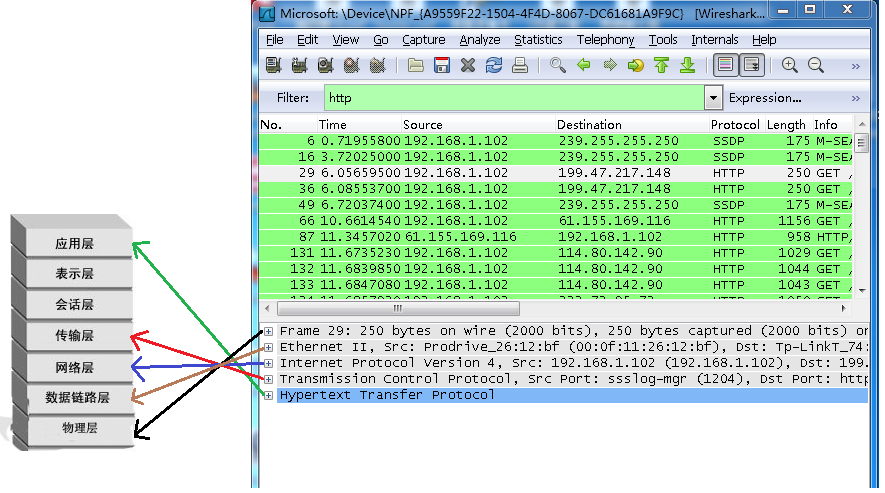

# wireshark的使用
## 条件判断

|符号|意义|
|---|---|
|`==`、`!=`|相等、不等|
|`<=`、`>=`|小于等于 、大于等于（`=`可以省略）|
|`and` 、`&&`|且，用于多个并列条件之间|

## 过滤ip

在wireshark的过滤规则框Filter中输入过滤条件。如查找目的地址为192.168.101.8的包，

```ini
ip.dst==192.168.101.8 // 目的IP
ip.src==1.1.1.1		  // 源IP
ip.addr == <ip_address>// 过滤特定IP地址
```

## 协议过滤

直接在Filter框中直接输入协议名即可，如过滤`http`、`tcp`、`udp`、`mqtt`

## 过滤端口

如过滤80端口，在Filter中输入，`tcp.port==80`，这条规则是把源端口和目的端口为80的都过滤出来。

使用`tcp.dstport==80`只过滤目的端口为80的，`tcp.srcport==80`只过滤源端口为80的包

协议名称（`tcp`，`udp`）.`port`、 `dstport`、`srcport`

```ini
tcp.port == xxx 
```

## http模式过滤

如过滤get包，`http.request.method=="GET"`,过滤post包，`http.request.method=="POST"`

## 调整显示

### 调整时间格式

`View(视图，V)` - `Time Display Format（时间显示格式，T）`- 选择`Time of Day`

或者 快捷键 `Ctrl + Alt + 2`

## 附录：TCP连接有关标志位

TCP连接:SYN ACK RST UTG PSH FIN

三次握手：发送端发送一个SYN=1，ACK=0标志的数据包给接收端，请求进行连接，这是第一次握手；  
接收端收到请求并且允许连接的话，就会发送一个SYN=1，ACK=1标志的数据包给发送端，告诉它，可以通讯了，并且让发送端发送一个确认数据包，这是第二次握手；  
最后，发送端发送一个SYN=0，ACK=1的数据包给接收端，告诉它连接已被确认，这就是第三次握手。之后，一个TCP连接建立，开始通讯。

### SYN：同步标志

同步序列编号(Synchronize Sequence Numbers)栏有效。该标志仅在三次握手建立TCP连接时有效。它提示TCP连接的服务端检查序列编号，该序列编号为TCP连接初始端(一般是客户端)的初始序列编号。  
在这里，可以把 TCP序列编号看作是一个范围从0到4，294，967，295的32位计数器。通过TCP连接交换的数据中每一个字节都经过序列编号。  
在TCP报头中的序列编号栏包括了TCP分段中第一个字节的序列编号。

### ACK：确认标志

确认编号(Acknowledgement Number)栏有效。大多数情况下该标志位是置位的。TCP报头内的确认编号栏内包含的确认编号(w+1，Figure-1)为下一个预期的序列编号，同时提示远端系统已经成功接收所有数据。

### RST：复位标志

复位标志有效。用于复位相应的TCP连接。

### URG：紧急标志

紧急(The urgent pointer) 标志有效。紧急标志置位，

### PSH：推标志

该标志置位时，接收端不将该数据进行队列处理，而是尽可能快将数据转由应用处理。在处理 telnet 或 rlogin 等交互模式的连接时，该标志总是置位的。

### FIN：结束标志

带有该标志置位的数据包用来结束一个TCP回话，但对应端口仍处于开放状态，准备接收后续数据。

TCP的几个状态对于我们分析所起的作用。在TCP层，有个FLAGS字段，这个字段有以下几个标识：SYN, FIN, ACK, PSH, RST, URG.其中，对于我们日常的分析有用的就是前面的五个字段。它们的含义是：SYN表示建立连接，FIN表示关闭连接，ACK表示响应，PSH表示有 DATA数据传输，RST表示连接重置。  
其中，ACK是可能与SYN，FIN等同时使用的，比如SYN和ACK可能同时为1，它表示的就是建立连接之后的响应，如果只是单个的一个SYN，它表示的只是建立连接。  
TCP的几次握手就是通过这样的ACK表现出来的。但SYN与FIN是不会同时为1的，因为前者表示的是建立连接，而后者表示的是断开连接。  
RST一般是在FIN之后才会出现为1的情况，表示的是连接重置。一般地，当出现FIN包或RST包时，我们便认为客户端与服务器端断开了连接；  
而当出现SYN和SYN＋ACK包时，我们认为客户端与服务器建立了一个连接。  
PSH为1的情况，一般只出现在DATA内容不为0的包中，也就是说PSH为1表示的是有真正的TCP数据包内容被传递。TCP的连接建立和连接关闭，都是通过请求－响应的模式完成的。

## 页面简介


Display Filter(显示过滤器)， 用于设置过滤条件进行数据包列表过滤。菜单路径：Analyze –> Display Filters。
Packet List Pane(数据包列表)， 显示捕获到的数据包，每个数据包包含编号，时间戳，源地址，目标地址，协议，长度，以及数据包信息。 不同协议的数据包使用了不同的颜色区分显示。
Packet Details Pane(数据包详细信息), 在数据包列表中选择指定数据包，在数据包详细信息中会显示数据包的所有详细信息内容。数据包详细信息面板是最重要的，用来查看协议中的每一个字段。各行信息分别为

（1）Frame: 物理层的数据帧概况
（2）Ethernet II: 数据链路层以太网帧头部信息
（3）Internet Protocol Version 4: 互联网层IP包头部信息
（4）Transmission Control Protocol: 传输层T的数据段头部信息，此处是TCP
（5）Hypertext Transfer Protocol: 应用层的信息，此处是HTTP协议



wireshark捕获到的TCP包中的每个字段


## 配置文件


可以设置一组特定的列以及着色、
规则和过滤器仅适用于该协议，或者正在查看配置IP或TLS或快速得到我想要的不同东西
解剖器的功能

创建一个自己习惯的配置文件

帧编号、时间、源和目标IP地址、协议长度和信息

### 设置布局
进入编辑找到首选项


从首选项中找到外观->布局


## 导航栏作用
看下导航栏按钮功能


> [wireshark抓包教程详解[通俗易懂]](https://cloud.tencent.com/developer/article/2133841)
