# UC1152无线数据传输终端与烽火三色灯与LoRaWan

## 概述

智能监控系统中，在设备发现发现告警（火情、水侵等）情况下需要及时提醒监控室内工作人员，以消息告警监控人员有时无法第一时间看到消息。因此需要使用报警设备（这里使用烽火三色灯）进行直观的提醒，针对这个需求做如下方案。
整体基于LoRaWAN进行组网，使用烟雾告警设备、水侵设备进行现场情况的检测。如果发现火情、水情第一时间进行告警，同时将消息推送给LoEaWAN网关，网关需要把消息下达给UC1152无线数据传输终端，触发设备中的继电器置为高电平，形成通路。这个高电平通路链接烽火三色灯的告警红灯和告警蜂鸣。以此达到直观告警效果。

## 设备简介

NC1152
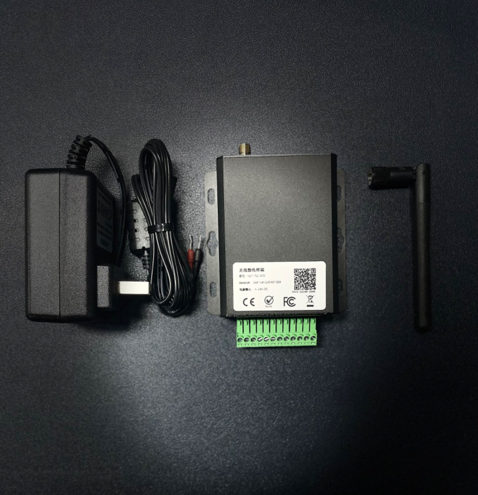

LoRaWAN
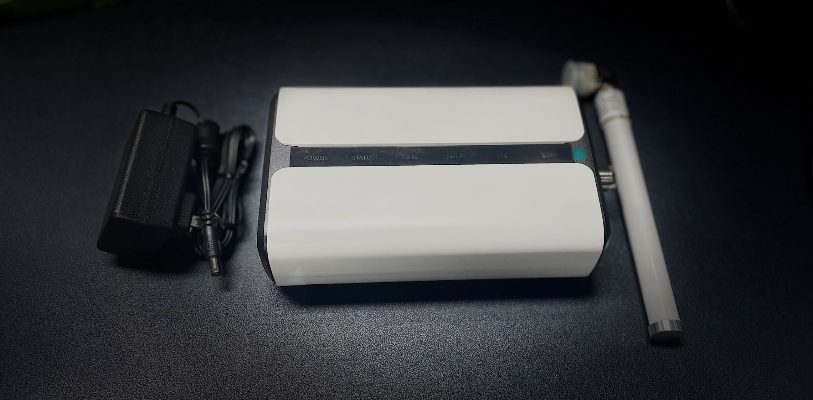

烽火三色灯
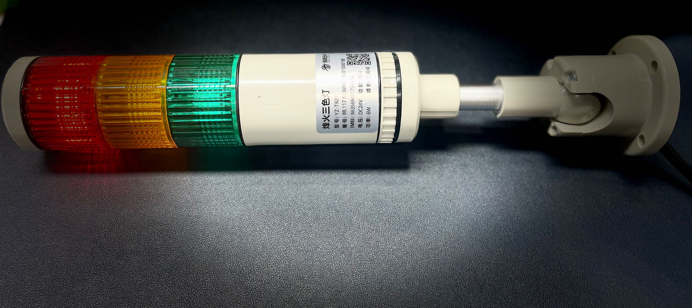

## 线路组装

UC1152电源供电
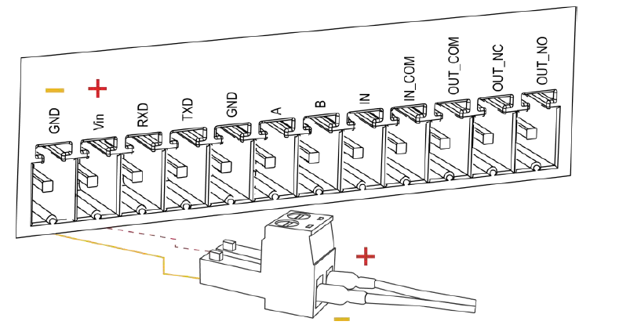

DO接线
UC11xx/UC300系列上的DO属于继电器输出，类似于做为一个单刀双掷开关，所接的设备是**干接点**，DO接受电压范围：3A DC (最大30 V) 或3A AC (最大250 V)。

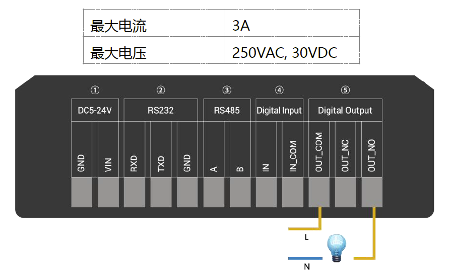

OUT_NC=常闭
OUT_COM=公开
OUT_NO=常开

1）如果是常开触点，接线如下，灯泡只有在开关打开时才会亮：
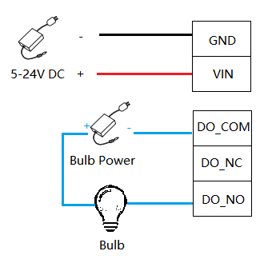

2）如果是常闭触点，接线如下，只有当开关打开时灯泡才会关闭：
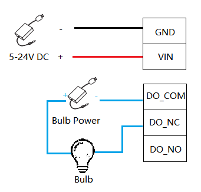

根据上述说明做如下接线

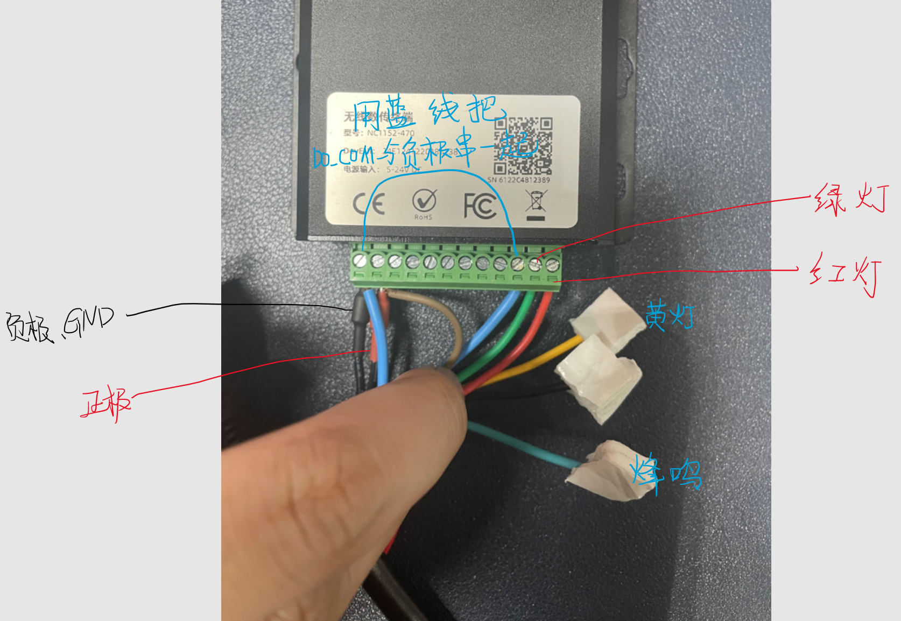


## 终端配置

用USB连接电脑，从我的电脑查看使用的端口，我这里是串行设备COM7，不同的插上以后不一样，插拔看看有无变化，变化的就是目标端口

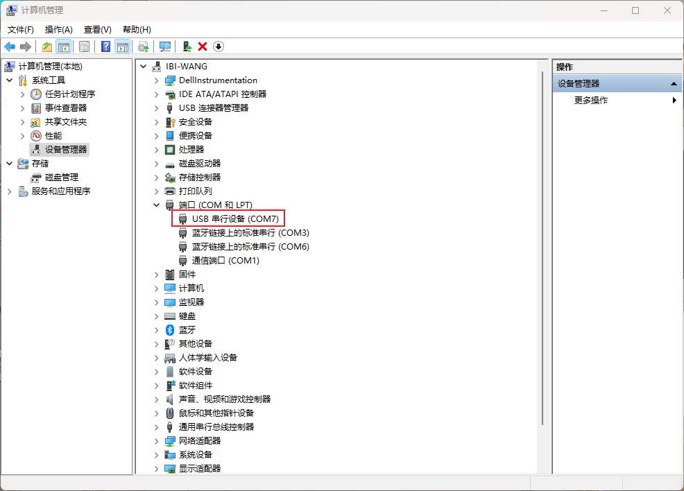

使用电脑版 ToolBox 进行配置，串口选择刚刚找到的串口。密码默认为123456


配置 LoRaWAN 即可，效果如下

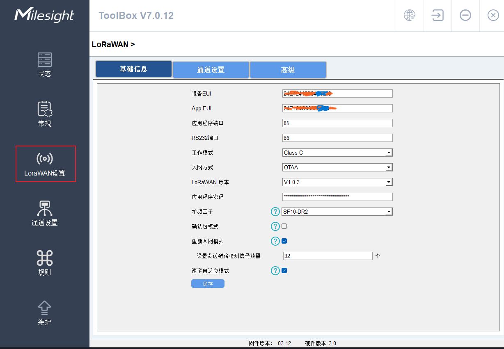

## LoRaWAN配置

新增设备，配置图

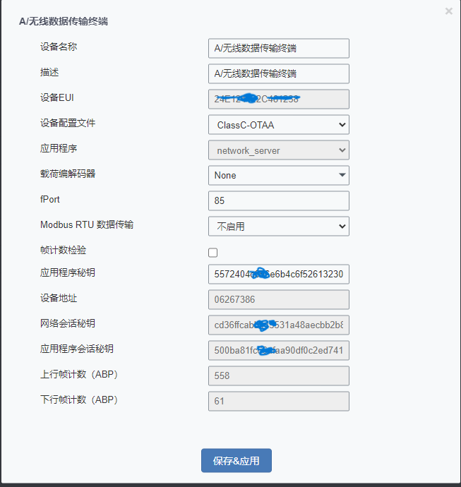

等待一下去到 ToolBox 即可看到入网状态为入网

## 下行消息

网关配置下行消息队列：`milesight-downlink-dev/$deveui`

高电平

```
{"confirmed":true,"fport":85,"data":"CQEA/w=="}
```


低电平

```
{"confirmed":true,"fport":85,"data":"CQAA/w=="}
```


参考文档

[星纵UC系列DIO对接](https://www.milesight.cn/support/milesight-controller-4/)

[无线数据终端DTU中UC1152 LoRaWAN无线数据传输终端](https://www.milesight.cn/documents-download/)

烽火三色灯说明书
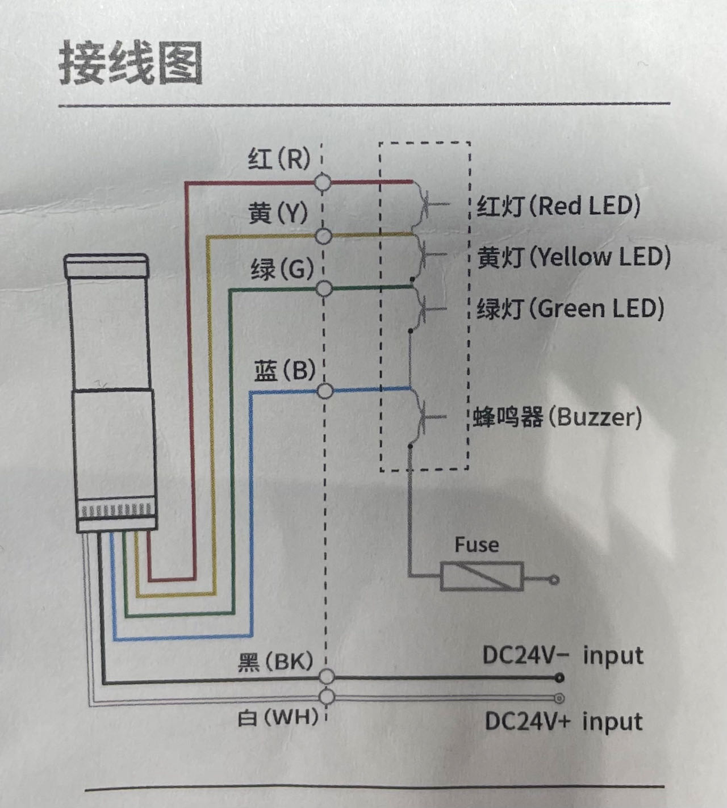


