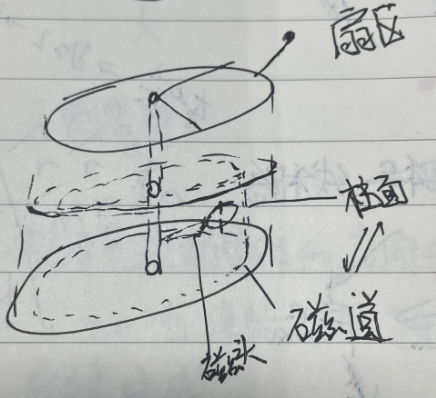

# 硬盘基本知识

## 概述

在磁盘的使用过程中，扇区，磁道（或柱面）和磁头数构成了硬盘结构的基本参数，下面了解下基本的硬盘知识。

附上手绘图，建立基本概念

硬盘最基本的组成部分是由坚硬金属材料制成的涂以磁性介质的盘片，不同容量硬盘的盘片数不等。每个盘片有两面，都可记录信息。

如图为一个磁盘内的概念图，逐个解释：

扇区：盘片被分成许多扇形的区域，每个区域叫一个扇区，每个扇区可存储128×2的N次方（N＝0,1,2,3）字节信息。

磁道：盘片表面上以盘片中心为圆心，不同半径的同心圆称为磁道。

柱面：不同盘片相同半径的磁道所组成的圆柱称为柱面（磁道与柱面都是表示不同半径的圆，在许多场合， 磁道和柱面可以互换使用）

磁头：每个磁盘有两个面，每个面都有一个磁头，习惯用磁头号来区分。

要点：

1. 硬盘有数个盘片，每盘片两个面，每个面一个磁头
2. 盘片被划分为多个扇形区域即扇区
3. 同一盘片不同半径的同心圆为磁道
4. 不同盘片相同半径构成的圆柱面即柱面
5. 存储容量＝磁头数×磁道（柱面）数×每道扇区数×每扇区字节数

## 磁道

当磁盘旋转时，磁头若保持在一个位置上，则每个磁头都会在磁盘表面划出一个圆形轨迹，这些圆形轨迹就叫做磁道。这些磁道用肉眼是根本看不到的，因为它们仅是盘面上以特殊方式磁化了的一些磁化区，磁盘上的信息便是沿着这样的轨道存放的。相邻磁道之间并不是紧挨着的，这是因为磁化单元相隔太近时磁性会相互产生影响，同时也为磁头的读写带来困难。一张1.44 MB的3.5英寸软盘，一面有80个磁道，而硬盘上的磁道密度则远远大于此值，通常一面有成千上万个磁道。

## 扇区

磁盘上的每个磁道被等分为若干个弧段，这些弧段便是磁盘的扇区，每个扇区可以存放512个字节的信息，磁盘驱动器在向磁盘读取和写入数据时，要以扇区为单位。1.44 MB的3.5英寸的软盘，每个磁道分为18个扇区。

看下扇区和磁道的关系

## 柱面

硬盘通常由重叠的一组盘片构成，每个盘片有可以存储数据的上、下两盘面（Side），它们从上至下从“0”开始依次编号。每个盘面都被划分为数目相等的磁道，并从外缘的“0”开始编号，具有相同编号的磁道形成一个圆柱，称之为磁盘的柱面。磁盘的柱面数与一个盘面上的磁道数是相等的。由于每个盘面都有自己的磁头，因此，盘面数等于总的磁头数。所谓硬盘的 CHS，即Cylinder（柱面）、Head（磁头）、Sector（扇区），只要知道了硬盘的 CHS 的数目，即可确定硬盘的容量，硬盘的容量 = 柱面数 \* 磁头数 \* 扇区数 \* 512 B。

## 读写磁头

每个盘面上一个读写磁头，盘面号即磁头号。所有磁头在磁头臂作用下同时内外移动，即任意时刻，所有磁头所处的磁道号是相同的。每个盘片有两个面，每个面都有一个磁头，习惯用磁头号来区分。

看下真实的磁盘样子

