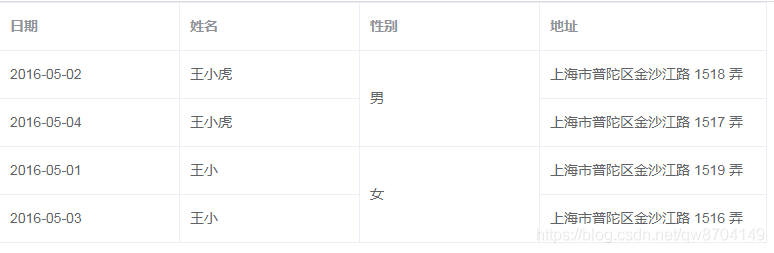

# vue表格(el-talbe)的span-method属性实现表格行合并
## demo效果

如上图实现表格中性别这一列实现行合并

## 实现要点

### 计算合并表格所需数据
该方法的主要目的是在表格渲染前，为表格合并行准备合并所需的数据，示例中是通过表格中的性别来判断是否需要合并
```js
// 为表格行合并准备数据
getRowList() {
  this.rowList = []
  this.rowListpos = 0
  this.tableData.forEach((item, index, arr) => {
    // 表格第一行必须保留
    if (index === 0) {
      this.rowList.push(1)
      this.rowListpos = 0
    } else {
      // 判断当前行性别与上一行性别是否相同 如果相同则合并
      if (item.sex === arr[index - 1].sex) {
        this.rowList[this.rowListpos] += 1
        this.rowList.push(0)
      } else {
        this.rowList.push(1)
        this.rowListpos = index
      }
    }
  })
}
```

### 配置span-method属性
el-table中的span-method属性用来配置计算合并行或列的计算方法，该属性的回调函数有四个参数row、column、rowIndex、columnIndex，该方法需要返回一个对象，这个对象包含两个属性：rowspan和colspan两个属性，rowspan表示占用行数，colspan表示占用列数，如果两个值都为0表示不用合并

```js
// 表格合并行的计算方法
objectSpanMethod({ row, column, rowIndex, columnIndex }) {
  //第三列表格合并行
  if (columnIndex === 2) {
    if (this.rowList[rowIndex]) {
      const rowNum = this.rowList[rowIndex]
      return {
        rowspan: rowNum,
        colspan: rowNum > 0 ? 1 : 0
      }
    } else {
      return {
        rowspan: 0,
        colspan: 0
      }
    }
  }
}
```

## dome代码
```js
<template>
  <el-table :data="tableData" style="width: 40%" border :span-method="objectSpanMethod">
    <el-table-column prop="date" label="日期" width="180">
    </el-table-column>
    <el-table-column prop="name" label="姓名" width="180">
    </el-table-column>
    <el-table-column prop="sex" label="性别" width="180">
    </el-table-column>
    <el-table-column prop="address" label="地址">
    </el-table-column>
  </el-table>
</template>
<script>
export default {
  name: '',
  data() {
    return {
      rowList: [],
      rowListpos: 0,
      tableData: [
        {
          date: '2016-05-02',
          name: '王小虎',
          sex: '男',
          address: '上海市普陀区金沙江路 1518 弄'
        },
        {
          date: '2016-05-04',
          name: '王小虎',
          sex: '男',
          address: '上海市普陀区金沙江路 1517 弄'
        },
        {
          date: '2016-05-01',
          name: '王小',
          sex: '女',
          address: '上海市普陀区金沙江路 1519 弄'
        },
        {
          date: '2016-05-03',
          name: '王小',
          sex: '女',
          address: '上海市普陀区金沙江路 1516 弄'
        }
      ]
    }
  },
  mounted() {
    this.getRowList()
  },
  methods: {
    // 表格合并行的计算方法
    objectSpanMethod({ row, column, rowIndex, columnIndex }) {
      //第三列表格合并行
      if (columnIndex === 2) {
        if (this.rowList[rowIndex]) {
          const rowNum = this.rowList[rowIndex]
          return {
            rowspan: rowNum,
            colspan: rowNum > 0 ? 1 : 0
          }
        } else {
          return {
            rowspan: 0,
            colspan: 0
          }
        }
      }
    },
    // 为表格行合并准备数据
    getRowList() {
      this.rowList = []
      this.rowListpos = 0
      this.tableData.forEach((item, index, arr) => {
        // 表格第一行必须保留
        if (index === 0) {
          this.rowList.push(1)
          this.rowListpos = 0
        } else {
          // 判断当前行性别与上一行性别是否相同 如果相同则合并
          if (item.sex === arr[index - 1].sex) {
            this.rowList[this.rowListpos] += 1 //需要合并的行数累加1
            this.rowList.push(0)
          } else {
            this.rowList.push(1)
            this.rowListpos = index
          }
        }
      })
    }
  }
}
</script>
```

----
[文章摘自](https://blog.csdn.net/qw8704149/article/details/116904888)

#vue #element

完~