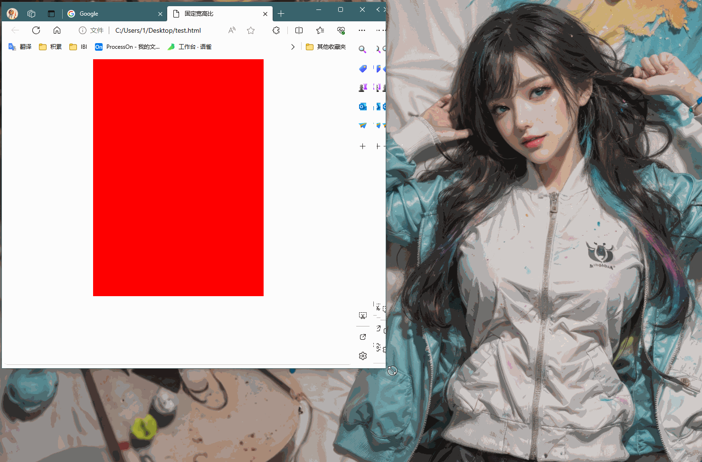
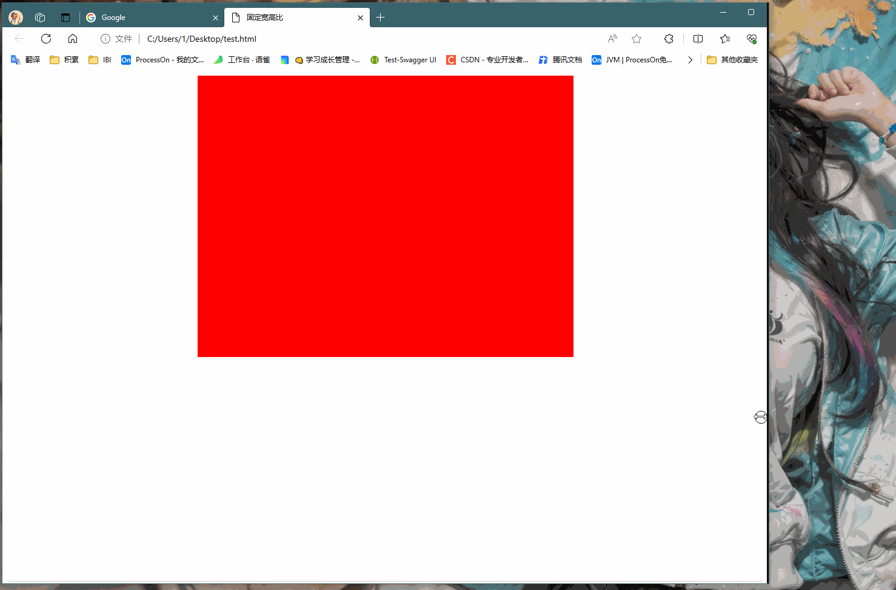
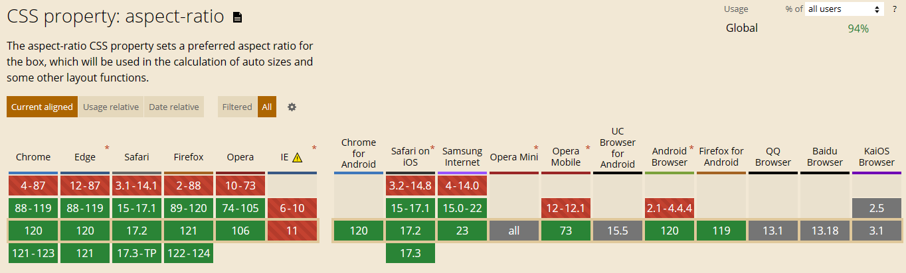
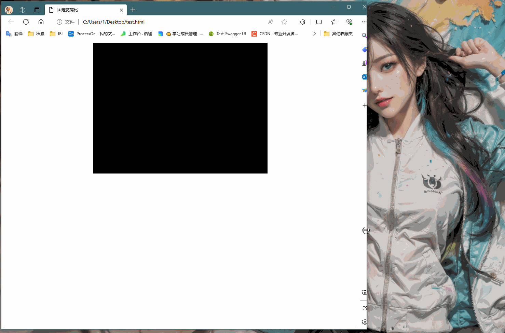

# 固定宽高比的实现

想要实现固定宽高比，多用于视频或图片网站

初始样子及效果

```html
<html>  
<head>  
    <title>固定宽高比</title>  
    <style>       
      .item {  
          background: red;  
          width: 50%;  
          margin: 0 auto;  
          height: 500px;  
       }  
    </style>  
</head>  
  
<body>  
    <div class="item"></div>  
</body>  
</html>
```

没有固定宽高比效果，可以看到高度没有随着宽度变化而变化



如果想要固定宽高比，那么在 div 的属性中高度不能固定。需要是自身宽度的一个比例

## 实现方案一：使用`aspect-ratio : 4 / 3;` 属性

`aspect-ratio` 是一个新的css，这个属性就是专门做这个事情用的。实现如下：

```html
<html>  
<head>  
    <title>固定宽高比</title>  
    <style>       
      .item {  
          background: red;  
          width: 50%;  
          margin: 0 auto;  
          aspect-ratio: 4 / 3;  
       }  
    </style>  
</head>  
  
<body>  
    <div class="item"></div>  
</body>  
</html>
```

看下效果，可以看到高度随着宽度变化跟着变化


> 有一点注意：老版本浏览器不支持这个属性
> 去 Can I use 看看，谷歌浏览器在2021年之后浏览器支持这个属性
> 
> 

## 实现方案二：使用嵌套结构

更好兼容性写法

改动元素结构，有一个嵌套结构inner。希望这是inner元素高度为自身宽度的一定比例（比如75%）。inner宽度为100%，那么inner自身高度75%就等于包含块宽度的75%。

> 包含块是什么

```html
<html>  
<head>  
    <title>固定宽高比</title>  
    <style>       
      .item {  
          background: red;  
          width: 50%;  
          margin: 0 auto;  
          aspect-ratio: 4 / 3;  
       }  
       .inner {  
          width: 100%;  
          height: 0;  
          /* 相当与父元素的百分比 */          padding-bottom: 75%;  
          /* 设置为相对定位*/  
          position: relative;  
       }  
       .container {  
          /* 绝对定位相对与相对定位元素的填充盒 */          
          /* 准确说：是包含块第一个定位元素的填充盒 */          
          position: absolute;  
          /* 撑满 */          
          inset: 0;  
          background: #000;  
       }  
    </style>  
</head>  
  
<body>  
    <div class="item">  
       <div class="inner">  
          <div class="container"></div>  
       </div>    
    </div>
</body>  
</html>
```

效果

