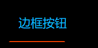
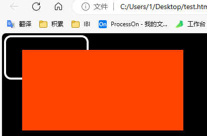
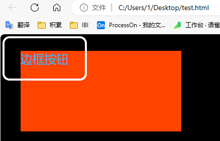
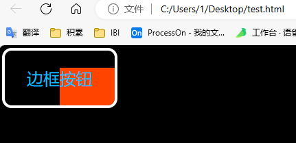
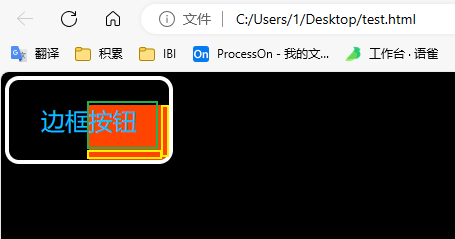
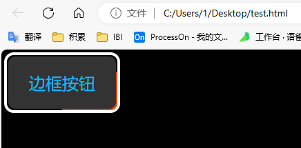
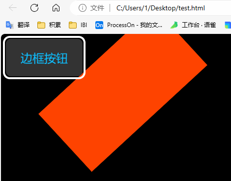
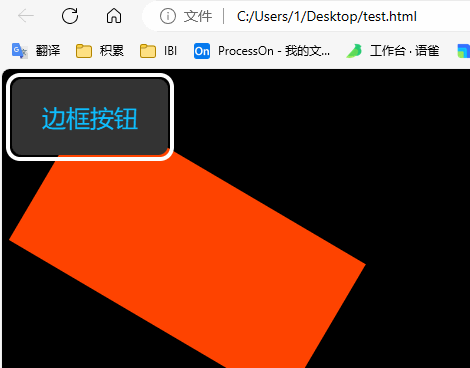
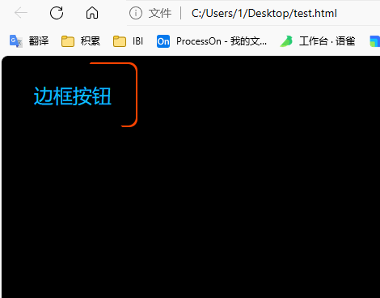

# 按钮旋转边框的实现

首先看下效果



基础准备

```html
<html>  
<head>  
    <title>固定宽高比</title>  
    <style>       body {  
          background: #000;  
       }  
       button {  
          width: 160px;  
          height: 80px;  
          font-size: 24px;  
          color: #0ebeff;  
          border: none;  
          outline: none;  
          z-index: 1;  
          border-radius: 10px;  
          cursor: pointer;  
          outline: 4px solid #fff;  
          background: #000;  
          position: relative;  
       }  
  
       button::before {  
          content: '';  
          position: absolute;  
          width: 200%;  
          height: 200%;  
          background: #f40;  
       }  
    </style>  
</head>  
  
<body>  
    <button>边框按钮</button>  
</body>  
</html>
```

给 `button` 加一个伪标签，效果如下



现在元素是覆盖上去的调整 `z-index` 顺序放在按钮的下面：`z-index: -2;`

```css
button::before {  
	content: '';  
	position: absolute;  
	width: 200%;  
	height: 200%;  
	background: #f40;  
	z-index: -2;  
}
```



调整伪元素中心，位于左上角

```css
button::before {  
    content: '';  
    position: absolute;  
    width: 200%;  
    height: 200%;  
    background: #f40;  
    z-index: -2;  
    /* 调整伪元素中心，位于左上角 */    left: 50%;  
    right: 50%;  
}
```


按钮设置溢出隐藏`overflow: hidden;`，效果如下。这个红色的就是旋转的边框



怎么是边框呢，下图解析。黄色的就是看到的边框，我们要找个东西把绿色部分盖住。让这个整个红色部分沿着左上角旋转起来，就成了。



先遮住，在写一个伪元素 `after`，调整覆盖层级为-1

```css
button::after {  
    content: '';  
    position: absolute;  
    /* css 变量*/  
    --w: 2px;  
    width: calc(100% - 2 * var(--w));  
    height: calc(100% - 2 * var(--w));  
    left: var(--w);  
    top: var(--w);  
    background: #333;  
    z-index: -1;  
    border-radius: inherit;  
}
```



写个动画让他动起来

```css
button::before {  
    content: '';  
    position: absolute;  
    width: 200%;  
    height: 200%;  
    background: #f40;  
    z-index: -2;  
    /* 调整伪元素中心，位于左上角 */    left: 50%;  
    right: 50%;  
    /* 加一个动画 */
    animation: rotation 3s linear infinite;  
}

@keyframes rotation {  
    to {  
       transform: rotate(1turn);  
    }  
}
```

放开button的溢出隐藏注释看下效果，现在效果是这样的



设置下 after 的形变原点`transform-origin: left top;`



最终调整，把button的溢出隐藏注释放开、after的背景颜色调整成黑色、去掉button的外边框，效果如下



所有代码

```html
<html>  
<head>  
    <title>固定宽高比</title>  
    <style>       body {  
          background: #000;  
       }  
       button {  
          width: 160px;  
          height: 80px;  
          font-size: 24px;  
          color: #0ebeff;  
          border: none;  
          outline: none;  
          z-index: 1;  
          border-radius: 10px;  
          cursor: pointer;  
          /*outline: 4px solid #fff;*/  
          background: #000;  
          position: relative;  
          overflow: hidden;  
       }  
  
       button::before {  
          content: '';  
          position: absolute;  
          width: 200%;  
          height: 200%;  
          background: #f40;  
          z-index: -2;  
          /* 调整伪元素中心，位于左上角 */          left: 50%;  
          right: 50%;  
          /* 设置形变原地 */          transform-origin: left top;  
          animation: rotation 1s linear infinite;  
       }  
  
       button::after {  
          content: '';  
          position: absolute;  
          /* css 变量*/  
          --w: 2px;  
          width: calc(100% - 2 * var(--w));  
          height: calc(100% - 2 * var(--w));  
          left: var(--w);  
          top: var(--w);  
          background: #000;  
          z-index: -1;  
          border-radius: inherit;  
       }  
  
       @keyframes rotation {  
          to {  
             transform: rotate(1turn);  
          }  
       }  
    </style>  
</head>  
  
<body>  
    <button>边框按钮</button>  
</body>  
</html>
```