# 代码游戏
## 入门

### 蠕虫的操作

您的 Spawn 会通过 spawnCreep 方法创建名为 "蠕虫 "的新单位。该方法的用法在文档中有所描述。每个 "蠕虫 "都有一个名字和特定的身体部位，这些部位会赋予 "蠕虫 "各种技能。

您可以通过以下方式用 Spawn 的名称来称呼它： `Game.spawns['Spawn1']`.

创建一个蠕虫工作者，使用体数组 `[WORK,CARRY,MOVE]`，并命名为 Harvester1（这个名字对教程很重要！）。您可以自己在控制台中键入代码，也可以复制并粘贴下面的提示。

```js
Game.spawns['Spawn1'].spawnCreep( [WORK, CARRY, MOVE], 'Harvester1' );
```

太好了 现在你可以控制一个名为 "Harvester1 "的蠕虫了。

通过 "查看 "操作，您可以看到爬行（或其他对象）的所有特征。
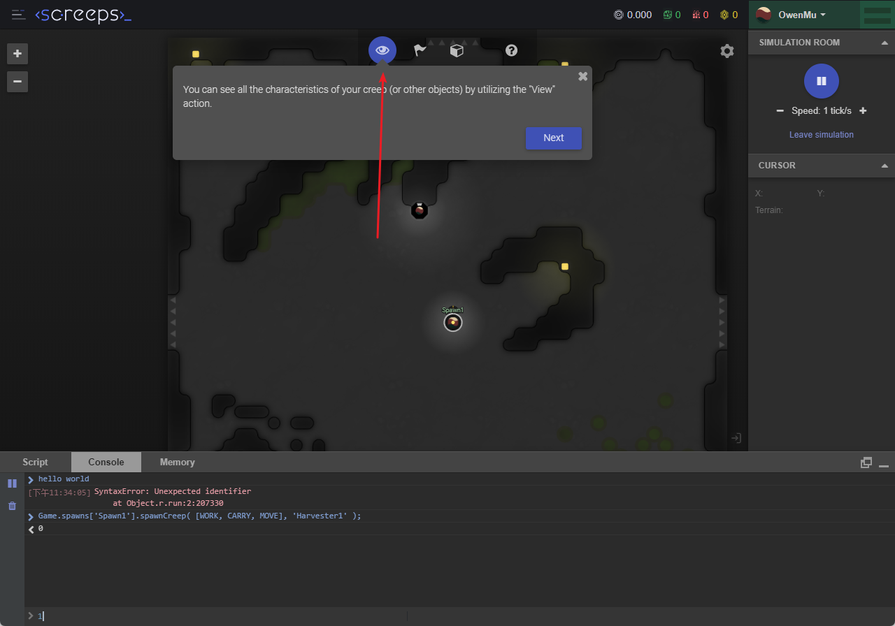

使用 Alt+Enter 隐藏编辑器面板，然后使用 "查看 "操作选择蠕变。


在这里，您可以看到您正在查看的对象的特征。每个特征的值和身体各部分的功能都在文档中有所描述。
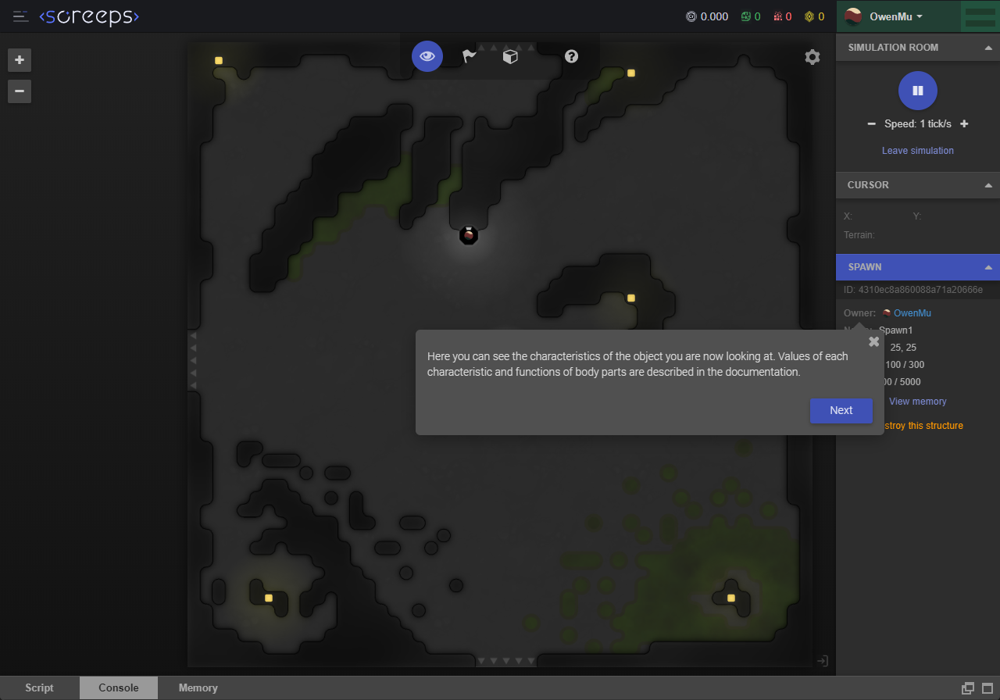

是时候让蠕虫开始工作了！这个黄色方块是一种能量源--一种宝贵的游戏资源。拥有一个或多个 "工作 "身体部位的蠕虫可以采集它，拥有 "搬运 "身体部位的蠕虫可以将它运送到产卵点。
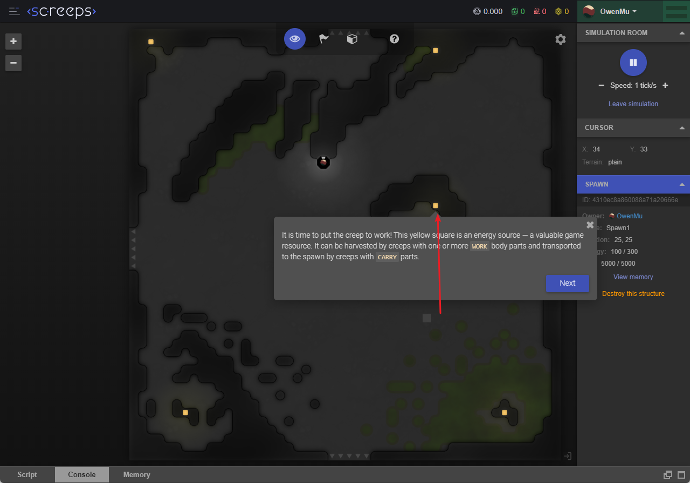


To give your creep a permanently working command, the console is not enough, since we want the creep to work all the time. So we'll be using the Script tab rather than the console.
要让你的蠕变指令永久有效，光靠控制台是不够的，因为我们希望蠕变指令一直有效。因此，我们将使用脚本选项卡而不是控制台。
Click the "Script" tab.
点击 Script 页签


Here you can write scripts that will run on a permanent basis, each game tick in a loop. It allows writing constantly working programs to control behaviour of your creeps which will work even while you are offline (in the real game only, not the Simulation Room mode).
To commit a script to the game so it can run, use this button or **Ctrl+Enter**.
The code for each Tutorial section is created in its own branch. You can view code from these branches for further use in your scripts.
在这里，您可以编写永久运行的脚本，每个游戏 tick 都会循环运行。它允许编写持续运行的程序来控制小兵的行为，这些程序即使在您离线时也能运行（仅限真实游戏，不包括模拟室模式）。
要将脚本提交到游戏中使其运行，请使用此按钮或按 Ctrl+Enter 键。
每个教程部分的代码都创建在自己的分支中。您可以查看这些分支中的代码，以便在脚本中进一步使用。
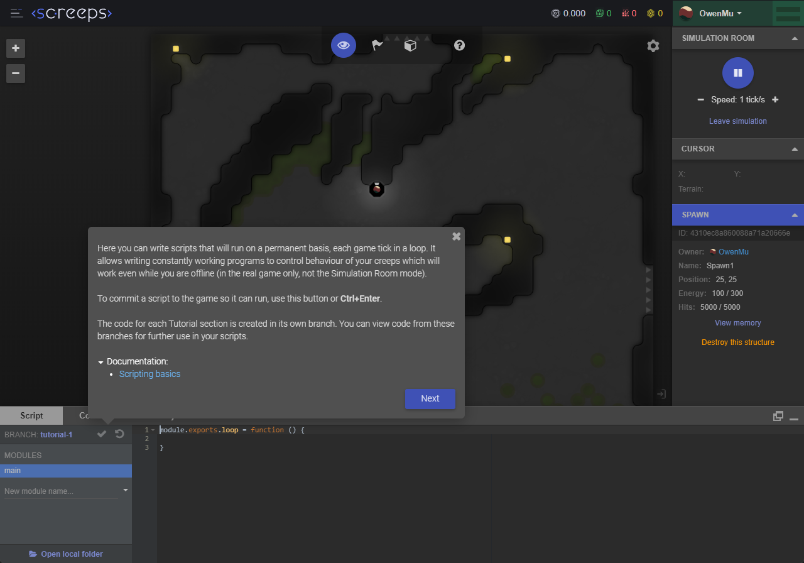


To send a creep to harvest energy, you need to use the methods described in the documentation section below. Commands will be passed each game tick. The `harvest` method requires that the energy source is adjacent to the creep.

You give orders to a creep by its name this way: `Game.creeps['Harvester1']`. Use the `FIND_SOURCES` constant as an argument to the `Room.find` method.

Send your creep to harvest energy by typing code in the "Script" tab.
要发送蠕变指令以获取能量，您需要使用下面文档部分描述的方法。每次游戏结束时都会传递命令。采集方法要求能源与爬行者相邻。

您可以通过蠕虫的名称向其下达指令： `Game.creeps['Harvester1']`. 使用 FIND_SOURCES 常量作为 Room.find 方法的参数。

在 "脚本 "选项卡中输入代码，让您的蠕虫收获能量。
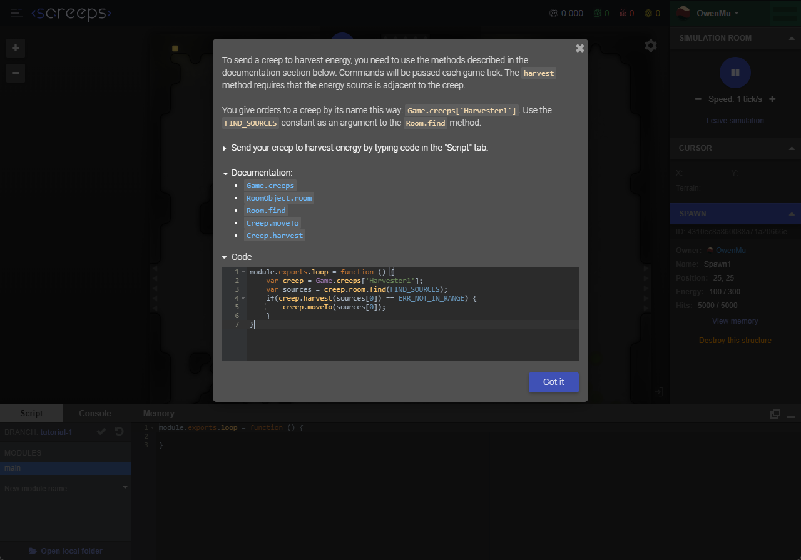
```js
module.exports.loop = function () {
    var creep = Game.creeps['Harvester1'];
    var sources = creep.room.find(FIND_SOURCES);
    if(creep.harvest(sources[0]) == ERR_NOT_IN_RANGE) {
        creep.moveTo(sources[0]);
    }
}
```


A bubbling yellow spot inside the creep means that it has started collecting energy from the source.
爬行器内部冒出的黄色气泡意味着它已开始从源头收集能量。
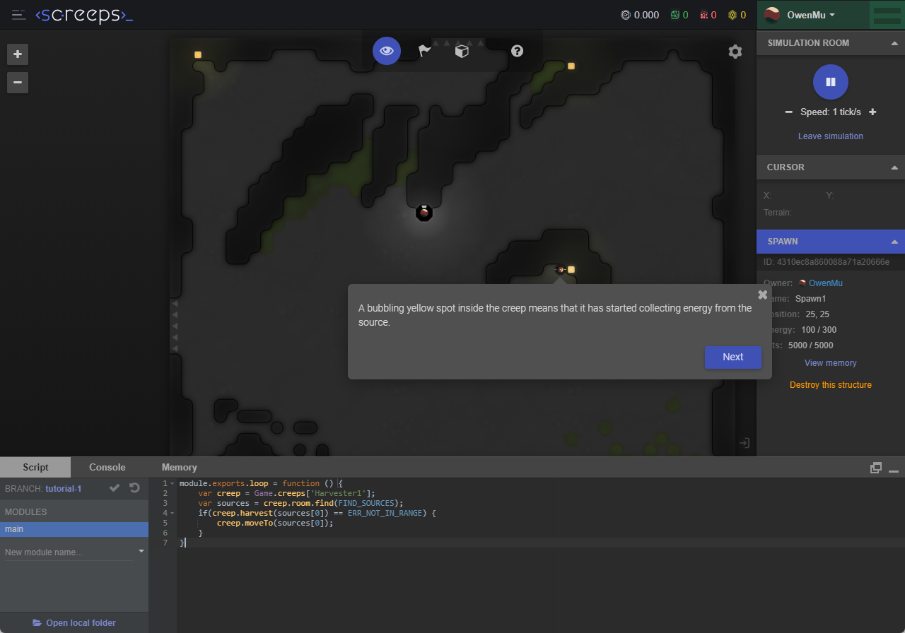

To make the creep transfer energy back to the spawn, you need to use the method `Creep.transfer`. However, remember that it should be done when the creep is next to the spawn, so the creep needs to walk back.
If you modify the code by adding the check `.store.getFreeCapacity() > 0` to the creep, it will be able to go back and forth on its own, giving energy to the spawn and returning to the source.
Extend the creep program so that it can transfer harvested energy to the spawn and return back to work.
要让蠕虫将能量传递回卵生地点，需要使用 `Creep.transfer` 方法。不过，请记住，这应该在蠕虫靠近产卵点时进行，因此蠕虫需要走回来。
如果修改代码，在蠕变程序中加入` .store.getFreeCapacity() > 0` 复选框，它就能自己来回走动，向产卵者提供能量并返回源。
扩展蠕变程序，使其能够将收获的能量转移到产卵点，然后返回工作。
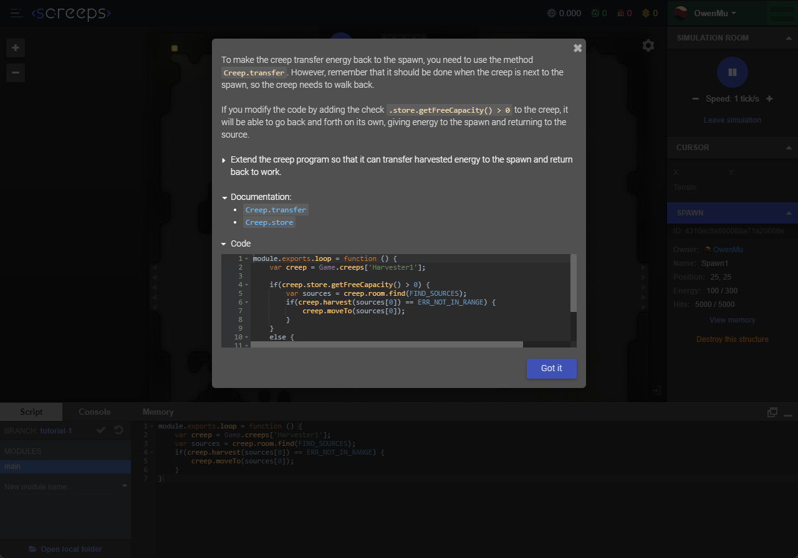
```js
module.exports.loop = function () {
    var creep = Game.creeps['Harvester1'];

	// 蠕虫有空闲空间
    if(creep.store.getFreeCapacity() > 0) {
        var sources = creep.room.find(FIND_SOURCES);
        if(creep.harvest(sources[0]) == ERR_NOT_IN_RANGE) {
            creep.moveTo(sources[0]);
        }
    }
    else {
	    // 
        if( creep.transfer(Game.spawns['Spawn1'], RESOURCE_ENERGY) == ERR_NOT_IN_RANGE ) {
            creep.moveTo(Game.spawns['Spawn1']);
        }
    }
}
```


Great! This creep will now work as a harvester until it dies. Remember that almost any creep has a life cycle of 1500 game ticks, then it "ages" and dies (this behavior is disabled in the Tutorial).
Let's create another worker creep to help the first one. It will cost another 200 energy units, so you may need to wait until your harvester collects enough energy. The `spawnCreep` method will return an error code `ERR_NOT_ENOUGH_ENERGY` (-6) until then.
Remember: to execute code once just type it in the "Console" tab.
Spawn a second creep with the body `[WORK,CARRY,MOVE]` and name `Harvester2`.
太好了 这只爬行者现在可以作为收割者工作，直到死亡。请记住，几乎所有蠕虫的生命周期都是 1500 个游戏时间，然后它就会 "衰老 "并死亡（教程中禁用了这一行为）。
让我们再创建一个工人蠕虫来帮助第一个蠕虫。这将另外耗费 200 个能量单位，所以你可能需要等到你的收割机收集到足够的能量。在此之前，`creawnCreep` 方法将返回错误代码`ERR_NOT_ENOUGH_ENERGY (-6)`。
记住：要执行一次代码，只需在 "控制台 "选项卡中输入即可。
生成第二个蠕虫，体型为` [WORK,CARRY,MOVE]`，名称为 `Harvester2`。
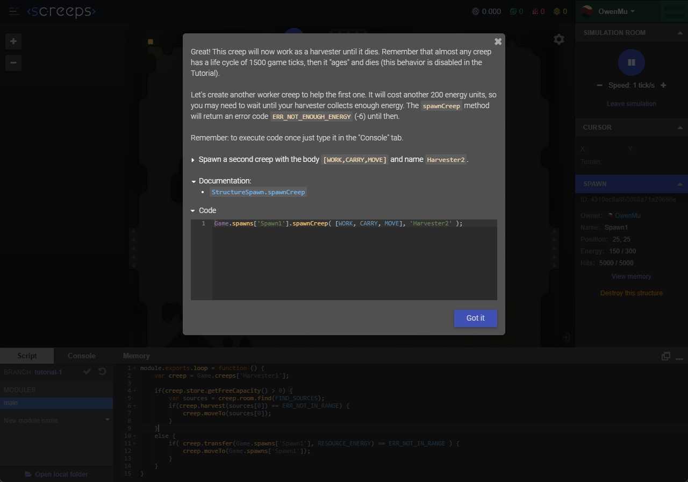


The second creep is ready, but it won't move until we include it into the program.
To set the behavior of both creeps we could just duplicate the entire script for the second one, but it's much better to use the `for` loop against all the screeps in `Game.creeps`.
Expand your program to both the creeps.
第二个蠕虫已经准备就绪，但在我们将其加入程序之前，它不会移动。
要设置两个蠕虫的行为，我们可以为第二个蠕虫复制整个脚本，但使用 `for` 循环来处理` Game.creeps` 中的所有蠕虫要好得多。
将你的程序扩展到两个爬虫。

```js
module.exports.loop = function () {
    for(var name in Game.creeps) {
        var creep = Game.creeps[name];

        if(creep.store.getFreeCapacity() > 0) {
            var sources = creep.room.find(FIND_SOURCES);
            if(creep.harvest(sources[0]) == ERR_NOT_IN_RANGE) {
                creep.moveTo(sources[0]);
            }
        }
        else {
            if(creep.transfer(Game.spawns['Spawn1'], RESOURCE_ENERGY) == ERR_NOT_IN_RANGE) {
                creep.moveTo(Game.spawns['Spawn1']);
            }
        }
    }
}
```


Now let's improve our code by taking the workers' behavior out into a separate _module_. Create a module called `role.harvester` with the help of the Modules section on the left of the script editor and define a `run` function inside the `module.exports` object, containing the creep behavior.
Create a `role.harvester` module.
现在，让我们改进代码，将工人的行为移到一个单独的模块中。借助脚本编辑器左侧的 _MODULES_ 部分。创建一个名为 `role.harvester` 的模块，并在 `module.exports` 对象中定义一个运行函数，其中包含蠕变行为。
创建一个 `role.harvester` 模块。
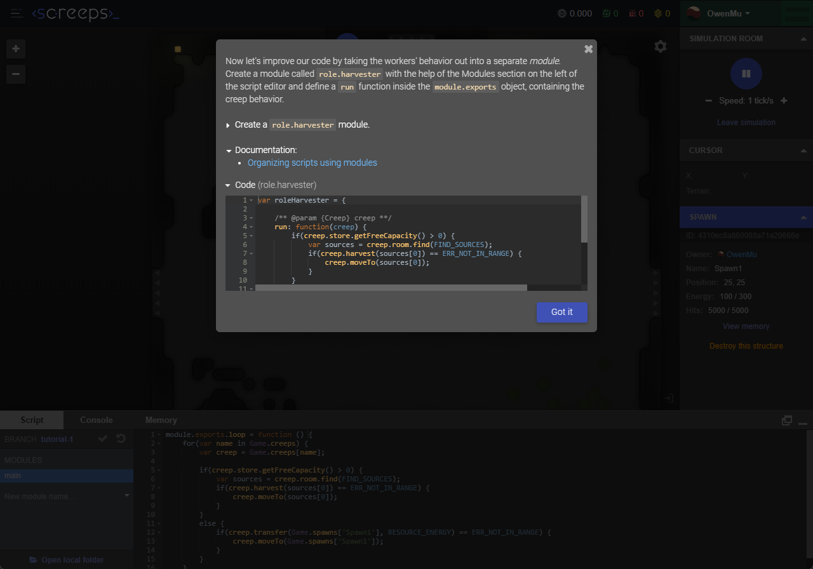
```js
var roleHarvester = {

    /** @param {Creep} creep **/
    run: function(creep) {
	    if(creep.store.getFreeCapacity() > 0) {
            var sources = creep.room.find(FIND_SOURCES);
            if(creep.harvest(sources[0]) == ERR_NOT_IN_RANGE) {
                creep.moveTo(sources[0]);
            }
        }
        else {
            if(creep.transfer(Game.spawns['Spawn1'], RESOURCE_ENERGY) == ERR_NOT_IN_RANGE) {
                creep.moveTo(Game.spawns['Spawn1']);
            }
        }
	}
};

module.exports = roleHarvester;
```

Now you can rewrite the main module code, leaving only the loop and a call to your new module by the method `require('role.harvester')`.
Include the `role.harvester` module in the main module.
现在你可以重写主模块代码，只留下循环和通过`require('role.harvester')`方法调用你的新模块。
在主模块中加入 `role.harvester` 模块。
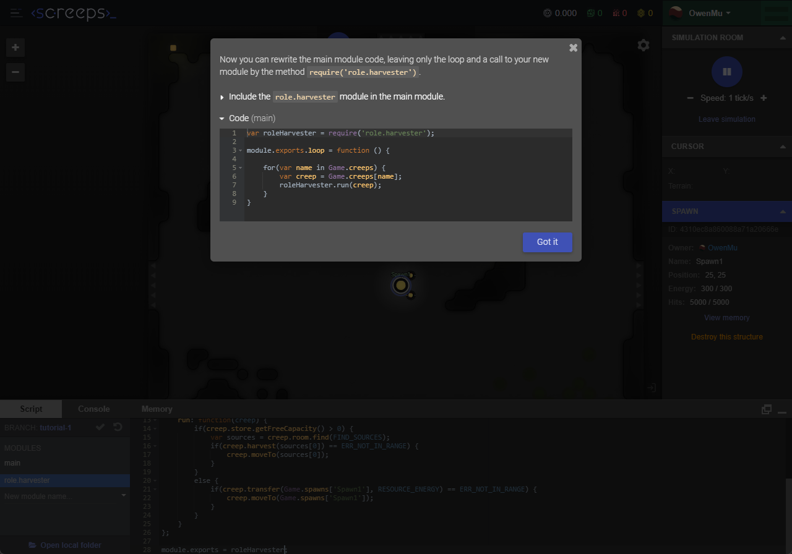
```js
var roleHarvester = require('role.harvester');

module.exports.loop = function () {

    for(var name in Game.creeps) {
        var creep = Game.creeps[name];
        roleHarvester.run(creep);
    }
}
```

现在好多了！
通过这种方式为爬虫添加新角色和模块，你可以控制和管理许多爬虫的工作。在下一节教程中，我们将开发一个新的爬虫角色。


### 房间的操作

In this Tutorial section we’ll talk about a key strategic object in your room: **Room Controller**. By controlling this invincible structure you can build facilities in the room. The higher the controller level, the more structures available to build.
在本教程中，我们将讨论房间中的一个重要战略物件： 房间控制器。通过控制这个无敌结构，你可以在房间里建造设施。控制器等级越高，可建造的建筑就越多。

In this Tutorial section we’ll talk about a key strategic object in your room: **Room Controller**. By controlling this invincible structure you can build facilities in the room. The higher the controller level, the more structures available to build.
在本教程中，我们将讨论房间中的一个重要战略物件： 房间控制器。通过控制这个无敌结构，你可以在房间里建造设施。控制器等级越高，可建造的建筑就越多。


You will need a new worker creep to upgrade your controller level. Let's call it "Upgrader1". In following sections we'll discuss how to create creeps automatically, but for now let's send a command manually to the console.
Spawn a creep with the body `[WORK,CARRY,MOVE]` and the name `Upgrader1`.
您需要一个新的蠕虫来升级控制器级别。让我们称它为 "Upgrader1"。在接下来的章节中，我们将讨论如何自动创建蠕虫，但现在让我们手动向控制台发送一条命令。
生成一个体型为` [WORK,CARRY,MOVE]`、名称为 Upgrader1 的蠕虫。
```js
Game.spawns['Spawn1'].spawnCreep( [WORK, CARRY, MOVE], 'Upgrader1' );
```


Creep "Upgrader1" went to perform the same task as the harvester, but we don't want it to. We need to differentiate creep roles.
蠕虫 "Upgrader 1 "去执行与收割机相同的任务，但我们并不希望它这样做。我们需要区分爬虫的角色。


To do that, we need to utilize the `memory` property of each creep that allows writing custom information into the creep's "memory". Let's do this to assign different roles to our creeps.
All your stored memory is accessible via the global `Memory` object. You can use it any way you like.
Write a property `role='harvester'` into the memory of the harvester creep and `role='upgrader'` — to the upgrader creep with the help of the console.
为此，我们需要利用每个小人的`Memory`属性，将自定义信息写入小人的`Memory`中。让我们来为爬虫分配不同的角色。
您可以通过全局 `Memory`"对象访问所有存储的内存。你可以随意使用它。
在控制台的帮助下，将`role='harvester'`的属性写入收割者爬虫的内存中，将`role='upgrader'`的属性写入升级者爬虫的内存中。
```js
Game.creeps['Harvester1'].memory.role = 'harvester';
Game.creeps['Upgrader1'].memory.role = 'upgrader';
```
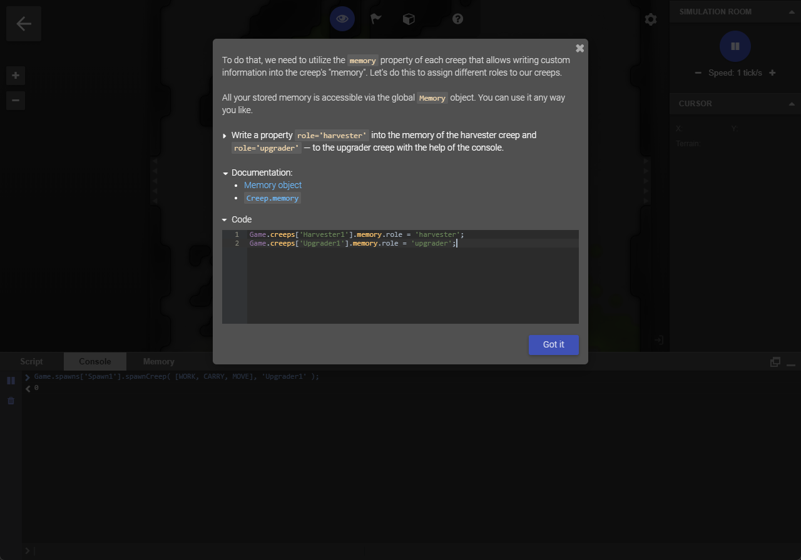


You can check your creeps' memory in either the creep information panel on the left or on the "Memory" tab.
Now let's define the behavior of the new creep. Both creeps should harvest energy, but the creep with the role `harvester` should bring it to the spawn, while the creep with the role `upgrader` should go to the Controller and apply the function `upgradeController` to it (you can get the Controller object with the help of the `Creep.room.controller` property).
In order to do this, we’ll create a new module called `role.upgrader`.
Create a new module `role.upgrader` with the behavior logic of your new creep.
您可以在左边的蠕虫信息面板或 "内存 "选项卡中查看蠕虫的内存。
现在我们来定义新蠕虫的行为。两只蠕虫都应收获能量，但拥有角色收获器的蠕虫应将能量带到产卵点，而拥有角色`升级器`的蠕虫应前往控制器并应用函数 `upgradeController`（可通过 `Creep.room.controller` 属性获取控制器对象）。
为此，我们将创建一个名为 `role.upgrader` 的新模块。
创建一个新模块 `role.upgrader`，其中包含新蠕虫的行为逻辑。
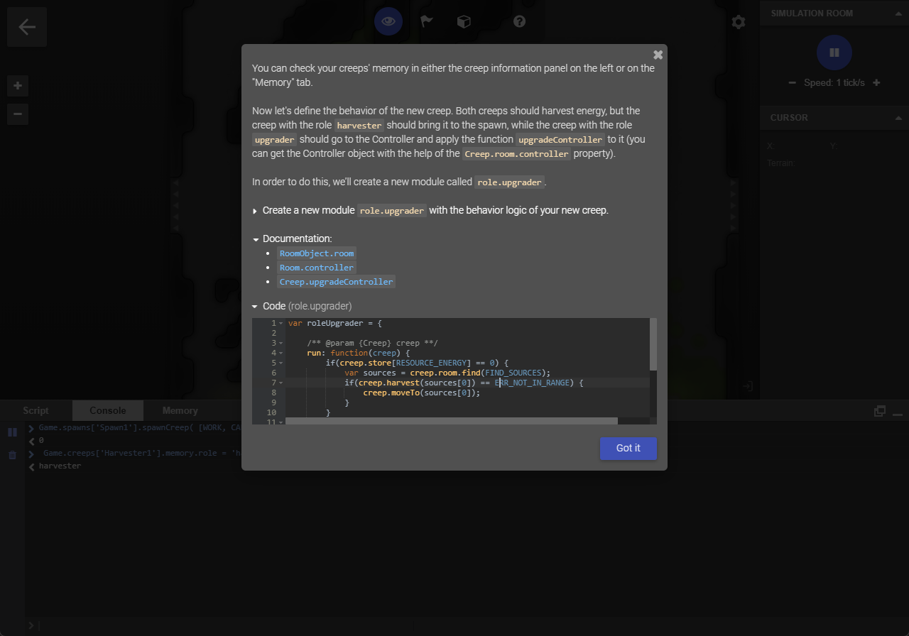
```js
var roleUpgrader = {

    /** @param {Creep} creep **/
    run: function(creep) {
	    if(creep.store[RESOURCE_ENERGY] == 0) {
            var sources = creep.room.find(FIND_SOURCES);
            if(creep.harvest(sources[0]) == ERR_NOT_IN_RANGE) {
                creep.moveTo(sources[0]);
            }
        }
        else {
            if(creep.upgradeController(creep.room.controller) == ERR_NOT_IN_RANGE) {
                creep.moveTo(creep.room.controller);
            }
        }
	}
};

module.exports = roleUpgrader;
```

In our main module, all creeps run the same role. We need to divide their behavior depending on the previously defined property `Creep.memory.role` by connecting the new module.
Apply the logic from the module `role.upgrader` to the creep with the role `upgrader` and check how it performed.
在我们的主模块中，所有蠕虫都运行相同的角色。我们需要通过连接新模块，根据先前定义的属性 `Creep.memory.role` 来划分它们的行为。
将`role.upgrader`模块中的逻辑应用于角色为`upgrader`的蠕虫，并检查其执行情况。
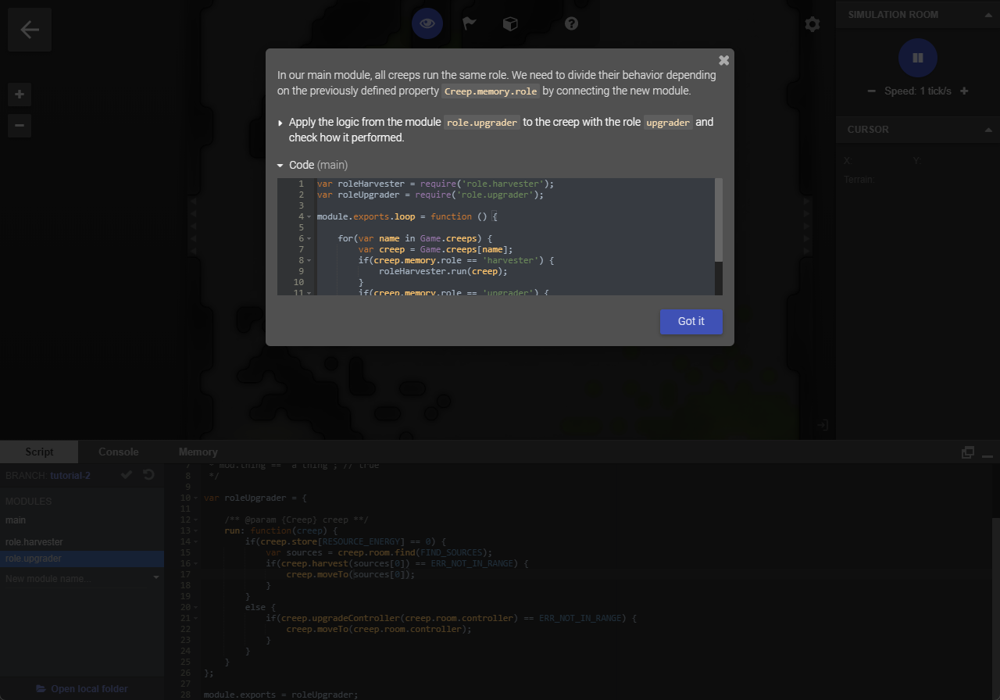

```js
var roleHarvester = require('role.harvester');
var roleUpgrader = require('role.upgrader');

module.exports.loop = function () {

    for(var name in Game.creeps) {
        var creep = Game.creeps[name];
        if(creep.memory.role == 'harvester') {
            roleHarvester.run(creep);
        }
        if(creep.memory.role == 'upgrader') {
            roleUpgrader.run(creep);
        }
    }
}
```

Perfect, you have upgraded your Controller level!
**Important:** If you don’t upgrade your Controller within 20,000 game ticks, it loses one level. On reaching level 0, you will lose control over the room, and another player will be able to capture it freely. Make sure that at least one of your creeps regularly performs the function `upgradeController`.
完美，您已提升控制器等级！
**重要提示：** 如果您没有在 20,000 个游戏时间内升级控制器，它就会掉一级。达到 0 级时，您将失去对房间的控制权，其他玩家可以自由占领房间。确保至少有一个小兵定期执行 `upgradeController` 功能。
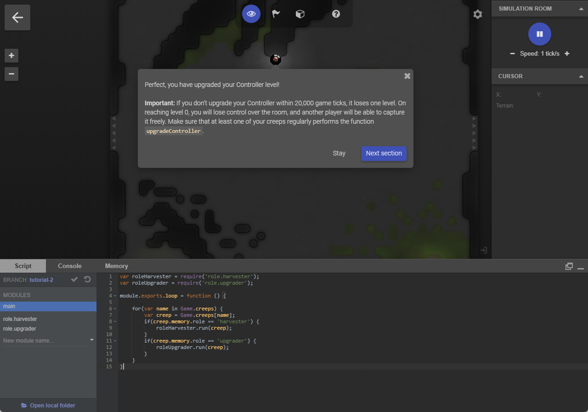


The Controller upgrade gives access to some new structures: walls, ramparts, and extensions. We’ll discuss walls and ramparts in the next Tutorial section, for now let’s talk about extensions.

**Extensions** are required to build larger creeps. A creep with only one body part of one type works poorly. Giving it several `WORKs` will make him work proportionally faster.

However, such a creep will be costly and a lone spawn can only contain 300 energy units. To build creeps costing over 300 energy units you need spawn extensions.
控制器升级后可以使用一些新结构：城墙、城垛和延伸部分。我们将在下一节教程中讨论城墙和城垛，现在让我们来谈谈扩展部分。

要建造更大的蠕虫，需要**扩展**。只有一种身体部位的蠕虫效果很差。赋予它多个 "工作 "会使它的工作速度成比例地提高。

然而，这样的蠕虫成本很高，而且一个单独的产卵只能包含 300 个能量单位。如果要建造超过 300 能量单位的蠕虫，就需要对产卵进行扩展。


The second Controller level has **5 extensions** available for you to build. This number increases with each new level.
You can place extensions at any spot in your room, and a spawn can use them regardless of the distance. In this Tutorial we have already placed corresponding construction sites for your convenience.
第二个控制器级别有**5个扩展**供您建造。每个新关卡的数量都会增加。
您可以在房间的任意位置放置扩展装置，而且无论距离多远，都可以使用它们。在本教程中，我们已经放置了相应的建筑工地，以方便您的使用。
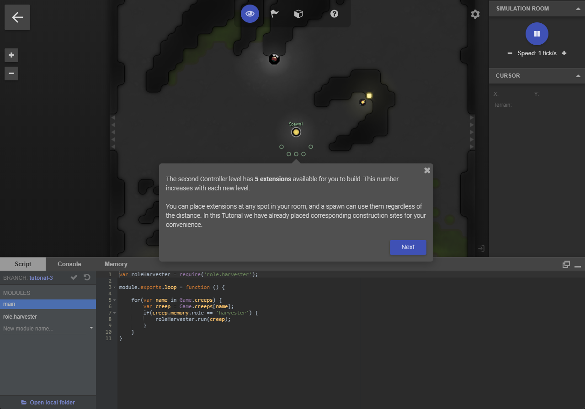

Let’s create a new creep whose purpose is to build structures. This process will be similar to the previous Tutorial sections. But this time let’s set `memory` for the new creep right in the method `Spawn.spawnCreep` by passing it in the third argument.
Spawn a creep with the body `[WORK,CARRY,MOVE]`, the name `Builder1`, and `{role:'builder'}` as its memory.
让我们创建一个新的蠕变，其目的是构建结构。这个过程与之前的教程部分类似。但这次我们要在方法 `Spawn.spawnCreep` 中为新蠕虫设置`内存`，将其作为第三个参数。
生成一个主体为 `[工作,携带,移动]`、名称为 `Builder1` 和内存为 `{role:'builder'}` 的蠕虫。
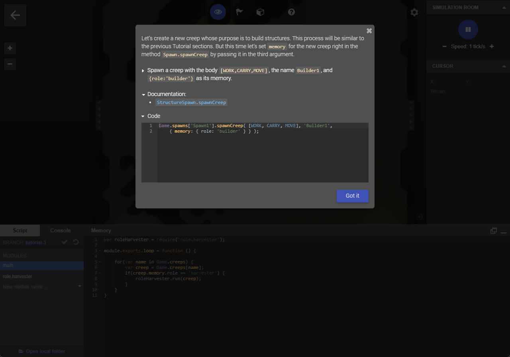

Our new creep won’t move until we define the behavior for the role `builder`.
在定义角色 `builder` 的行为之前，我们的新蠕变不会移动。
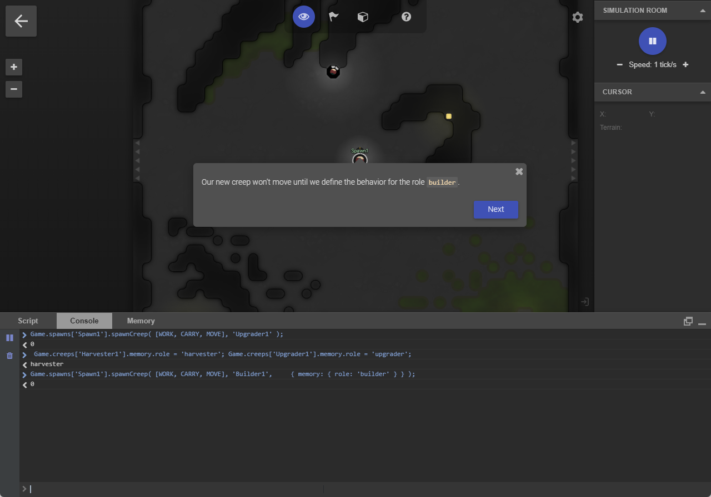

