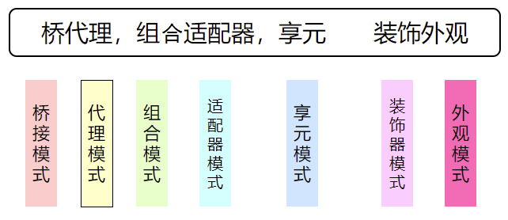
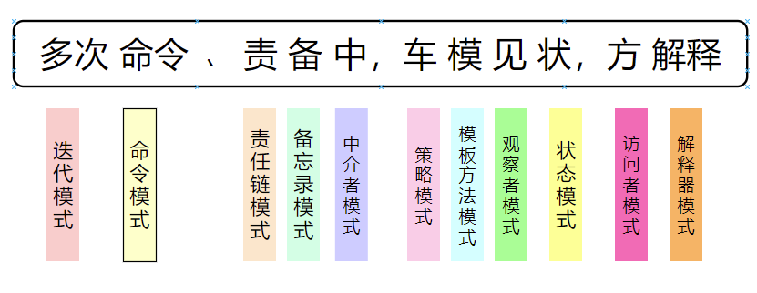

| 模式分类 | 模式名称 |
| :-----: | ----- |
| 创建型 | 单例模式、工厂模式、抽象工厂模式、建造者模式、原型模式 |、
| 结构型 | 适配器模式、桥接模式、装饰模式、组合模式、外观模式、享元模式、代理模式 |
| 行为型 | 模板方法模式、命令模式、迭代器模式、观察者模式、中介模式、备忘录模式、解释器模式、状态模式、策略模式、职责链模式、访问者模式  |

速记：

姓桥的代理，他组合适配器，(他的儿子)享元（拿回家）装饰外观。

多次（迭：多次的意思，迭代模式）命令（命令模式）、责（责任链模式）备（备忘录模式）中（中介者模式），车（策略模式）模（模板方法模式）见（观察者模式）状（状态模式），方（访问者模式）解释（解释器模式）。

---
#设计模式
